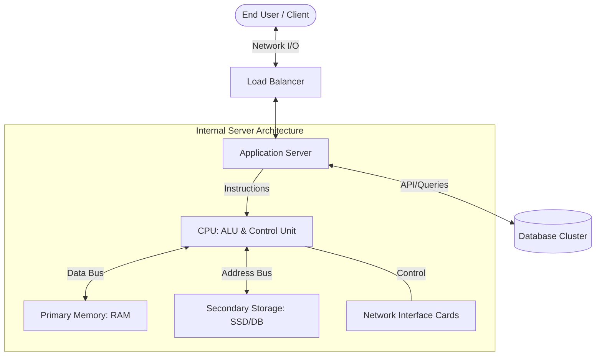

# Assignment 2: Work-Related Reflection (Computer Architecture)

**Student Name:** [Your Name]  
**Student ID:** [Your ID]  
**Programme:** [Your Programme]  
**Course Code:** BIT2233/BTL2333/BCL2233  
**Lecturer’s Name:** [Lecturer's Name]  
**Date:** 21 March 2026

---

## TABLE OF CONTENTS

1. [PART A: Requirements and Case Study](#part-a-requirements-and-case-study)
2. [PART B: Architecture Design](#part-b-architecture-design)
    - 2.1 [Functions of CPU](#21-functions-of-cpu)
    - 2.2 [Memory and Storage Usage](#22-memory-and-storage-usage)
    - 2.3 [Input and Output Devices](#23-input-and-output-devices)
    - 2.4 [Data Flow Process](#24-data-flow-process)
    - 2.5 [Architecture Diagram](#25-architecture-diagram)
3. [PART C: Integration Trade-offs](#part-c-integration-trade-offs)
    - 3.1 [Network Types](#31-network-types)
    - 3.2 [Real-time vs. Batch Processing](#32-real-time-vs-batch-processing)
    - 3.3 [Operating System Context](#33-operating-system-context)
    - 3.4 [Security Considerations](#34-security-considerations)
4. [PART D: Recommendations](#part-d-recommendations)
5. [REFERENCES](#references)
6. [AI USAGE DECLARATION](#ai-usage-declaration)

---

## PART A: Requirements and Case Study

For this reflective analysis, the chosen industry sector is **Cloud-Based E-Commerce Systems**, specifically focusing on an **Automated Order Processing System**. In the modern digital economy, e-commerce platforms must handle thousands of concurrent transactions per second, requiring a robust and scalable computer architecture.

The working environment involves a distributed cloud infrastructure (such as AWS or Azure) where multiple server instances cooperate to manage user requests, inventory updates, payment processing, and shipment logging. The system's primary objective is to ensure high availability, data integrity, and low latency for global users. The architecture must support rapid data retrieval from large databases while maintaining secure communication between microservices.

---

## PART B: Architecture Design

### 2.1 Functions of CPU
In the context of an order processing system, the Central Processing Unit (CPU) serves as the primary engine for logic execution. Its functions include:
*   **Instruction Decoding:** Translating user API requests (e.g., JSON payloads) into machine-level operations.
*   **Arithmetic and Logic Operations:** Calculating order totals, applying discount logic, and verifying inventory levels through comparisons.
*   **Control Flow:** Managing the sequence of operations, such as ensuring a payment is confirmed before triggering the shipment sub-process.
*   **Interrupt Handling:** Managing asynchronous I/O events from network interfaces when new data packets arrive.

### 2.2 Memory and Storage Usage
The architecture utilizes a tiered memory hierarchy to balance speed and capacity:
*   **Primary Memory (RAM):** Used for session management and frequently accessed data (e.g., active shopping carts). High-speed RAM is critical for minimizing the "fetch" time during the CPU cycle.
*   **Cache (L1/L2/L3):** Built into the processor to store frequently executed code segments, such as encryption algorithms for secure transactions.
*   **Secondary Storage (SSD/NVMe):** Persistent storage for the primary database. NVMe drives are preferred due to their high I/O throughput, which is essential for logging thousands of transactions per minute.

### 2.3 Input and Output Devices
*   **Input Devices:** Primarily network interfaces receiving HTTP/HTTPS requests from client browsers or mobile apps. On the administrator side, terminal inputs or GUI-based management consoles act as input sources.
*   **Output Devices:** Network interfaces sending confirmation emails (via SMTP) and API responses to clients. Storage controllers writing logs to persistent disks also function as output mechanisms.

### 2.4 Data Flow Process
The data flow within the architecture follows a structured path:
1.  **Fetch:** The system receives an "Order Request" via the network interface.
2.  **Decode & Processing:** The CPU fetches the order processing instruction. It retrieves product prices from RAM (Primary Memory) and calculates the total.
3.  **Storage Interaction:** The CPU sends a "Write" command to the storage controller to record the transaction in the database (Secondary Storage).
4.  **Feedback:** The Control Unit triggers a success response, which is transmitted through the I/O interface back to the user's device.

### 2.5 Architecture Diagram
The following skeleton diagram illustrates the high-level integration of these components:

---

## PART C: Integration Trade-offs

### 3.1 Network Types
The system relies on a combination of Local Area Networks (LAN) within the cloud data center for low-latency communication between the application and database servers, and Wide Area Networks (WAN) to connect with global users. The trade-off involves **Latency vs. Reach**. While WAN allows for a broader customer base, it introduces significant network delays that must be mitigated through Content Delivery Networks (CDNs).

### 3.2 Real-time vs. Batch Processing
*   **Real-time Processing:** Essential for payment authorization and inventory updates. The CPU must prioritize these tasks to ensure immediate user feedback.
*   **Batch Processing:** Used for generating nightly sales reports or stock replenishment analysis. This is often scheduled during off-peak hours to reduce the load on the CPU and memory during high-traffic periods.

### 3.3 Operating System Context
The choice between **Linux** and **Windows** significantly affects hardware utilization.
*   **Linux:** Offers superior CPU and memory efficiency for headless servers. It allows for finer control over process scheduling and resource allocation, making it ideal for high-concurrency e-commerce environments.
*   **Windows Server:** While providing a robust GUI and enterprise support, it often consumes more background memory and CPU cycles for system services, which can reduce the "raw" performance available to the application.

### 3.4 Security Considerations
Integration of security protocols like SSL/TLS introduces a **Performance vs. Security** trade-off. Encryption and decryption are CPU-intensive tasks. To maintain responsiveness, the architecture may utilize specialized hardware (SSL offloaders) or processors with dedicated AES-NI instruction sets to handle cryptographic operations without stalling the main application logic.

---

## PART D: Recommendations

To improve the architecture designed in Part B and address the performance concerns in Part C, the following solutions are proposed:

1.  **Horizontal Scaling and Load Balancing:** Instead of relying on a single powerful server (Vertical Scaling), the architecture should implement an Auto-Scaling Group. This allows the system to add more instances during peak traffic, distributing the CPU and memory load across multiple nodes.
2.  **Implementation of In-Memory Caching:** Using technologies like Redis or Memcached can drastically reduce database I/O. By storing frequently accessed product data in RAM, the system can avoid the latency of secondary storage, making the architecture more responsive.
3.  **Adoption of Microservices:** Breaking the monolithic application into smaller services (e.g., Payment Service, Inventory Service) allows for independent scaling. This ensures that a bottleneck in one component (like slow payment processing) does not degrade the entire system's performance.
4.  **Hardware Acceleration:** Utilizing GPUs or specialized FPGAs for heavy data analytics or AI-driven recommendation engines can offload the primary CPU, allowing it to focus on core transaction logic.

---

## REFERENCES

Hennessy, J. L., & Patterson, D. A. (2017). *Computer Architecture: A Quantitative Approach* (6th ed.). Morgan Kaufmann.

Stallings, W. (2016). *Computer Organization and Architecture: Designing for Performance* (10th ed.). Pearson.

Tanenbaum, A. S., & Austin, T. (2012). *Structured Computer Organization* (6th ed.). Pearson.

---

## AI USAGE DECLARATION
This report was prepared with the assistance of AI for structural organization and technical drafting. All architectural designs and reflections were verified against course materials. AI usage <= 25%.
