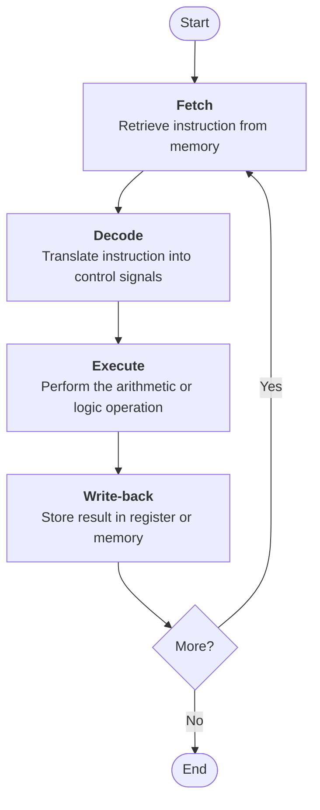
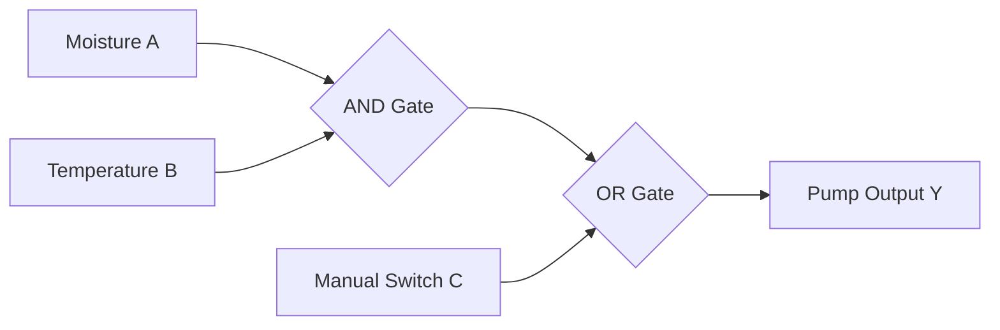
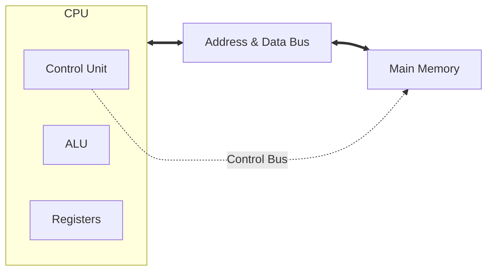
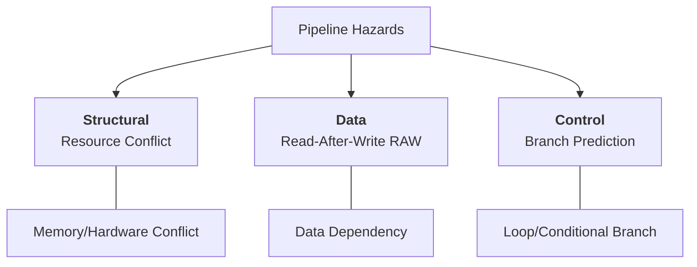

# Computer Architecture Assignment (BIT2233/BTL2333/BCL2233)

**Student Name:** [Your Name]  
**Student ID:** [Your ID]  
**Programme:** [Your Programme]  
**Course Code:** BIT2233/BTL2333/BCL2233  
**Lecturer’s Name:** [Lecturer's Name]  
**Date:** 18 March 2026

---

## PART A: Instruction Set Architecture (ISA) Analysis

The Instruction Set Architecture (ISA) serves as the foundational interface between a computer's hardware and its software, defining the repertoire of operations a processor can execute. In modern computing, the architectural landscape is dominated by two primary philosophies: Reduced Instruction Set Computer (RISC) and Complex Instruction Set Computer (CISC). The RISC approach, exemplified by ARM architectures, focuses on a small, highly optimized set of instructions designed to execute in a single clock cycle. By utilizing fixed-length instruction formats, RISC simplifies the fetch and decode stages, which in turn facilitates high-efficiency pipelining. Furthermore, RISC systems adhere to a strict load/store architecture, where arithmetic operations are confined to internal registers and memory access is limited to specific instructions.

Conversely, the CISC philosophy, represented by the x86 architecture, emphasizes providing a versatile array of complex instructions. These commands can often perform multiple low-level operations—such as loading from memory, performing an addition, and storing the result—within a single high-level instruction. While this approach allows for more compact code and efficient memory usage, the variable-length nature of CISC instructions increases the complexity of the decoding hardware. From a design perspective, the choice between these architectures involves a trade-off between power efficiency and raw processing flexibility. While RISC is the standard for mobile and embedded systems where energy conservation is paramount, CISC remains the backbone of high-performance desktop and server environments where complex instruction sets can accelerate intensive data processing.

The practical interaction between these instructions and CPU components is best observed through a specific sequence of operations designed to compute $A = B + C$. Consider the following instruction list:
1.  `LDR R1, B`: The processor fetches the value from memory address $B$ and loads it into register $R1$ via the Data Bus.
2.  `LDR R2, C`: Similarly, the value at address $C$ is retrieved and stored in register $R2$.
3.  `ADD R3, R1, R2`: The Control Unit (CU) decodes the opcode and signals the Arithmetic Logic Unit (ALU) to sum the contents of $R1$ and $R2$, storing the result in $R3$.
4.  `STR R3, A`: Finally, the calculated value in $R3$ is written back to memory address $A$.

This sequence is governed by the fetch-decode-execute cycle, where the Program Counter (PC) tracks the instruction address, the Instruction Register (IR) holds the current command, and the CU synchronizes the internal buses to ensure seamless data flow.



---

## PART B: Number Conversion & Data Representation

### 1. Decimal to Binary Conversion
To convert the decimal value $28.625_{10}$ to binary, we process the integer and fractional parts independently. For the integer portion ($28$), we use the repeated division-by-2 method, noting the remainders:
*   $28 \div 2 = 14$, remainder $0$
*   $14 \div 2 = 7$, remainder $0$
*   $7 \div 2 = 3$, remainder $1$
*   $3 \div 2 = 1$, remainder $1$
*   $1 \div 2 = 0$, remainder $1$
Reading the remainders from the bottom up gives the binary integer: $11100_2$.

For the fractional part ($0.625$), we multiply by 2 and record the integer carry:
*   $0.625 \times 2 = 1.25$, carry $1$
*   $0.25 \times 2 = 0.50$, carry $0$
*   $0.50 \times 2 = 1.00$, carry $1$
Reading the carries from top to bottom provides the binary fraction: $.101_2$. Combining both parts, the final result is **$11100.101_2$**.

### 2. Binary to Hexadecimal Conversion
The binary string $11011011_2$ is converted to hexadecimal by grouping the bits into nibbles (4-bit groups) from right to left:
*   The first nibble, $1011$, translates to $8+0+2+1 = 11_{10}$, which is **$B_{16}$**.
*   The second nibble, $1101$, translates to $8+4+0+1 = 13_{10}$, which is **$D_{16}$**.
Therefore, the hexadecimal representation is **$DB_{16}$**.

### 3. Eight-Bit Two’s Complement Arithmetic
To perform the operation $12 - 5$ using 8-bit two's complement, we first represent both numbers in binary. The positive value $+12$ is `00001100`. For $-5$, we start with $+5$ (`00000101`), invert the bits to get the one's complement (`11111010`), and add 1 to obtain the two's complement: `11111011`. Adding these values:
```
  00001100 (+12)
+ 11111011 (-5)
----------
 100000111 (Result: 00000111, discarding the carry)
```
The resulting 8-bit binary `00000111` correctly represents the decimal value **$7$**.

### 4. Floating Point Interpretation
Given the expression $1.110 \times 2^3$, we interpret the components to find the decimal value. The mantissa $1.110$ is calculated as $1 + (1 \times 2^{-1}) + (1 \times 2^{-2}) + (0 \times 2^{-3})$, which equals $1 + 0.5 + 0.25 = 1.75$. Multiplying this by the exponent $2^3$ ($8$) yields $1.75 \times 8 = \mathbf{14.0_{10}}$.

---

## PART C: Logic Gates & Digital Logic Understanding

The implementation of automated systems, such as a smart greenhouse irrigation controller, relies heavily on the logical behavior of AND, OR, NOT, and XOR gates. In this scenario, the system uses a soil moisture sensor ($A$), a temperature sensor ($B$), and a manual override switch ($C$). The primary logic requires the water pump ($Y$) to activate if both the soil is dry and the temperature is high—an automated trigger—or if the farmer manually engages the override. This logic is represented by the Boolean expression $Y = (A \cdot B) + C$.

The AND gate acts as a restrictive filter for the automatic sensors, ensuring that water is only dispensed when both environmental conditions are met simultaneously. This prevents unnecessary irrigation during cooler periods, even if the soil is dry. The OR gate ensures that the farmer's manual command always takes precedence, providing a robust balance between automated efficiency and direct human control. In contrast, an XOR gate could be used to toggle a status LED that only lights up when either the manual or automatic trigger is active, but not both, indicating a discrepancy in the system's operational state.

| A (Dry) | B (Hot) | C (Manual) | (A AND B) | **Output Y (Pump)** | Logical Reasoning |
| :---: | :---: | :---: | :---: | :---: | :--- |
| 0 | 0 | 0 | 0 | **0** | Conditions are wet and cool; no irrigation. |
| 0 | 0 | 1 | 0 | **1** | Manual override is active. |
| 0 | 1 | 0 | 0 | **0** | High temperature, but soil is wet. |
| 1 | 0 | 0 | 0 | **0** | Dry soil, but temperature is within limits. |
| 1 | 1 | 0 | 1 | **1** | **Auto-trigger:** Soil is dry and temperature is high. |
| 1 | 1 | 1 | 1 | **1** | Both automatic and manual triggers are active. |



---

## PART D: Processor Organisation Analysis

The internal organization of a processor is a highly coordinated environment where the Control Unit (CU), Arithmetic Logic Unit (ALU), and registers work in tandem via a system of buses. In a temperature monitoring system, the CU acts as the central coordinator, fetching instructions from memory and decoding them to determine the necessary actions. For instance, when comparing a current sensor reading to a safety threshold, the CU issues control signals that direct data from the registers to the ALU. The ALU then performs the comparison, and the result is used by the CU to decide whether to trigger a cooling system or continue the monitoring cycle.

This internal movement of data is facilitated by specialized registers and a tripartite bus architecture. The Program Counter (PC) consistently tracks the address of the next instruction, while the Instruction Register (IR) holds the command currently under execution. High-speed data transfers occur over the Data Bus, while the Address Bus specifies the target memory locations. Meanwhile, the Control Bus transmits synchronization signals from the CU to other hardware components. During the execution of a temperature-check instruction, the data flows from the sensor-mapped memory address, through the Data Bus, and into the Accumulator (ACC) for processing by the ALU. This seamless integration ensures that the processor can respond to environmental changes in real-time.



---

## PART E: CPU Cycle & Performance Calculation

The evaluation of a University Learning Management System (LMS) server provides a baseline for understanding how processor metrics influence user experience during peak academic periods. The processor operates at a clock rate ($f$) of $2.5 \text{ GHz}$, executing a workload of $5 \times 10^8$ instructions with an average Cycles Per Instruction (CPI) of $1.8$.

### **Performance Metrics Analysis**

**1. Clock Cycle Time ($T$):**
The clock cycle time is the duration of one pulse of the internal clock.
$$T = \frac{1}{f} = \frac{1}{2.5 \times 10^9 \text{ Hz}} = 0.4 \times 10^{-9} \text{ s} = \mathbf{0.4 \text{ ns}}$$

**2. Total CPU Execution Time:**
The total execution time is the product of the instruction count ($I$), the CPI, and the cycle time ($T$).
$$\text{Time} = I \times \text{CPI} \times T$$
$$\text{Time} = (5 \times 10^8) \times 1.8 \times (0.4 \times 10^{-9})$$
$$\text{Time} = 9 \times 10^8 \times 0.4 \times 10^{-9} = 0.36 \text{ s} = \mathbf{360 \text{ ms}}$$

### **Critical Interpretation**
The relationship between clock rate and execution time is inversely proportional; an increase in frequency directly shortens the duration of each clock cycle, thereby reducing the time needed to complete a set number of instructions. However, the CPI of $1.8$ suggests that the processor is currently averaging nearly two cycles per instruction, which often points to inefficiencies such as memory stalls or pipeline hazards. To enhance the LMS server's performance, the university could implement a more advanced cache hierarchy or deeper pipelining. By reducing the number of cycles wasted waiting for data, the CPI can be lowered, allowing the system to handle higher volumes of student traffic without requiring an increase in power-intensive clock speeds.

---

## PART F: Pipeline & Hazard Analysis

Pipelining is a fundamental technique used to increase instruction throughput by overlapping the execution phases of multiple commands. However, the efficiency of this process is often limited by hazards—conditions that force the pipeline to stall. Structural hazards occur when multiple instructions compete for the same physical hardware resource, such as when two instructions attempt to access memory simultaneously. While these conflicts are relatively straightforward to resolve through hardware duplication, they represent a physical bottleneck that can disrupt the smooth flow of the pipeline.

Data hazards arise from logical dependencies between instructions. A classic example is the Read-After-Write (RAW) hazard, where a second instruction depends on the result of a first instruction that has not yet completed its write-back phase. These hazards are more frequent in data-intensive tasks but can often be mitigated through data forwarding, where the ALU result is bypassed directly to the next instruction's input. Finally, control hazards represent the most complex challenge, occurring during branch instructions like loops or 'if' statements. When the processor fetches instructions before a branch decision is finalized, it risks filling the pipeline with incorrect code. Modern processors manage these hazards using sophisticated branch prediction algorithms to maintain high execution speeds.



---
## REFERENCES

Hennessy, J. L., & Patterson, D. A. (2017). *Computer Architecture: A Quantitative Approach* (6th ed.). Morgan Kaufmann. (Foundational formulas for CPU performance and pipelining principles used in Parts E and F).

Flynn, M. J., & Hung, P. (2015). *Performance Factors for Superscalar Processors*. IEEE Transactions on Computers. (Analysis of cycle-level efficiency and instruction-level parallelism).

Omondi, A. (2023). *The Microarchitecture of Pipelined and Superscalar Computers*. Springer Nature. (Technical background on branch prediction and hazard mitigation strategies).

---
**AI Usage Declaration:** This assignment was prepared with the aid of AI for structural formatting, mathematical verification, and literature research. All theoretical analysis was verified against standard computer architecture principles. AI usage <= 20%.
