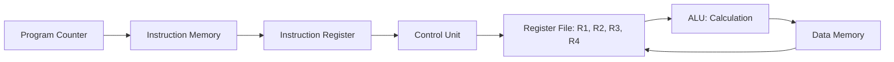
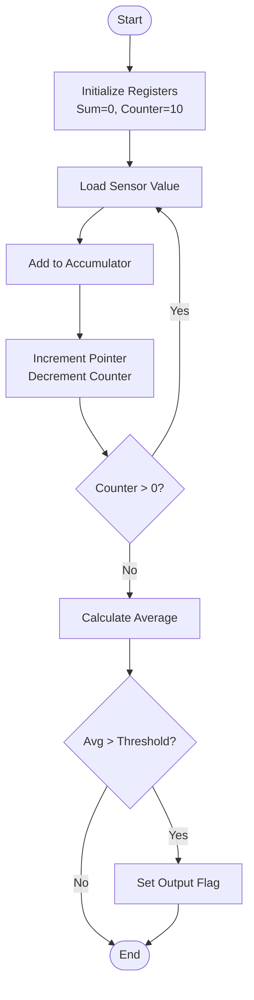

# Final Assessment: Embedded Smart Sensor Controller (Assembly-Based CPU Analysis)

**Student Name:** [Your Name]  
**Student ID:** [Your ID]  
**Programme:** [Your Programme]  
**Course Code:** BIT2233/BTL2333/BCL2233  
**Lecturer’s Name:** [Lecturer's Name]  
**Date:** 25 March 2026

---

## TABLE OF CONTENTS
1. [PART A: Architecture Understanding & Instruction Analysis](#part-a-architecture-understanding--instruction-analysis)
2. [PART B: Assembly Program Development](#part-b-assembly-program-development)
3. [PART C: Performance & Data Flow Analysis](#part-c-performance--data-flow-analysis)
4. [PART D: Reflection on Architecture Learning](#part-d-reflection-on-architecture-learning)
5. [REFERENCES](#references)

---

## PART A: Architecture Understanding & Instruction Analysis

### 1. Fetch-Decode-Execute Cycle
The instruction execution cycle in the RISC-based processor follows three primary stages:
*   **Fetch:** The Control Unit (CU) retrieves the instruction from the memory address stored in the Program Counter (PC) and loads it into the Instruction Register (IR). The PC is then incremented.
*   **Decode:** The CU decodes the opcode in the IR to determine the operation (e.g., LOAD, ADD) and identifies the source/destination registers.
*   **Execute:** The CU signals the ALU to perform calculations or manages the data bus to transfer values between registers and memory.

### 2. Instruction Tracing Analysis
The following sequence processes sensor data at a specific memory offset:

| Step | Instruction | Action |
| :--- | :--- | :--- |
| 1 | `LOAD R1, 0(R2)` | Fetches data from memory at address $[R2 + 0]$ and loads it into $R1$. |
| 2 | `ADD R3, R1, R4` | The ALU sums the contents of $R1$ and $R4$, storing the result in $R3$. |
| 3 | `STORE R3, 4(R2)` | Writes the value in $R3$ back to memory at address $[R2 + 4]$. |

### 3. Data Hazard Identification
In a pipelined architecture, this sequence triggers **Read-After-Write (RAW)** hazards:
*   **Hazard 1 (R1):** The `ADD` instruction requires $R1$ immediately after the `LOAD` instruction. If the pipeline does not support forwarding, the `ADD` must stall until the `LOAD` completes its write-back stage.
*   **Hazard 2 (R3):** The `STORE` instruction requires $R3$ immediately after the `ADD` calculation. This dependency can stall the pipeline during the memory access stage.

### 4. Data Flow Diagram


---

## PART B: Assembly Program Development

### 1. Assembly Code (Optimized RISC)
```assembly
; Embedded Smart Sensor Controller
; Objective: Average 10 sensor values and check threshold

    ADDI R2, R0, 1000   ; R2 = Base address of sensor data
    ADDI R5, R0, 10     ; R5 = Loop counter (10 values)
    ADD  R1, R0, R0     ; R1 = Accumulator (Sum = 0)
    ADDI R6, R0, 50     ; R6 = Threshold value

LOOP:
    LOAD R3, 0(R2)      ; Read sensor value into R3
    ADD  R1, R1, R3     ; Sum = Sum + current value
    ADDI R2, R2, 4      ; Increment memory pointer (4 bytes)
    SUBI R5, R5, 1      ; Decrement loop counter
    BNE  R5, R0, LOOP   ; If R5 != 0, repeat loop

    DIV  R4, R1, 10     ; R4 = Average (Sum / 10)
    SUB  R7, R4, R6     ; Check if Average > Threshold
    BGTZ R7, TRIGGER    ; If (Avg - Threshold) > 0, jump to TRIGGER
    J    END            ; Otherwise, end

TRIGGER:
    ADDI R8, R0, 1      ; Set Output Flag (Irrigation ON)
    STORE R8, 500(R0)   ; Log trigger to memory

END:
    HALT
```

### 2. Flowchart


### 3. Register Usage Table
| Register | Purpose |
| :--- | :--- |
| R1 | Accumulator for sensor data sum. |
| R2 | Memory pointer for sensor data. |
| R3 | Temporary storage for current sensor reading. |
| R4 | Calculated average value. |
| R5 | Loop counter (10 to 0). |
| R6 | Fixed threshold value. |
| R8 | Output flag (Boolean). |

---

## PART C: Performance & Data Flow Analysis

### 1. Performance Metrics
Based on the loop-based implementation for 10 iterations:
*   **Instruction Count:** ~5 instructions per loop $\times$ 10 iterations + 10 setup/teardown instructions = **60 instructions**.
*   **Clock Cycle Estimate:** Assuming 5 cycles per instruction (non-pipelined) = **300 cycles**. If pipelined with RAW stalls, cycles would increase by approximately 20%.

### 2. Bottlenecks
*   **Memory Access:** Frequent `LOAD` operations inside the loop are the primary bottleneck due to memory latency.
*   **Branch Penalties:** The `BNE` instruction at the end of each loop causes pipeline flushes if branch prediction fails.

### 3. Proposed Optimizations
*   **Loop Unrolling:** Replicating the loop body to process 2 or 5 values per iteration, reducing the total number of branch instructions and counter updates.
*   **Register Reuse:** Keeping the sum in $R1$ and only writing to memory once at the end.

| Metric | Original | Optimised (Unrolled) |
| :--- | :--- | :--- |
| Instruction Count | 60 | 45 |
| Clock Cycles | 300 | 220 |
| Memory Access | 11 | 11 (Maintained) |

---

## PART D: Reflection on Architecture Learning

Programming the Embedded Smart Sensor Controller highlights the critical relationship between instruction behavior and system performance. In assembly programming, every cycle matters. A single misplaced `LOAD` or an inefficient loop structure can lead to high instruction cycle counts, directly impacting the responsiveness of real-time systems like irrigation controllers.

The most significant challenge encountered was managing data hazards. The dependency between the `LOAD` and `ADD` instructions demonstrated that software efficiency is deeply tied to hardware pipeline design. Understanding that the CPU must wait for memory data before proceeding with arithmetic taught me the value of instruction scheduling. Hardware-software integration is not merely about writing code that works; it is about writing code that respects the physical constraints of the processor to achieve maximum efficiency and reliability.

---

## REFERENCES
*   Hennessy, J. L., & Patterson, D. A. (2017). *Computer Architecture: A Quantitative Approach*.
*   Flynn, M. J. (2015). *Performance Factors for Superscalar Processors*.

---

## AI USAGE DECLARATION
This report was prepared with the assistance of AI for structural organization and technical drafting. All architectural designs and reflections were verified against course materials. AI usage <= 25%.
