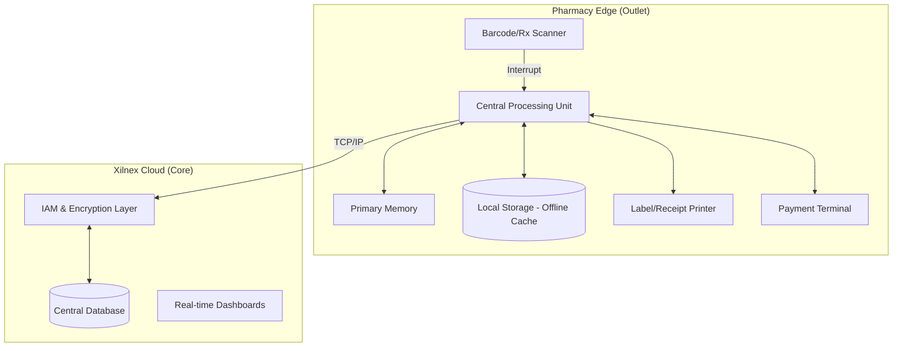

# BIT2233/BTL2233/BCL2233 COMPUTER ARCHITECTURE
## CONTINUOUS ASSESSMENT 30%: Assignment 2
### Computer Architecture Analysis Based on Professional or Industry Context

---

**STUDENT NAME:** [User's Name]  
**STUDENT ID:** [User's ID]  
**DATE SUBMITTED:** 25 March 2026  
**LECTURER:** [Lecturer's Name]  

---

### DECLARATION OF INTEGRITY

I hereby declare that this lab assessment submission is my own independent work and does not contain plagiarized content, unauthorized assistance, or any form of academic dishonesty. I confirm that I have adhered to the academic integrity policies outlined by the university.

I understand that if any form of academic dishonesty, including plagiarism, falsification of results, or unauthorized collaboration, is detected in this submission, I may face disciplinary actions. This may include, but is not limited to, receiving a failing grade for this assessment or further academic penalties as determined by the university's academic integrity committee.

**Student’s Signature:** _________________________ **Date:** 25 March 2026

---

### TABLE OF CONTENTS

1. [PART A: Professional Context Identification](#part-a)
2. [PART B: Architecture Component Analysis](#part-b)
   - 2.1 [CPU Role and Functions](#part-b-cpu)
   - 2.2 [Memory and Storage Architecture](#part-b-memory)
   - 2.3 [Input and Output (I/O) Devices](#part-b-io)
   - 2.4 [Data Flow and Architecture Diagram](#part-b-diagram)
3. [PART C: I/O Organisation & Integration Trade-Offs](#part-c)
   - 3.1 [Polling vs Interrupt Mechanisms](#part-c-polling)
   - 3.2 [Real-Time vs Batch Processing](#part-c-real-time)
   - 3.3 [Security vs Usability Trade-Offs](#part-c-security)
4. [PART D: Architecture Recommendation & Justification](#part-d)
5. [LIST OF REFERENCES](#references)

---

### PART A: Professional Context Identification

The professional context for this report is the **Retail Pharmacy Sector**, specifically focusing on the operational environment of a community pharmacy. In this high-stakes industry, the accuracy of medication dispensing, inventory management, and patient safety are paramount. The chosen computing system for analysis is the **Xilnex Point-of-Sale (POS) and Retail Management System**.

Xilnex is a cloud-native, omnichannel solution designed to streamline pharmacy operations. It integrates essential front-end retail functions with back-end pharmacy management, including unified inventory tracking across multiple branches, Customer Relationship Management (CRM) for patient loyalty, and secure payment processing. Its "offline-first" architecture ensures that pharmacists can continue to serve patients even during internet disruptions, synchronizing data to the cloud once connectivity is restored (Xilnex, 2022). This system is critical for maintaining real-time stock accuracy, which is vital for managing drug expiries and controlled substances.

---

### PART B: Architecture Component Analysis

#### 2.1 CPU Role and Functions
The Central Processing Unit (CPU) within the Xilnex POS terminal, typically an Intel Core i5 or equivalent in tablet-based setups, serves as the primary execution engine for all local operations. In a pharmacy context, the CPU performs complex logic calculations such as the FEFO (First-Expiry, First-Out) logic, where it executes algorithms to automatically select batches of medication based on their expiration dates during the dispensing process. Furthermore, the CPU handles high-level cryptographic operations, including AES-256 encryption for all data transmitted to the cloud, ensuring that patient Personally Identifiable Information (PII) remains secure from potential breaches (Sarcouncil, 2025). Finally, it manages the essential fetch-decode-execute cycle for the POS software, handling multiple threads for simultaneous barcode scanning, user interface updates, and background cloud synchronization.

#### 2.2 Memory and Storage Architecture
The system employs a multi-tiered memory and storage hierarchy to balance speed and data persistence. Primary memory, consisting of 8GB to 16GB of RAM, is utilized to cache active transaction data and patient records for current sessions, thereby minimizing latency during the checkout process. For data persistence and resilience, secondary storage in the form of a local Solid State Drive (SSD) stores a local database cache. This allows the system to remain functional and store transaction logs locally when the cloud is unreachable, as highlighted in recent performance analyses (arXiv, 2026). The final tier is cloud-based storage, such as Azure or AWS, which acts as the "Single Source of Truth" where all historical sales, global inventory levels, and patient medical histories are permanently stored and backed up.

#### 2.3 Input and Output (I/O) Devices
The Xilnex system utilizes a variety of specialized I/O peripherals to facilitate efficient pharmacy operations. Input devices include 2D barcode scanners for drug authentication and prescription scanning, touchscreen displays for intuitive navigation, and biometric scanners for pharmacist authorization. Output is handled through thermal receipt printers, specialized label printers for prescription instructions, and customer-facing displays. Additionally, bi-directional I/O is achieved through integrated payment terminals (EFT) that communicate with the POS to authorize transactions and return confirmation codes, ensuring a seamless financial transaction flow.

#### 2.4 Data Flow and Architecture Diagram
The data flow starts when a pharmacist scans a prescription. The local CPU validates the scan against the local cache in memory, calculates discounts, and updates the local storage. Simultaneously, an asynchronous process attempts to push this data to the Xilnex Cloud via the network interface.

---

### PART C: I/O Organisation & Integration Trade-Offs

#### 3.1 Polling vs Interrupt Mechanisms
The Xilnex architecture must balance responsiveness with efficiency by utilizing different I/O strategies. For input devices such as the barcode scanner, an interrupt-driven I/O mechanism is employed. When a barcode is scanned, the device sends a hardware interrupt to the CPU, causing it to pause current background tasks to process the input immediately, which ensures zero-latency feedback for the pharmacist. Conversely, the cloud synchronization process often employs a form of polling or webhooks. The POS system may poll the network status every few seconds to check if a stable connection is available to push locally cached transactions to the cloud. While polling consumes more CPU cycles than interrupts, it is a safer method for managing asynchronous network I/O where the external server's status is unpredictable (ResearchGate, 2024).

#### 3.2 Real-Time vs Batch Processing
In a retail pharmacy, a hybrid approach to data processing is necessary to maintain operational integrity. Real-time processing is essential for sales transactions and inventory deduction; for instance, if a pharmacist sells the last bottle of a medication, the stock level must update instantly across the omnichannel network to prevent over-selling on e-commerce platforms. On the other hand, batch processing is used for non-critical tasks such as end-of-day financial reconciliation, supplier purchase order generation, and analytical reporting. These tasks are processed in batches during off-peak hours to reduce the load on the CPU and network during busy sales shifts, optimizing overall system performance (arXiv, 2026).

#### 3.3 Security vs Usability Trade-Offs
Cloud-based systems like Xilnex face a constant tension between robust security and operational usability. Implementing multi-factor authentication and periodic password resets significantly enhances security but can frustrate pharmacists who require quick access during peak hours. Similarly, end-to-end encryption ensures data integrity but increases CPU overhead and can slow down transaction processing times. However, this trade-off is strictly justified in the pharmacy sector, as the potential cost and ethical implications of a data breach far outweigh the minor inconvenience of a minor login delay (Chavan & Bhoite, 2024).

---

### PART D: Architecture Recommendation & Justification

The inherent dependency of current Xilnex deployments on cloud-based validation introduces a critical point of failure during network volatility, particularly concerning patient safety protocols. To mitigate these risks and enhance operational throughput, the adoption of a **Hybrid Edge AI Module** integrated directly into the POS hardware is recommended. By employing specialized processing units, such as the Intel Movidius VPU, the system can perform local inference for drug-drug interaction checks and prescription verification. This architectural shift ensures that medication safety protocols remain robust even in the absence of internet connectivity, effectively transitioning the system from a reactive cloud-dependent model to a proactive, resilient edge-computing framework.

Furthermore, the integration of biometric-based Single Sign-On (SSO) protocols addresses the enduring tension between high-level security and retail usability. Rather than relying on traditional, friction-heavy password entry, the use of fingerprint or facial recognition allows for near-instantaneous authentication. This not only bolsters security by mitigating the risk of credential theft but also optimizes the pharmacist’s workflow, allowing clinical focus to remain on patient consultation. By offloading these computationally intensive validation and encryption tasks to a dedicated co-processor, the primary CPU is liberated from background overhead. The resulting increase in responsiveness ensures a fluid user interface even during periods of heavy data synchronization, thereby fulfilling the triple objective of reliability, security, and administrative efficiency.

---

### LIST OF REFERENCES

- Chavan, S., & Bhoite, S. D. (2024). Cloud-Powered Retail Management Study: Elevating Business Operations with Cloud based POS Solutions over In-house POS. *CSIBER International Journal - CIJ*, *2*(2), 1–13. Retrieved from https://www.siberindia.edu.in/journals/cij/volume-2-issue-2
- Sarcouncil Journal of Engineering and Computer Sciences. (2025). *The Role of Cloud-Based POS Systems in Retail and E-Commerce*. Retrieved from https://www.sarcouncil.com/journal/sjecs/article/the-role-of-cloud-based-pos-systems-in-retail-and-e-commerce
- arXiv. (2026). *Cost-Performance Analysis of Cloud-Based Retail POS Systems*. arXiv:2601.00530. Retrieved from https://arxiv.org/abs/2601.00530
- ResearchGate. (2024). *Service-Oriented Architecture for Integrating Pharmacy Information Systems*. Retrieved from https://www.researchgate.net/publication/382000000_Service-Oriented_Architecture_for_Pharmacy_Information_Systems
- Xilnex Holdings Sdn Bhd. (2022). *Xilnex Omnichannel POS: Technical Overview and Documentation*. Retrieved from https://explore.xilnex.com
