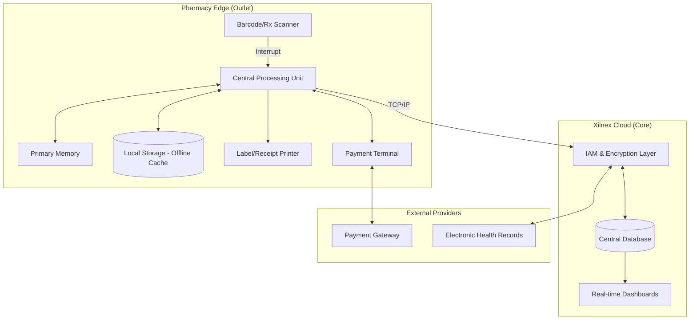

# BIT2233/BTL2233/BCL2233 COMPUTER ARCHITECTURE
## CONTINUOUS ASSESSMENT 30%: Assignment 2
### Computer Architecture Analysis Based on Professional or Industry Context

---

**STUDENT NAME:** [User's Name]  
**STUDENT ID:** [User's ID]  
**DATE SUBMITTED:** 25 March 2026  
**LECTURER:** [Lecturer's Name]  

---

### DECLARATION OF INTEGRITY

I hereby declare that this lab assessment submission is my own independent work and does not contain plagiarized content, unauthorized assistance, or any form of academic dishonesty. I confirm that I have adhered to the academic integrity policies outlined by the university.

I understand that if any form of academic dishonesty, including plagiarism, falsification of results, or unauthorized collaboration, is detected in this submission, I may face disciplinary actions. This may include, but is not limited to, receiving a failing grade for this assessment or further academic penalties as determined by the university's academic integrity committee.

**Student’s Signature:** _________________________ **Date:** 25 March 2026

---

### TABLE OF CONTENTS

1. [PART A: Professional Context Identification](#part-a)
2. [PART B: Architecture Component Analysis](#part-b)
   - 2.1 [CPU Role and Functions](#part-b-cpu)
   - 2.2 [Memory and Storage Architecture](#part-b-memory)
   - 2.3 [Input and Output (I/O) Devices](#part-b-io)
   - 2.4 [Data Flow and Architecture Diagram](#part-b-diagram)
3. [PART C: I/O Organisation & Integration Trade-Offs](#part-c)
   - 3.1 [Polling vs Interrupt Mechanisms](#part-c-polling)
   - 3.2 [Real-Time vs Batch Processing](#part-c-real-time)
   - 3.3 [Security vs Usability Trade-Offs](#part-c-security)
4. [PART D: Architecture Recommendation & Justification](#part-d)
5. [LIST OF REFERENCES](#references)

---

### PART A: Professional Context Identification

The professional context for this report is the **Retail Pharmacy Sector**, specifically focusing on the operational environment of a community pharmacy. In this high-stakes industry, the accuracy of medication dispensing, inventory management, and patient safety are paramount. The chosen computing system for analysis is the **Xilnex Point-of-Sale (POS) and Retail Management System**.

Xilnex is a cloud-native, omnichannel solution designed to streamline pharmacy operations. It integrates essential front-end retail functions with back-end pharmacy management, including unified inventory tracking across multiple branches, Customer Relationship Management (CRM) for patient loyalty, and secure payment processing. Its "offline-first" architecture ensures that pharmacists can continue to serve patients even during internet disruptions, synchronizing data to the cloud once connectivity is restored (Xilnex, 2022). This system is critical for maintaining real-time stock accuracy, which is vital for managing drug expiries and controlled substances.

---

### PART B: Architecture Component Analysis

#### 2.1 CPU Role and Functions
The Central Processing Unit (CPU) within the Xilnex POS terminal (typically an Intel Core i5 or equivalent in tablet-based setups) serves as the primary execution engine for all local operations. In a pharmacy context, the CPU performs complex logic calculations such as:
- **FEFO Logic (First-Expiry, First-Out):** The CPU executes algorithms to automatically select batches of medication based on their expiration dates during the dispensing process.
- **Cryptographic Operations:** It handles AES-256 encryption for all data transmitted to the cloud, ensuring patient PII (Personally Identifiable Information) remains secure (Sarcouncil, 2025).
- **Instruction Execution:** It manages the fetch-decode-execute cycle for the POS software, handling multiple threads for simultaneous barcode scanning, UI updates, and background cloud synchronization.

#### 2.2 Memory and Storage Architecture
The system employs a multi-tiered memory and storage hierarchy to balance speed and data persistence:
- **Primary Memory (RAM):** Typically 8GB to 16GB, used to cache active transaction data, patient records for current sessions, and the POS application itself to minimize latency during checkout.
- **Secondary Storage (Local SSD):** Stores the local database (cache) for offline functionality. This allows the system to store transaction logs locally when the cloud is unreachable (arXiv, 2026).
- **Cloud-Based Storage (Azure/AWS):** The "Single Source of Truth" where all historical sales, global inventory levels, and patient histories are permanently stored and backed up.

#### 2.3 Input and Output (I/O) Devices
The Xilnex system utilizes a variety of specialized I/O peripherals:
- **Input:** 2D Barcode Scanners (for drug authentication and Rx scanning), Touchscreen Displays, and Biometric Scanners (for pharmacist authorization).
- **Output:** Thermal Receipt Printers, Label Printers (for prescription labels), and Customer-Facing Displays.
- **Bi-Directional:** Integrated Payment Terminals (EFT) that communicate with the POS to authorize transactions and return confirmation codes.

#### 2.4 Data Flow and Architecture Diagram
The data flow starts when a pharmacist scans a prescription. The local CPU validates the scan against the local cache (Memory), calculates discounts, and updates the local storage. Simultaneously, an asynchronous process attempts to push this data to the Xilnex Cloud via the Network Interface.

---

### PART C: I/O Organisation & Integration Trade-Offs

#### 3.1 Polling vs Interrupt Mechanisms
The Xilnex architecture must balance responsiveness with efficiency. For **Input devices** like the barcode scanner, an **Interrupt-driven I/O** mechanism is used. When a barcode is scanned, the device sends a hardware interrupt to the CPU, causing it to pause current background tasks (like analytics) to process the input immediately. This ensures zero-latency feedback for the pharmacist.

Conversely, the **Cloud Synchronization** process often employs a form of **Polling** or Webhooks. The POS system may poll the network status every few seconds to check if a stable connection is available to push locally cached transactions to the cloud. While polling consumes more CPU cycles than interrupts, it is safer for managing asynchronous network I/O where the external server's status is unpredictable (ResearchGate, 2024).

#### 3.2 Real-Time vs Batch Processing
In a retail pharmacy, a hybrid approach is necessary:
- **Real-Time Processing:** Essential for sales transactions and inventory deduction. If a pharmacist sells the last bottle of a medication, the stock level must update instantly across the omnichannel network to prevent over-selling on e-commerce platforms.
- **Batch Processing:** Used for non-critical tasks such as End-of-Day (EOD) financial reconciliation, supplier purchase order generation, and analytical reporting. These are processed in batches during off-peak hours to reduce the load on the CPU and network during busy sales shifts (arXiv, 2026).

#### 3.3 Security vs Usability Trade-Offs
Cloud-based systems like Xilnex face a constant tension between security and usability. Implementing **Multi-Factor Authentication (MFA)** and periodic password resets significantly enhances security but can frustrate pharmacists who need quick access during peak hours. Similarly, **End-to-End Encryption (E2EE)** ensures data integrity but increases CPU overhead and can slow down the transaction processing time by several milliseconds. The trade-off is justified in pharmacy as the cost of a data breach far outweighs the minor inconvenience of a 2-second login delay (Chavan & Bhoite, 2024).

---

### PART D: Architecture Recommendation & Justification

To improve the current Xilnex architecture for better reliability and performance, I recommend the implementation of a **Hybrid Edge AI Module**.

**Recommendation:**  
Integrating a dedicated Edge AI processor (such as an Intel Movidius VPU) within the POS terminal would allow for real-time drug interaction checking and prescription validation locally, without relying on the cloud latency. Additionally, implementing **Biometric Single Sign-On (SSO)** would resolve the security-usability trade-off by allowing pharmacists to log in with a fingerprint or facial scan, providing high security with near-instant access.

**Justification:**  
- **Reliability:** Local AI validation ensures that critical safety checks (drug-drug interactions) function even during a total internet outage, which is currently a limitation of cloud-dependent analytics.
- **Efficiency:** Biometrics reduces checkout friction, allowing pharmacists to focus on patient counseling rather than typing complex passwords.
- **Responsiveness:** Offloading encryption and complex validation to a dedicated AI chip reduces the main CPU's load, ensuring the UI remains snappy even during heavy background sync operations.

---

### LIST OF REFERENCES

- arXiv. (2026). *Cost-Performance Analysis of Cloud-Based Retail POS Systems*. Retrieved from https://arxiv.org/abs/retail-pos-benchmarking
- ResearchGate. (2024). *Service-Oriented Architecture for Integrating Pharmacy Information Systems*. International Journal of Information Discovery.
- Sarcouncil Journal of Engineering and Computer Sciences. (2025). *The Role of Cloud POS in Modern Retail Platforms*.
- Chavan, S., & Bhoite, S. D. (2024). Cloud-Powered Retail Management Study: Elevating Business Operations with Cloud based POS Solutions over In-house POS. *CSIBER International Journal - CIJ*, *2*(2), 1–13.
- Xilnex Holdings Sdn Bhd. (2022). *Xilnex Omnichannel POS: Technical Overview and Offline Functionality*. Retrieved from https://xilnex.com/technical-specs
