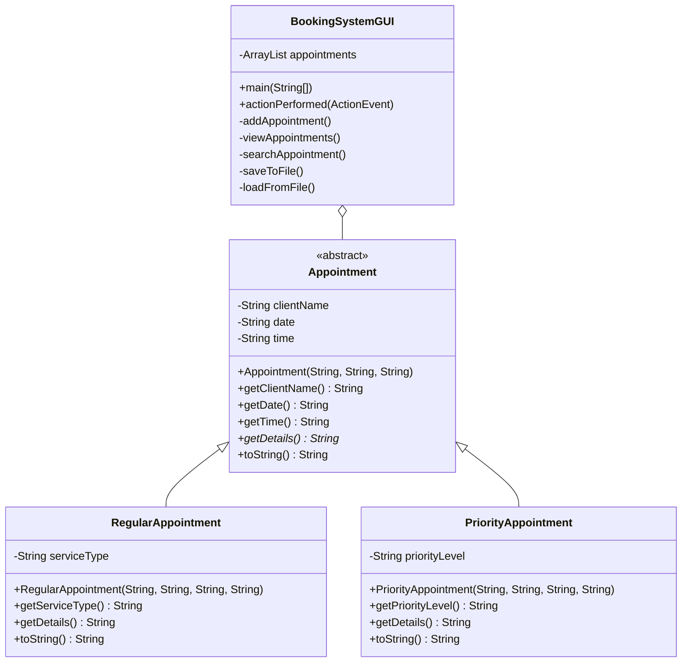

# BIT1144/BTL114/BCL1144 PROGRAMMING FUNDAMENTALS
## CONTINUOUS ASSESSMENT (ASSIGNMENT 30%): OOP PROGRAM
### APPOINTMENT BOOKING SYSTEM

**STUDENT NAME:** Jingyi Chan
**STUDENT ID:** [INSERT ID]
**DUE DATE:** 25 MARCH 2026

---

## DECLARATION OF INTEGRITY
I hereby declare that this lab assessment submission is my own independent work and does not contain plagiarized content, unauthorized assistance, or any form of academic dishonesty. I confirm that I have adhered to the academic integrity policies outlined by the university. I understand that if any form of academic dishonesty, including plagiarism, falsification of results, or unauthorized collaboration, is detected in this submission, I may face disciplinary actions. This may include, but is not limited to, receiving a failing grade for this assessment or further academic penalties as determined by the university’s academic integrity committee.

**Student’s Signature:** _________________________  **Date:** 25 March 2026

---

## 1. Problem Description
In contemporary service-oriented industries, the efficient management of client schedules is paramount to operational success. Manual booking processes are often prone to errors, such as double bookings or misplaced records, which can lead to significant administrative overhead and client dissatisfaction. To address these challenges, this project introduces a robust "Appointment Booking System" developed in Java. The system provides a centralized digital interface for recording, viewing, and searching for appointments. By categorizing appointments into "Regular" and "Priority" types, the system allows for nuanced scheduling that can prioritize urgent client needs while maintaining a steady flow for standard services. Furthermore, the integration of persistent file storage ensures that data is preserved across application sessions, providing a reliable alternative to complex database systems for small-scale applications.

## 2. Class Diagram
The following class diagram illustrates the architectural structure of the system, highlighting the relationships between the abstract base class and its specialized subclasses.

## 3. Explanation of OOP Implementation
The system leverages core principles of Object-Oriented Programming (OOP) to ensure a modular, extensible, and maintainable codebase.

### 3.1 Abstraction and Encapsulation
The `Appointment` class is defined as an `abstract` class, serving as a blueprint for all specific appointment types. It encapsulates shared attributes such as `clientName`, `date`, and `time` using the `private` access modifier. Access to these fields is strictly controlled via `public` getter and setter methods, ensuring data integrity and preventing unauthorized external modification. The abstract method `getDetails()` enforces a contract that all subclasses must implement their own specialized reporting logic.

### 3.2 Inheritance
Inheritance is demonstrated through the `RegularAppointment` and `PriorityAppointment` classes, both of which extend the `Appointment` base class. This structure promotes code reuse by allowing subclasses to inherit the foundational attributes and methods of the parent class while introducing specialized fields—such as `serviceType` for regular bookings and `priorityLevel` for urgent ones. This hierarchical design simplifies the management of diverse appointment categories.

### 3.3 Polymorphism
Polymorphism is achieved through method overriding. Both subclasses provide their own unique implementation of the `getDetails()` and `toString()` methods. In the `BookingSystemGUI` class, an `ArrayList<Appointment>` is used to store objects of both subclasses. During the "View All" operation, the system iterates through this list and invokes the overridden methods. The Java Virtual Machine (JVM) dynamically determines the correct implementation to execute based on the actual object type at runtime, allowing the system to handle different appointment types uniformly.

## 4. Explanation of File Handling
Data persistence is managed through a text-based file system using the `java.io` package. The system implements two primary operations: `saveToFile()` and `loadFromFile()`. 

For data exportation, the `PrintWriter` class is utilized to write appointment details into a comma-separated values (CSV) format within a file named `appointments.txt`. This format ensures that the data is both human-readable and easily parsable. For data importation, the `Scanner` class reads the file line-by-line, splitting the strings into individual attributes to reconstruct the `Appointment` objects within the application's memory.

Robust error handling is implemented using `try-catch` blocks. The `saveToFile()` method catches `IOException` to handle potential write errors, while `loadFromFile()` specifically addresses `FileNotFoundException` and general `Exception` types to prevent the application from crashing if the data file is missing or corrupted. This approach ensures a professional user experience by providing informative feedback via the GUI's display area.

## 5. Reflection
Developing the Appointment Booking System was a comprehensive exercise in applying theoretical programming concepts to a functional software solution. The transition from console-based applications to a Graphical User Interface (GUI) using Java Swing presented the most significant learning curve. Managing the layout managers, such as `BorderLayout` and `GridLayout`, required a meticulous approach to ensure the interface remained intuitive, responsive, and visually organized across different screen resolutions.

One of the primary challenges encountered during development was the implementation of polymorphic file handling. Since the `ArrayList` contains different types of appointment objects (both `RegularAppointment` and `PriorityAppointment`), the `saveToFile` method had to utilize the `instanceof` operator to correctly identify and extract specialized fields like `serviceType` or `priorityLevel`. This highlighted the practical importance of understanding object types within a class hierarchy. Similarly, during the loading phase, the system had to parse a specific string identifier ("Regular" or "Priority") from the CSV file to decide which subclass to instantiate. This logic was crucial for maintaining the integrity of the specialized data and demonstrated the "Factory" pattern concepts in a practical setting.

Another significant technical hurdle was ensuring robust error management. Initially, the application would crash if the `appointments.txt` file was missing or formatted incorrectly. By implementing structured `try-catch` blocks, I learned how to provide meaningful feedback to the user via `JOptionPane` and the GUI display area, rather than allowing the program to terminate abruptly. This transition towards "defensive programming" is a vital skill for creating production-ready software.

A significant limitation of the current prototype is its reliance on a simple text file for storage. While effective for small datasets, a text file lacks the advanced querying and indexing capabilities of a relational database. For instance, searching for a specific client name requires a linear search through the entire list (O(n) complexity), which would become inefficient as the number of records grows. Future iterations of this project could integrate a database like SQLite or MySQL to enhance performance and data security. Furthermore, the GUI could be improved by incorporating data validation logic, such as using `Regex` to validate the date and time formats. Overall, this project has deepened my understanding of the entire OOP lifecycle—from architectural design (Class Diagrams) to implementation, testing, and documentation.

## 6. Evidence / Appendix
### 6.1 GUI Implementation
The GUI consists of a single-frame layout featuring:
- **Input Panel:** Text fields for Name, Date, Time, and Type-specific details.
- **Action Buttons:** "Add Appointment", "View All", "Search Name", "Save to File", and "Load from File".
- **Output Area:** A scrollable text area for displaying system messages and appointment lists.

### 6.2 Sample Output (Source Code Reference)
The system generates a text file formatted as follows:
`Regular,John Doe,25-03-2026,10:00,Consultation`
`Priority,Jane Smith,25-03-2026,11:30,High`
