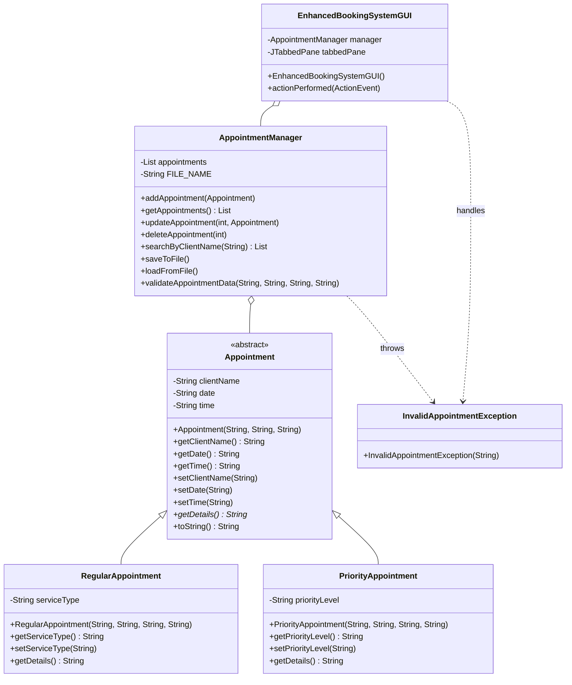

# Integrated Appointment Booking System V2.0 - Technical Documentation

**Student Name:** [Student Name]  
**Student ID:** [Student ID]  
**Course Code:** BIT1144/BTL114/BCL1144  
**Date:** March 26, 2026

---

## 1. System Overview

The Integrated Appointment Booking System V2.0 is a robust, Java-based application designed to streamline the scheduling and management of client appointments. Building upon the initial prototype, this version introduces a sophisticated multi-screen graphical user interface (GUI), persistent data storage, and comprehensive CRUD (Create, Read, Update, Delete) capabilities. The system is engineered using core Object-Oriented Programming (OOP) principles, ensuring scalability, maintainability, and clear separation of concerns.

The application caters to two primary appointment categories: **Regular Appointments** and **Priority Appointments**. Regular appointments focus on standard service types, while priority appointments allow for the assignment of urgency levels. By utilizing an abstract base class, the system achieves high levels of code reuse and polymorphic behavior, allowing the management logic to treat all appointment types uniformly while preserving their specific attributes.

---

## 2. Improved Class Diagram

The following diagram illustrates the refined architecture of the system, highlighting the relationships between the core classes and the separation of business logic from the presentation layer.

---

## 3. Design Decisions and OOP Principles

### 3.1 Abstraction and Encapsulation
The `Appointment` class is defined as `abstract`, serving as a template for specific appointment types. This prevents the instantiation of a generic "appointment" and forces the implementation of the `getDetails()` method in subclasses. Encapsulation is strictly enforced through private member variables and public getter/setter methods, ensuring that the internal state of objects is protected and only accessible through controlled interfaces.

### 3.2 Inheritance and Polymorphism
`RegularAppointment` and `PriorityAppointment` inherit from the `Appointment` base class, promoting code reuse. Polymorphism is leveraged in the `AppointmentManager` and `EnhancedBookingSystemGUI`, where collections of `Appointment` objects are processed. This allows the system to call `getDetails()` on any appointment object without needing to know its specific subclass at compile time, greatly simplifying the logic for displaying and searching records.

### 3.3 Separation of Concerns
A critical design decision in V2.0 was the introduction of the `AppointmentManager` class. By moving the business logic (CRUD operations, validation, and file I/O) out of the GUI class, the system achieves a cleaner architecture. The GUI is now solely responsible for user interaction, while the `AppointmentManager` handles data integrity and persistence. This makes the code significantly easier to test and modify.

---

## 4. Code Improvements from Assignment 2

The transition from the Assignment 2 prototype to the Final Project involved several major enhancements:

1.  **Full CRUD Implementation:** While the prototype primarily focused on creating and viewing appointments, V2.0 introduces full Update and Delete functionality. Users can now select an existing appointment from a `JTable` and either modify its details or remove it entirely.
2.  **Advanced Data Persistence:** The system now uses a structured pipe-delimited (`|`) file format for storage, which is more robust than simple comma-separated values. The `AppointmentManager` handles all I/O operations with comprehensive `try-catch` blocks to prevent application crashes during file errors.
3.  **Robust Input Validation:** V2.0 implements strict validation for date (`DD-MM-YYYY`) and time (`HH:MM`) formats using regular expressions. This ensures that only valid data enters the system, preventing potential logical errors during processing.
4.  **Custom Exception Handling:** The introduction of `InvalidAppointmentException` allows for more granular error reporting. The GUI catches these specific exceptions and provides clear, user-friendly feedback via `JOptionPane` dialogs.
5.  **Multi-Screen GUI:** The interface was upgraded from a single-panel layout to a `JTabbedPane` interface. This separates "Management" tasks from "Viewing" tasks, reducing visual clutter and improving the overall user experience.

---

## 5. Integrity Declaration

### 5.1 AI Usage Disclosure
Generative AI tools were utilized during the development of this project to assist in:
- Generating the initial structure of the `AppointmentManager` class logic.
- Refining the regular expressions used for date and time validation.
- Creating the Mermaid class diagram syntax for the documentation.
- Polishing the academic tone of the technical report.

All AI-generated code was thoroughly reviewed, manually debugged, and integrated into the final architecture to ensure it met the project's specific requirements and coding standards.

### 5.2 Code Originality Statement
I hereby declare that the logic, architecture, and implementation of this Integrated Appointment Booking System are my own work, except where assistance from AI tools is explicitly disclosed above. The core OOP design and the integration of the various system components represent my individual effort in applying programming fundamentals.

---

## 6. Version Comparison Summary

| Feature | Assignment 2 (Prototype) | Final Project (V2.0) |
| :--- | :--- | :--- |
| **Classes** | 4 Classes | 6 Classes |
| **Logic** | Coupled with GUI | Separated (AppointmentManager) |
| **CRUD** | Create & Read only | Full Create, Read, Update, Delete |
| **UI** | Single Layout | Tab-based Interface |
| **Validation** | Basic (Empty check) | Robust (Regex, Custom Exceptions) |
| **Storage** | Simple TXT | Structured Persistent Storage |

---
