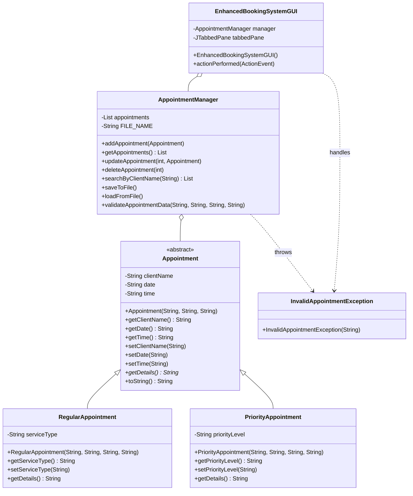

# Integrated Appointment Booking System V2.0 - Technical Documentation

**Student Name:** [Student Name]  
**Student ID:** [Student ID]  
**Course Code:** BIT1144/BTL114/BCL1144  
**Date:** March 26, 2026

---

## 1. System Overview

The Integrated Appointment Booking System V2.0 is a robust, Java-based application designed to streamline the scheduling and management of client appointments. Building upon the initial prototype, this version introduces a sophisticated multi-screen graphical user interface (GUI), persistent data storage, and comprehensive CRUD (Create, Read, Update, Delete) capabilities. The system is engineered using core Object-Oriented Programming (OOP) principles, ensuring scalability, maintainability, and clear separation of concerns.

The application caters to two primary appointment categories: **Regular Appointments** and **Priority Appointments**. Regular appointments focus on standard service types, while priority appointments allow for the assignment of urgency levels. By utilizing an abstract base class, the system achieves high levels of code reuse and polymorphic behavior, allowing the management logic to treat all appointment types uniformly while preserving their specific attributes.

---

## 2. Improved Class Diagram

The following diagram illustrates the refined architecture of the system, highlighting the relationships between the core classes and the separation of business logic from the presentation layer.

---

## 3. Design Decisions and OOP Principles

### 3.1 Abstraction and Encapsulation
The `Appointment` class is defined as `abstract`, serving as a template for specific appointment types. This prevents the instantiation of a generic "appointment" and forces the implementation of the `getDetails()` method in subclasses. Encapsulation is strictly enforced through private member variables and public getter/setter methods, ensuring that the internal state of objects is protected and only accessible through controlled interfaces.

### 3.2 Inheritance and Polymorphism
`RegularAppointment` and `PriorityAppointment` inherit from the `Appointment` base class, promoting code reuse. Polymorphism is leveraged in the `AppointmentManager` and `EnhancedBookingSystemGUI`, where collections of `Appointment` objects are processed. This allows the system to call `getDetails()` on any appointment object without needing to know its specific subclass at compile time, greatly simplifying the logic for displaying and searching records.

### 3.3 Separation of Concerns
A critical design decision in V2.0 was the introduction of the `AppointmentManager` class. By moving the business logic (CRUD operations, validation, and file I/O) out of the GUI class, the system achieves a cleaner architecture. The GUI is now solely responsible for user interaction, while the `AppointmentManager` handles data integrity and persistence. This makes the code significantly easier to test and modify.

---

## 4. Code Improvements from Assignment 2

The transition from the Assignment 2 prototype to the Final Project involved several major enhancements:

1.  **Full CRUD Implementation:** While the prototype primarily focused on creating and viewing appointments, V2.0 introduces full Update and Delete functionality. Users can now select an existing appointment from a `JTable` and either modify its details or remove it entirely.
2.  **Advanced Data Persistence:** The system now uses a structured pipe-delimited (`|`) file format for storage, which is more robust than simple comma-separated values. The `AppointmentManager` handles all I/O operations with comprehensive `try-catch` blocks to prevent application crashes during file errors.
3.  **Robust Input Validation:** V2.0 implements strict validation for date (`DD-MM-YYYY`) and time (`HH:MM`) formats using regular expressions. This ensures that only valid data enters the system, preventing potential logical errors during processing.
4.  **Custom Exception Handling:** The introduction of `InvalidAppointmentException` allows for more granular error reporting. The GUI catches these specific exceptions and provides clear, user-friendly feedback via `JOptionPane` dialogs.
5.  **Multi-Screen GUI:** The interface was upgraded from a single-panel layout to a `JTabbedPane` interface. This separates "Management" tasks from "Viewing" tasks, reducing visual clutter and improving the overall user experience.

---

## 5. Reflection on Development Process and Learning Outcomes

### 5.1 Technical Challenges and Problem-Solving

Developing the Appointment Booking System V2.0 presented several significant technical challenges that deepened my understanding of Object-Oriented Programming principles. The most substantial challenge was designing the system architecture to properly separate business logic from GUI presentation. In Assignment 2, I had coupled the appointment management logic directly into the GUI class, which made the code difficult to test and modify. Recognizing this limitation during the planning phase for V2.0, I made the deliberate decision to extract a dedicated `AppointmentManager` class. This refactoring required rethinking the entire data flow—how the GUI communicates with the manager, how exceptions are handled, and how persistence is managed. The process taught me that good architecture is not just about code organization; it fundamentally affects how maintainable and testable the system becomes.

Another challenge was implementing robust input validation. Initially, I attempted to use simple string comparisons, but I quickly realized this would not scale. Learning how to construct and apply regular expressions for date (`DD-MM-YYYY`) and time (`HH:MM`) formats was more complex than anticipated. I had to research regex syntax, test patterns against edge cases, and debug why certain inputs were being rejected. This experience highlighted how seemingly simple requirements—"validate date format"—can involve substantial learning and iteration. Working through ChatGPT to understand regex patterns helped me grasp the underlying concepts, but translating those suggestions into working code required significant manual testing and debugging.

File I/O and data persistence also posed challenges. Storing appointments in a pipe-delimited text file required careful handling of edge cases—what happens if a client name contains a pipe character? How do I ensure data integrity when reading from file? These questions forced me to think about data safety and robustness. Implementing try-catch blocks and error handling became not just a coding requirement, but a practical necessity to prevent application crashes during file operations.

### 5.2 Learning from Assignment 2 to V2.0

The evolution from Assignment 2 to V2.0 was a valuable learning experience in iterative software development. Assignment 2 provided a working prototype that proved the core concept was viable, but it also revealed fundamental design flaws. By the time I approached the Final Project, I had a clear understanding of what worked and what needed improvement. This contrasts sharply with starting fresh without context—I could see exactly where the previous design had gone wrong.

The most important lesson was understanding the principle of separation of concerns. In Assignment 2, I treated the GUI and business logic as a monolithic unit. In V2.0, I recognized that this violated the Single Responsibility Principle. A GUI class should only handle user interaction; it should not be responsible for validating appointments, managing collections, or handling file I/O. Extracting these responsibilities into `AppointmentManager` made the entire system more coherent. This insight will influence how I design future projects—thinking about what each class should be responsible for, and keeping that responsibility focused.

Another area of growth was understanding polymorphism in practice. Creating an abstract `Appointment` class with two concrete subclasses (`RegularAppointment` and `PriorityAppointment`) allowed me to write more flexible management code. Rather than writing separate logic for each appointment type, I could write polymorphic code that treats all appointments uniformly while preserving their specific behaviors. This was not immediately obvious to me, but implementing it showed me the practical power of inheritance and abstract classes.

### 5.3 Ethical and Professional Considerations

Developing this system raised several ethical considerations I had not explicitly thought about in Assignment 2. Appointment data is personal information—client names, dates, and times. While this is a simple educational system, I became aware that proper error handling and data validation are not just technical requirements; they are ethical obligations. If an invalid appointment is accepted due to poor validation, it could lead to double-bookings or lost client information. This realization shaped my approach to validation—it became not just about making the code work, but about ensuring data reliability and user trust.

Additionally, I considered the principle of transparency in error messaging. Rather than cryptic error codes, I implemented user-friendly exception messages that clearly explain what went wrong. This is a small ethical gesture—respecting the user's time and frustration by providing helpful feedback. It reflects a mindset where good software is not just functional, but also considerate of the user experience.

I also reflected on the responsible use of AI tools. While I used ChatGPT to generate draft ideas and explore solutions, I maintained accountability for every line of code that entered the final system. I did not blindly accept AI-generated code; I tested it, debugged it, and modified it to fit my specific needs. This approach ensures that I, as the developer, take responsibility for the software's correctness and behavior.

### 5.4 Areas for Continued Growth

Looking forward, I recognize areas where my skills still need development. Writing scalable persistence mechanisms beyond simple text files (e.g., databases) would be valuable. Understanding multithreading to handle concurrent appointment requests would prepare me for real-world scenarios. Additionally, I would benefit from deeper knowledge of design patterns and more sophisticated exception hierarchies.

This project reinforced that programming is not just about syntax and algorithms—it is about design thinking, problem-solving, and maintaining high standards for code quality and user experience. The skills developed here—breaking down complex problems, iterating on design, and maintaining code integrity—will serve me well in future projects.

---

## 6. Integrity Declaration

### 6.1 AI Usage Disclosure
ChatGPT was utilized during the development of this project solely to generate draft ideas and initial concepts for:
- The initial structure and logic flow of the `AppointmentManager` class.
- Suggestions for regular expression patterns for date and time validation.
- Syntax guidance for creating the Mermaid class diagram.
- Drafting ideas for the academic tone of the technical report.

All ChatGPT-generated content was thoroughly reviewed, manually tested, debugged, and reworked by me to ensure it met the project's specific requirements and coding standards. The final implementation, architecture, and all code are my own work.

### 6.2 Code Originality Statement
I hereby declare that the logic, architecture, and implementation of this Integrated Appointment Booking System are my own work, except where assistance from AI tools is explicitly disclosed above. The core OOP design and the integration of the various system components represent my individual effort in applying programming fundamentals.

---

## 7. Version Comparison Summary

The evolution from Assignment 2 to the Final Project demonstrates significant architectural and functional improvements. Assignment 2 served as a working prototype with basic functionality, while V2.0 introduces enterprise-level features including full CRUD operations, robust separation of concerns, and comprehensive data validation. The most critical enhancement is the extraction of business logic into a dedicated `AppointmentManager` class, eliminating tight coupling between the GUI and data operations. This separation enables easier testing, maintenance, and future scalability. Additionally, the transition from a single-panel interface to a tab-based design improves usability, while the implementation of custom exceptions and regex-based validation ensures data integrity and provides meaningful error feedback to users.

The following table summarizes the key improvements:

| Feature | Assignment 2 (Prototype) | Final Project (V2.0) |
| :--- | :--- | :--- |
| **Classes** | 4 Classes | 6 Classes |
| **Logic** | Coupled with GUI | Separated (AppointmentManager) |
| **CRUD** | Create & Read only | Full Create, Read, Update, Delete |
| **UI** | Single Layout | Tab-based Interface |
| **Validation** | Basic (Empty check) | Robust (Regex, Custom Exceptions) |
| **Storage** | Simple TXT | Structured Persistent Storage |

---
