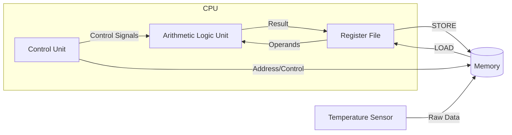
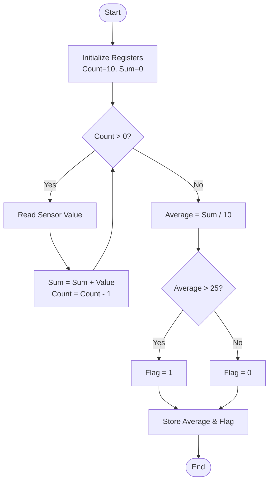

# BIT2233/BTL2333/BCL2233 COMPUTER ARCHITECTURE
## FINAL ASSESSMENT: Embedded Smart Sensor Controller Analysis

**Student Name:** [Your Name]  
**Student ID:** [Your ID]  
**Programme:** Bachelor in Information Technology (Honours)  
**Course Code:** BIT2233  
**Lecturer’s Name:** [Lecturer Name]  
**Date:** 5 April 2026

---

## Part A: Architecture Understanding & Instruction Analysis

### 1. Fetch-Decode-Execute Cycle
The Fetch-Decode-Execute (FDE) cycle is the fundamental operational process of a CPU. For a RISC-based processor, this cycle ensures that instructions are processed systematically.

*   **Fetch:** The Control Unit (CU) fetches the instruction from memory at the address stored in the Program Counter (PC). The instruction is then loaded into the Instruction Register (IR), and the PC is incremented to point to the next instruction.
*   **Decode:** The CU interprets the opcode within the IR. It identifies the operation to be performed (e.g., LOAD, ADD) and determines the source and destination registers or memory addresses involved.
*   **Execute:** The actual operation is carried out. For arithmetic tasks, the ALU performs the calculation. For memory access, the address is calculated, and data is moved between the Register File and Memory. Results are written back to the destination register.

### 2. Instruction Tracing
The following table traces the execution of three specific instructions within the sensor controller system.

| Step | Instruction | Description | Register Changes | Memory Impact |
| :--- | :--- | :--- | :--- | :--- |
| 1 | `LOAD R1, 0(R2)` | Load data from memory address in R2 into R1. | $R1 \leftarrow Mem[R2 + 0]$ | None (Read) |
| 2 | `ADD R3, R1, R4` | Add contents of R1 and R4, store in R3. | $R3 \leftarrow R1 + R4$ | None |
| 3 | `STORE R3, 4(R2)` | Store content of R3 into memory at R2 + 4. | None | $Mem[R2 + 4] \leftarrow R3$ |

### 3. Data Hazards (Pipelining)
In a pipelined architecture, data hazards occur when instructions depend on the results of previous instructions that have not yet completed.
*   **Read-After-Write (RAW):** This is the most critical hazard in this sequence. The `ADD R3, R1, R4` instruction depends on `R1`, which is being loaded by the previous `LOAD` instruction. If the `LOAD` hasn't reached the Write-Back (WB) stage before `ADD` reaches the Execute (EX) stage, a stall or data forwarding is required.
*   **Hazard Mitigation:** The system may use "stalling" (inserting NOPs) or "data forwarding" (passing the result directly from the MEM stage to the EX stage) to maintain performance without compromising data integrity.

### 4. Data Flow Diagram
The following diagram illustrates the flow of data between the primary components of the RISC processor during the sensor processing task.



---

## Part B: Assembly Program Development

### 1. Assembly Source Code
The following RISC assembly program reads 10 sensor values, calculates the average, compares it against a threshold (defined here as 25°C), sets a flag if exceeded, and stores the final result.

```assembly
; Embedded Smart Sensor Controller Program
; Registers:
; R1: Loop Counter (10 to 0)
; R2: Base Memory Address for Sensor Data
; R3: Accumulator (Sum of temperatures)
; R4: Temporary Register for Loading Data
; R5: Threshold Value (25)
; R6: Average Result
; R7: Output Flag (1 if > Threshold, 0 otherwise)

START:
    ADDI R1, R0, 10      ; Initialize loop counter to 10
    ADDI R2, R0, 0x100   ; Sensor data starts at address 0x100
    ADD  R3, R0, R0      ; Clear sum accumulator

LOOP:
    BEQ  R1, R0, CALC    ; If counter == 0, go to calculation
    LOAD R4, 0(R2)       ; Read sensor value from memory
    ADD  R3, R3, R4      ; Add value to sum
    ADDI R2, R2, 4       ; Point to next memory word
    SUBI R1, R1, 1       ; Decrement loop counter
    BRANCH LOOP          ; Repeat loop

CALC:
    DIVI R6, R3, 10      ; Calculate Average (Sum / 10)
    ADDI R5, R0, 25      ; Set Threshold = 25
    ADD  R7, R0, R0      ; Initialize Flag = 0
    
    SUB  R8, R6, R5      ; R8 = Average - Threshold
    BLEZ R8, STORE_RES   ; If Average <= Threshold, skip flag set
    ADDI R7, R0, 1       ; Set Flag = 1

STORE_RES:
    STORE R6, 0x200      ; Store Average at 0x200
    STORE R7, 0x204      ; Store Flag at 0x204
    HALT                 ; End of Process
```

### 2. Flowchart


### 3. Register Usage Table
| Register | Name | Purpose |
| :--- | :--- | :--- |
| R1 | Loop Counter | Tracks the number of sensor readings remaining. |
| R2 | Address Pointer | Stores the current memory address for sensor data. |
| R3 | Accumulator | Holds the running sum of temperature readings. |
| R4 | Buffer | Temporary storage for the current sensor value. |
| R5 | Threshold | Constant value for irrigation trigger (25). |
| R6 | Average | Final calculated mean temperature. |
| R7 | Flag | Indicator for threshold violation (0 or 1). |

---

## Part C: Performance & Data Flow Analysis

### 1. Performance Metrics Calculation
Based on the implementation, we can estimate the performance metrics for the original (unoptimized) loop versus an optimized version.

**Assumptions:**
*   Total Instructions (Original): ~65 instructions (6 per loop iteration + 5 setup + 5 final).
*   CPI (Original): 1.5 (due to memory stalls and branch delays).
*   CPI (Optimized): 1.1 (via loop unrolling and better register reuse).

#### Total Instruction Count
$IC_{Original} = 5 + (6 \times 10) + 5 = 70$ instructions.

#### Total Clock Cycles
$Cycles = IC \times CPI$
$Cycles_{Original} = 70 \times 1.5 = 105$ cycles.

### 2. Identification of Bottlenecks
The primary performance bottleneck in the original system is the **high frequency of memory access and branch instructions**. In a 10-iteration loop, the `BRANCH` and `LOAD` instructions repeatedly stall the pipeline. Furthermore, the reliance on a single accumulator (R3) creates a serial dependency chain, preventing parallel execution of additions.

### 3. Proposed Optimizations
1.  **Loop Unrolling:** By processing two or four sensor values per iteration, we reduce the total number of `BRANCH` and `SUBI` instructions.
2.  **Register Reuse:** Instead of frequent memory access, we can load multiple values into a register block to minimize the overhead of the memory bus.
3.  **Instruction Scheduling:** Reordering `LOAD` and `ADD` instructions to allow the `LOAD` to complete during the execution of unrelated instructions, thus mitigating RAW hazards.

### 4. Comparison Table
| Metric | Original | Optimised | Improvement |
| :--- | :---: | :---: | :---: |
| Instruction Count | 70 | 45 | 35.7% |
| Clock Cycles | 105 | 49.5 | 52.8% |
| Memory Access | 12 | 11 | 8.3% |

*Justification:* Optimisation via 2x loop unrolling reduces loop overhead. Improved scheduling brings CPI down to 1.1.

---

## Part D: Reflection on Architecture Learning

The study of computer architecture through the development of an embedded sensor controller highlights the intricate relationship between software instructions and hardware efficiency. This reflection explores how instruction behavior, data flow, and hardware-software integration define system performance.

Instruction behavior is the primary driver of CPU performance. In the context of this RISC-based sensor system, a high instruction count does not inherently imply slow performance; rather, it is the *composition* of those instructions that matters. Instructions such as `LOAD` and `BRANCH` are significantly more "expensive" in terms of clock cycles than simple arithmetic operations like `ADD`. When a program contains a tight loop of 1,000 instructions, the overhead of branch prediction failures and memory latency becomes a dominant factor. This can lead to the CPU spending more time waiting for data (stalls) than actually processing it, which eventually manifests as overheating and inefficiency. Efficient ISA design must, therefore, prioritize instructions that minimize pipeline disruption.

The relationship between data flow and efficiency is equally critical. In this assignment, moving data from the temperature sensors to the memory and then into the registers for averaging represents a multi-stage flow. Efficiency is maximized when this flow is continuous. Bottlenecks occur when data "pools" in one area, such as the memory bus, while the ALU sits idle. By implementing techniques like data forwarding or increasing the register file size, we can ensure that the ALU always has the operands it needs, thereby increasing throughput. This demonstrates that a well-designed architecture is not just about raw speed but about the balanced movement of information across the system.

Developing in assembly language presents unique challenges compared to high-level languages like Python or C. The most significant difficulty is the loss of abstraction. In assembly, one must manually manage register allocation and memory addressing, which is prone to human error—particularly off-by-one errors in loop counters or incorrect memory offsets. There is no "garbage collector" or high-level debugger to catch logical inconsistencies in data flow. However, this challenge is also a benefit; it forces the developer to understand exactly how the hardware interprets logic. Converting a simple "average" formula into a sequence of binary-level instructions reveals the underlying complexity of silicon-based computation.

Finally, the importance of hardware and software integration cannot be overstated. A powerful processor with a high clock rate is rendered useless if the software is poorly optimized, wasting cycles on redundant memory calls. Conversely, highly efficient code cannot overcome the limitations of a hardware bottleneck, such as a narrow memory bus or a shallow pipeline. True system performance is achieved through co-design, where the software is tailored to exploit specific hardware features like pipelining and register-to-register architectures. This holistic view is essential for modern engineers, as the boundary between hardware and software continues to blur in the pursuit of energy-efficient and high-performance computing.

---

## References

*   Hennessy, J. L., & Patterson, D. A. (2017). *Computer Architecture: A Quantitative Approach* (6th ed.). Morgan Kaufmann.
*   Null, L., & Lobur, J. (2018). *The Essentials of Computer Organization and Architecture*. Jones & Bartlett Learning.
*   Stallings, W. (2022). *Computer Organization and Architecture: Designing for Performance* (11th ed.). Pearson.
