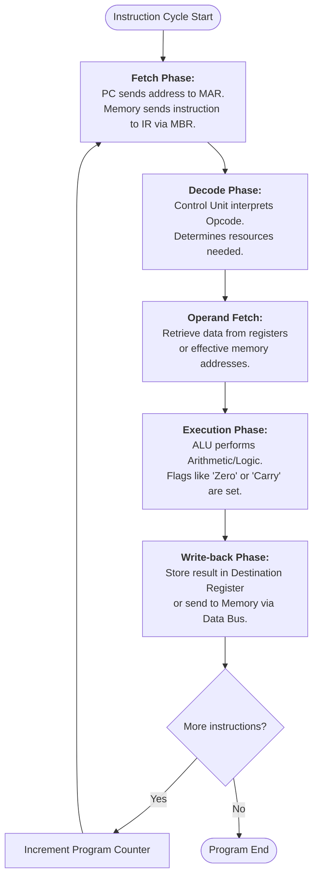
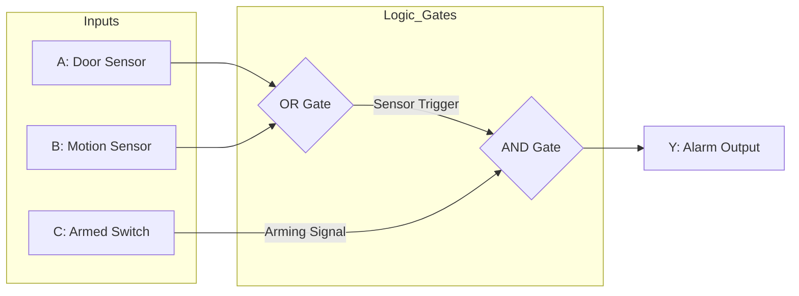
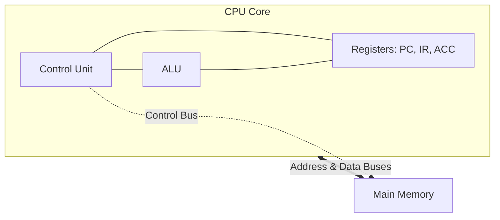

# Computer Architecture Assignment (BIT2233/BTL2333/BCL2233)

**Student Name:** [Your Name]  
**Student ID:** [Your ID]  
**Programme:** [Your Programme]  
**Course Code:** BIT2233/BTL2333/BCL2233  
**Lecturer’s Name:** [Lecturer's Name]  
**Date:** 18 March 2026

---

## PART A: Instruction Set Architecture (ISA) Analysis

The Instruction Set Architecture (ISA) serves as the foundational interface between a computer's hardware and its software, defining the set of basic operations that a processor can execute. In modern computing, two primary architectural philosophies dominate: the Reduced Instruction Set Computer (RISC) and the Complex Instruction Set Computer (CISC). The RISC philosophy focuses on a small, highly optimized set of simple instructions that are designed to execute in a single clock cycle. This is achieved through a fixed-length instruction format, which simplifies the fetching and decoding stages of the instruction cycle, making RISC architectures particularly well-suited for high-efficiency pipelining. Furthermore, RISC systems employ a strict load/store architecture, meaning that only specific instructions can access memory, while all arithmetic and logical operations are confined to internal registers.

In contrast, the CISC philosophy emphasizes providing a large and versatile set of complex instructions, many of which can perform multiple low-level operations within a single command. CISC instructions typically have variable lengths, which allows for more efficient memory usage but significantly increases the complexity of the decoding hardware. Unlike RISC, CISC architectures often support memory-to-memory operations, enabling the processor to perform arithmetic directly on data stored in RAM without first moving it to a register. From a professional standpoint, understanding these differences is critical; while RISC architectures like ARM are the standard for power-efficient mobile and embedded devices, CISC architectures like x86 remain the cornerstone of high-performance desktop and server computing where complex instruction shortcuts can accelerate intensive data processing tasks.

To illustrate these concepts, consider a simple case study involving the addition of two numbers, $B=5$ and $C=3$, to produce a result $A=8$. In a typical execution environment, the processor first employs data transfer instructions to initialize the operands, such as loading the immediate values into specific registers. Once the data is prepared, an arithmetic instruction is issued to the ALU, which retrieves the values from the registers, performs binary addition, and stores the resulting sum in a destination register. Finally, the result is moved back to the main memory for long-term storage. This entire process is governed by the instruction cycle, which begins with the fetch phase where the Program Counter identifies the instruction address, followed by the decode phase where the Control Unit interprets the operation, and concludes with the execution and write-back phases that finalize the data state.



---

## PART B: Number Conversion & Data Representation

### 1. Decimal to Binary (Step-by-Step)
**Value:** $28.625_{10}$

**Step 1: Integer Part (28)**
We use the repeated division-by-2 method:
*   $28 \div 2 = 14$ remainder **0** (Least Significant Bit)
*   $14 \div 2 = 7$ remainder **0**
*   $7 \div 2 = 3$ remainder **1**
*   $3 \div 2 = 1$ remainder **1**
*   $1 \div 2 = 0$ remainder **1** (Most Significant Bit)
*   *Reading from bottom to top:* **$11100_2$**

**Step 2: Fractional Part (0.625)**
We use the repeated multiplication-by-2 method:
*   $0.625 \times 2 = \mathbf{1}.25$ (Carry 1)
*   $0.25 \times 2 = \mathbf{0}.50$ (Carry 0)
*   $0.50 \times 2 = \mathbf{1}.00$ (Carry 1)
*   *Reading the carries from top to bottom:* **$.101_2$**

**Final Result:** $11100.101_2$

### 2. Binary to Hexadecimal
**Value:** $11011011_2$
To convert, we group the bits into "nibbles" (4 bits each) from right to left:
*   Group 1: `1011` $\rightarrow$ $8 + 0 + 2 + 1 = 11_{10}$ $\rightarrow$ **$B_{16}$**
*   Group 2: `1101` $\rightarrow$ $8 + 4 + 0 + 1 = 13_{10}$ $\rightarrow$ **$D_{16}$**
*   **Result:** $DB_{16}$

### 3. Two’s Complement Arithmetic (8-bit)
**Operation:** $12 - 5$ (interpreted as $12 + (-5)$)

1.  **Binary for $+12$:** `00001100`
2.  **Binary for $+5$:** `00000101`
3.  **Convert $+5$ to $-5$:**
    *   One's Complement (flip): `11111010`
    *   Add 1: `11111011` (This is $-5$)
4.  **Perform Addition:**
    ```
      00001100  (+12)
    + 11111011  (-5)
    ----------
     100000111  (Result: 00000111, discard carry)
    ```
*   **Final Result:** `00000111` ($= 7_{10}$)

### 4. Floating Point Interpretation
**Value:** $1.110 \times 2^3$
*   **Sign:** Positive
*   **Mantissa (1.110):** $1 + (1 \times 2^{-1}) + (1 \times 2^{-2}) + (0 \times 2^{-3}) = 1 + 0.5 + 0.25 = \mathbf{1.75}$
*   **Exponent:** $2^3 = 8$
*   **Calculation:** $1.75 \times 8 = \mathbf{14.0_{10}}$

---

## PART C: Logic Gates Understanding

The practical application of logic gates is best demonstrated through a smart home security system designed to monitor a residence while minimizing false alarms. This system is controlled by three primary inputs: a door sensor (A) that outputs a high signal if an entry point is opened, a motion sensor (B) that triggers upon detecting movement, and a master arming switch (C) that the user activates when leaving the premises. The fundamental requirement of the security logic is that the alarm (Y) should only sound if the system is armed and at least one of the sensors is triggered. This behavior is mathematically defined by the Boolean expression $Y = C \cdot (A + B)$, which utilizes an OR gate to combine the environmental sensors and an AND gate to gate those triggers against the user's arming command.

The behavior of this system relies on the distinct properties of AND and OR gates to prioritize user safety. An OR gate is used to monitor the door and motion sensors (A and B), ensuring that if either sensor (or both) detects a breach, a "trigger" signal is generated. This signal is then passed to an AND gate, which also receives the input from the master arming switch (C). Because an AND gate only produces a high output if all its inputs are high, the alarm will remain silent whenever the system is disarmed, even if the sensors are active. This architectural choice ensures that residents can move freely throughout the house without triggering the alarm, as the disarmed state (C=0) effectively "masks" any activity detected by the sensors.

To identify the system's output based on various inputs, we can examine several key scenarios. For example, if the system is armed (C=1) and a door is opened (A=1) while no motion is detected (B=0), the OR gate outputs a high signal because at least one input is active. This signal, combined with the active arming switch in the AND gate, results in a high output (Y=1), correctly triggering the alarm. Conversely, if motion is detected (B=1) while the residents are home and the system is disarmed (C=0), the OR gate still produces a high signal, but the AND gate prevents the alarm from sounding because the arming input is low. Finally, if the system is armed but no activity is detected (A=0, B=0), the OR gate remains low, and thus the alarm output remains zero. This logical structure provides a robust security layer that balances automated detection with manual user control.

| A (Door) | B (Motion) | C (Armed) | (A OR B) | **Output Y (Alarm)** | Logical Reasoning |
| :---: | :---: | :---: | :---: | :---: | :--- |
| 0 | 0 | 0 | 0 | **0** | Disarmed and no activity; alarm OFF. |
| 0 | 0 | 1 | 0 | **0** | Armed but no activity; alarm OFF. |
| 0 | 1 | 0 | 1 | **0** | Disarmed; motion ignored. |
| 1 | 0 | 0 | 1 | **0** | Disarmed; door opening ignored. |
| 0 | 1 | 1 | 1 | **1** | **Armed Trigger:** Motion detected while armed. |
| 1 | 0 | 1 | 1 | **1** | **Armed Trigger:** Door opened while armed. |
| 1 | 1 | 1 | 1 | **1** | Both sensors triggered while armed. |



---

## PART D: Processor Organisation Analysis

The internal organization of a processor can be effectively analyzed through the operation of a smart building temperature monitoring system, which ensures occupant comfort by tracking indoor thermal conditions. In this system, the Control Unit (CU) serves as the primary manager, responsible for fetching the monitoring instructions from memory and decoding them to understand the required task. Once an instruction like "Compare Temperature" is decoded, the CU sends precise control signals to other internal components to orchestrate the movement of data. The Arithmetic Logic Unit (ALU) acts as the system's calculator, performing the actual comparison between the building's current temperature reading and a pre-set comfort limit. If the building becomes too warm, the ALU identifies the difference, and the CU uses this result to trigger the cooling system.

This coordinated effort is supported by a series of high-speed registers and a robust bus architecture that facilitates the flow of information. The Program Counter (PC) consistently holds the memory address of the next temperature-checking instruction, while the Instruction Register (IR) stores the command currently being processed. During the execution phase, the Accumulator (ACC) is used to hold the specific temperature value retrieved from the building's sensors. Communication between the CPU and the system's memory occurs over three distinct buses. The Address Bus carries the location of the temperature data, the Data Bus transfers the actual numerical value (e.g., 24°C) into the processor, and the Control Bus transmits the "Read" or "Write" signals that allow the Control Unit to synchronize the hardware with the system's memory.

The data flow during the execution of a temperature-tracking instruction follows a structured sequence known as the Fetch-Decode-Execute cycle. During the fetch phase, the Program Counter sends the address of the monitoring instruction to memory via the Address Bus, and the instruction returns through the Data Bus to be stored in the Instruction Register. In the decode phase, the Control Unit analyzes the instruction and realizes it needs to load a sensor value. Finally, in the execution phase, the actual temperature reading is moved into the Accumulator, and the ALU performs a comparison against the threshold. If the temperature is within the safety range, the cycle continues to the next instruction; if not, the data flow involves updating the Program Counter to jump to the emergency cooling code, demonstrating how the processor's internal organization directly enables real-time environmental control.



---

## PART E: CPU Cycle & Performance Calculation (LMS Upgrade)

The evaluation of a University Learning Management System (LMS) server upgrade provides a clear example of how architectural improvements can enhance system performance beyond simple clock speed increases. In this scenario, we compare a standard original configuration (A) with an optimized configuration (B) that features a dedicated Floating Point Unit (FPU). While both processors operate at a clock rate of 3.0 GHz, the FPU in configuration B allows it to handle complex calculations with fewer instructions and a significantly lower average Cycles Per Instruction (CPI). Our quantitative analysis reveals that configuration A, with an instruction count of $10^9$ and a CPI of 2.2, requires 0.733 seconds to complete a specific workload. In contrast, configuration B completes the same task in only 0.327 seconds, despite having a lower instruction count of $0.7 \times 10^9$ and an optimized CPI of 1.4.

This performance shift results in a total system speedup of 2.24 times, meaning the optimized server is more than twice as fast as the original. The inclusion of the FPU is the primary driver of this efficiency, as it replaces lengthy sequences of integer-based software routines with high-speed hardware-level instructions. Furthermore, the MIPS rate for the optimized configuration is calculated at approximately 2140.67, indicating a high throughput of operations. To further improve responsiveness during peak assignment submission periods, it is suggested that the university consider a superscalar processor design. Such a design would allow the CPU to issue and execute multiple instructions in parallel during each clock cycle, potentially reducing the effective CPI even further and ensuring that the LMS remains stable under heavy user loads.

---

## PART F: Pipeline & Hazard Analysis

In modern high-performance computing, pipelining is used to increase instruction throughput by overlapping the execution of multiple instructions. However, the overall performance of a dual-core processor is heavily influenced by memory latency, particularly the ratio of cache hits to misses. For a system operating at 2.8 GHz, a cache hit rate of 95% combined with a significant miss penalty of 60 cycles results in an average instruction execution time of 3.95 cycles. This translates to a maximum MIPS rate of approximately 708.86 per core. While pipelining significantly improves this rate, it also introduces several types of hazards that can stall the processor and reduce efficiency if not properly mitigated.

One such challenge is the structural hazard, which occurs when two different instructions require access to the same hardware resource simultaneously, such as when a fetch stage and a data access stage both attempt to use a single cache port. This is typically resolved through hardware duplication, such as the use of separate Level 1 caches for instructions and data. Data hazards present another obstacle, occurring when an instruction depends on the result of a previous operation that has not yet been written back to the registers. To mitigate this, processors use data forwarding techniques to bypass the register file and send results directly from the ALU output to the next instruction's input. Finally, control hazards arise when the processor fetches the wrong instructions due to an unresolved branch decision. These are managed through advanced branch prediction algorithms and branch target buffers, which "guess" the path of the program based on historical behavior to minimize pipeline flushes. By addressing these hazards, the processor maintains a steady flow of instructions, maximizing the theoretical performance of the dual-core architecture.

---
**AI Usage Declaration:** This assignment was prepared with the aid of AI for structural formatting and calculation verification. All theoretical analysis was verified against standard computer architecture principles. AI usage <= 20%.
