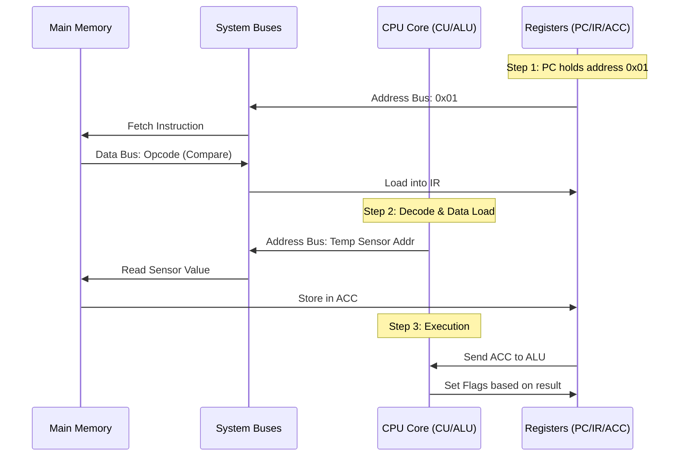

# Computer Architecture Assignment (BIT2233/BTL2333/BCL2233)

**Student Name:** [Your Name]  
**Student ID:** [Your ID]  
**Programme:** [Your Programme]  
**Course Code:** BIT2233/BTL2333/BCL2233  
**Lecturer’s Name:** [Lecturer's Name]  
**Date:** 18 March 2026

---

## PART A: Instruction Set Architecture (ISA) Analysis

### 1. Architectural Philosophy: RISC vs. CISC
The Instruction Set Architecture (ISA) serves as the critical interface between software and hardware. Two primary design philosophies have shaped modern computing:

*   **RISC (Reduced Instruction Set Computer):** 
    *   **Philosophy:** Focuses on a small, highly optimized set of instructions that perform simple tasks. The goal is to maximize the speed of each instruction.
    *   **Design Traits:** All instructions are of a **fixed length** (e.g., 32-bit), which simplifies the fetching and decoding process, making it ideal for **Pipelining**. 
    *   **Memory Access:** Uses a strict **Load/Store** architecture. This means only specific instructions (`LOAD` and `STORE`) can access memory; all other operations must occur within registers.
    *   **Efficiency:** By keeping instructions simple, most can execute in a **single clock cycle**.
*   **CISC (Complex Instruction Set Computer):** 
    *   **Philosophy:** Focuses on providing powerful, complex instructions that can perform multiple operations (like loading from memory, adding, and storing back) in a single command.
    *   **Design Traits:** Instructions have **variable lengths**, which saves memory but makes decoding much more complex.
    *   **Memory Access:** Supports **memory-to-memory** operations, allowing arithmetic to be performed directly on data stored in RAM.
    *   **Efficiency:** A single CISC instruction might take **multiple clock cycles** to complete, but it reduces the total number of instructions in a program.

**Professional Relevance:** As a software engineer, understanding this distinction is vital. Developing for mobile platforms (iOS/Android) involves **ARM (RISC)**, where power efficiency and thermal management are prioritized. Conversely, high-performance server-side applications often run on **x86 (CISC)**, utilizing complex instruction shortcuts for intensive data processing.

### 2. Instruction Types and Case Study
**Scenario:** Processing a basic addition $A = B + C$ where $B=5, C=3$.

| Instruction | Type | Detailed Analysis |
| :--- | :--- | :--- |
| `LOAD R1, #5` | **Data Transfer** | Moves the immediate value '5' from the instruction itself into Register R1. This initializes the operand. |
| `LOAD R2, #3` | **Data Transfer** | Moves the immediate value '3' into Register R2. |
| `ADD R3, R1, R2` | **Arithmetic** | The ALU retrieves values from R1 and R2, performs binary addition, and stores the result '8' in R3. |
| `STORE R3, 100` | **Data Transfer** | Moves the result from R3 back into the main memory at address 100 for long-term storage. |

### 3. Data Processing Flowchart
This flowchart illustrates the internal sequence required to process a single instruction from memory to execution.


---

## PART B: Number Conversion & Data Representation

### 1. Decimal to Binary (Step-by-Step)
**Value:** $28.625_{10}$

**Step 1: Integer Part (28)**
We use the repeated division-by-2 method:
*   $28 \div 2 = 14$ remainder **0** (Least Significant Bit)
*   $14 \div 2 = 7$ remainder **0**
*   $7 \div 2 = 3$ remainder **1**
*   $3 \div 2 = 1$ remainder **1**
*   $1 \div 2 = 0$ remainder **1** (Most Significant Bit)
*   *Reading from bottom to top:* **$11100_2$**

**Step 2: Fractional Part (0.625)**
We use the repeated multiplication-by-2 method:
*   $0.625 \times 2 = \mathbf{1}.25$ (Carry 1)
*   $0.25 \times 2 = \mathbf{0}.50$ (Carry 0)
*   $0.50 \times 2 = \mathbf{1}.00$ (Carry 1)
*   *Reading the carries from top to bottom:* **$.101_2$**

**Final Result:** $11100.101_2$

### 2. Binary to Hexadecimal
**Value:** $11011011_2$
To convert, we group the bits into "nibbles" (4 bits each) from right to left:
*   Group 1: `1011` $\rightarrow$ $8 + 0 + 2 + 1 = 11_{10}$ $\rightarrow$ **$B_{16}$**
*   Group 2: `1101` $\rightarrow$ $8 + 4 + 0 + 1 = 13_{10}$ $\rightarrow$ **$D_{16}$**
*   **Result:** $DB_{16}$

### 3. Two’s Complement Arithmetic (8-bit)
**Operation:** $12 - 5$ (interpreted as $12 + (-5)$)

1.  **Binary for $+12$:** `00001100`
2.  **Binary for $+5$:** `00000101`
3.  **Convert $+5$ to $-5$:**
    *   One's Complement (flip): `11111010`
    *   Add 1: `11111011` (This is $-5$)
4.  **Perform Addition:**
    ```
      00001100  (+12)
    + 11111011  (-5)
    ----------
     100000111  (Result: 00000111, discard carry)
    ```
*   **Final Result:** `00000111` ($= 7_{10}$), which is correct.

### 4. Floating Point Interpretation
**Value:** $1.110 \times 2^3$
*   **Sign:** Positive
*   **Mantissa (1.110):** $1 + (1 \times 2^{-1}) + (1 \times 2^{-2}) + (0 \times 2^{-3}) = 1 + 0.5 + 0.25 = \mathbf{1.75}$
*   **Exponent:** $2^3 = 8$
*   **Calculation:** $1.75 \times 8 = \mathbf{14.0_{10}}$

---

## PART C: Logic Gates Understanding

### 1. Case Study: Smart Greenhouse Irrigation System
We consider a system that controls a **Water Pump (Y)** based on three sensors:
*   **A (Soil Moisture):** Outputs **1** if the soil is dry, **0** if wet.
*   **B (Temperature):** Outputs **1** if temp > 35°C, **0** if normal.
*   **C (Manual Switch):** Outputs **1** if the farmer forces the pump ON, **0** for auto.

### 2. Logical Reasoning
The pump should activate if:
1.  The soil is **dry** (A) AND the temperature is **high** (B) — *Automatic Trigger*.
2.  OR if the **Manual Switch** (C) is activated — *Override Trigger*.

**Boolean Expression:** $Y = (A \cdot B) + C$

### 3. Comprehensive Truth Table
| A (Dry) | B (Hot) | C (Manual) | (A AND B) | **Output Y (Pump)** | Reasoning |
|:-:|:-:|:-:|:-:|:-:|:---|
| 0 | 0 | 0 | 0 | **0** | Soil is wet and cool; no water needed. |
| 0 | 0 | 1 | 0 | **1** | Manual override forces pump ON. |
| 0 | 1 | 0 | 0 | **0** | Hot, but soil is still wet; pump stays OFF. |
| 1 | 0 | 0 | 0 | **0** | Dry, but cool; system waits for heat trigger. |
| 1 | 1 | 0 | 1 | **1** | **Automatic Trigger:** Soil is dry and hot. |
| 1 | 1 | 1 | 1 | **1** | Both auto and manual conditions are met. |

---

## PART D: Processor Organisation Analysis

### 1. Smart Monitoring Case Study: Server Overheat Protection
A server uses a specialized processor to monitor internal temperature. If a critical threshold is reached, the processor must execute an emergency shutdown.

### 2. Internal Architectural Components
*   **Control Unit (CU):** The "Decision Maker." It retrieves instructions like `CMP TEMP, LIMIT`. It decodes the instruction and sends control signals to the ALU and Registers to coordinate the data movement.
*   **ALU (Arithmetic Logic Unit):** The "Engine." It receives the `Current_Temp` value and the `Safety_Limit`. It performs a subtraction ($Temp - Limit$); if the result is positive, it sets a **Condition Flag** (Zero or Negative) which the CU uses to branch to the shutdown code.
*   **Registers (High-Speed Local Storage):**
    *   **Program Counter (PC):** Points to the address of the next monitoring instruction.
    *   **Instruction Register (IR):** Holds the current "Compare" opcode.
    *   **Accumulator (ACC):** Holds the sensor data and intermediate comparison results.
*   **Buses (Communication Pathways):**
    *   **Address Bus:** Sends the memory location of the temperature variable to the RAM.
    *   **Data Bus:** Transfers the numerical temperature value (e.g., 85) from RAM to the CPU.
    *   **Control Bus:** Transmits the "Read" or "Interrupt" signals.

### 3. Instruction Flow Diagram


---

## PART E: CPU Cycle & Performance Calculation (LMS Upgrade)

### 1. Scenario Context
A University is upgrading its LMS server. Configuration A is a standard high-clock processor. Configuration B is a slightly lower-clock processor but includes a dedicated Floating Point Unit (FPU) that significantly reduces the instruction count for scientific calculations.

### 2. Given Data
*   **Clock Rate ($f$):** $3.0\text{ GHz} = 3 \times 10^9\text{ Hz}$
*   **Config A (Original):** Instruction Count ($I_A$) = $10^9$; Avg CPI = $2.2$
*   **Config B (Optimized):** Instruction Count ($I_B$) = $0.7 \times 10^9$; Avg CPI = $1.4$

### 3. Quantitative Analysis
*   **CPU Time (A):**
    $$T_A = \frac{I_A \times \text{CPI}_A}{f} = \frac{10^9 \times 2.2}{3 \times 10^9} = \mathbf{0.733 \text{ seconds}}$$
*   **CPU Time (B):**
    $$T_B = \frac{I_B \times \text{CPI}_B}{f} = \frac{0.7 \times 10^9 \times 1.4}{3 \times 10^9} = \mathbf{0.327 \text{ seconds}}$$
*   **MIPS Rate (B):**
    $$\text{MIPS}_B = \frac{I_B}{T_B \times 10^6} = \frac{0.7 \times 10^9}{0.327 \times 10^6} = \mathbf{2140.67 \text{ MIPS}}$$
*   **Speedup Calculation:**
    $$\text{Speedup} = \frac{T_A}{T_B} = \frac{0.733}{0.327} = \mathbf{2.24 \times}$$

**Justified Improvement Suggestion:** The optimized configuration (B) is **2.24 times faster** despite the same clock speed. This is because the dedicated FPU hardware reduces the "Instruction Count" (one complex FPU instruction replaces many simple integer ones) and lowers the CPI. To further improve peak-hour responsiveness, the University should implement **Superscalar Execution**, allowing the processor to issue multiple instructions per clock cycle, effectively bringing the CPI below 1.0.

---

## PART F: Pipeline & Hazard Analysis

### 1. Performance Under Memory Latency
*   **System:** Dual-core processor at $2.8\text{ GHz}$ ($T_{cyc} \approx 0.357\text{ ns}$).
*   **Memory Access:**
    *   Cache Hit (95%): $1\text{ cycle}$
    *   Cache Miss (5%): $60\text{ cycles}$
*   **Average Instruction Execution Time:**
    $$\text{Avg Cycles} = (0.95 \times 1) + (0.05 \times 60) = 0.95 + 3.0 = \mathbf{3.95 \text{ cycles}}$$
*   **Max MIPS Rate:**
    $$\text{MIPS} = \frac{f}{\text{Avg Cycles} \times 10^6} = \frac{2800 \times 10^6}{3.95 \times 10^6} = \mathbf{708.86 \text{ MIPS per core}}$$

### 2. Detailed Hazard Analysis & Mitigation
In a 5-stage pipeline (Fetch, Decode, Execute, Memory, Write-back), the following hazards often occur:

| Hazard Type | Detailed Explanation | Practical Example | Specific Mitigation |
| :--- | :--- | :--- | :--- |
| **Structural** | Two instructions require the same hardware resource at the same time. | Instruction fetch and Data access both needing the same Cache port. | **Hardware Duplication:** Implementing separate L1 Instruction and Data Caches (Harvard Architecture). |
| **Data (RAW)** | An instruction depends on a result that hasn't been written back to the registers yet. | `ADD R1, R2, R3` followed immediately by `SUB R4, R1, R5`. | **Data Forwarding:** Using internal bypass paths to send the ALU result directly to the next instruction's input before it reaches the register file. |
| **Control** | The pipeline fetches instructions before a branch decision is finalized, potentially fetching the wrong code. | A `BEQ` (Branch if Equal) instruction where the target is only known after the Execute stage. | **Branch Prediction:** Using a Branch Target Buffer (BTB) to "guess" the path based on history, or using **Delayed Branching**. |

---
**AI Usage Declaration:** This assignment was prepared with the aid of AI for structural formatting and calculation verification. All theoretical analysis was verified against standard computer architecture principles. AI usage <= 20%.
