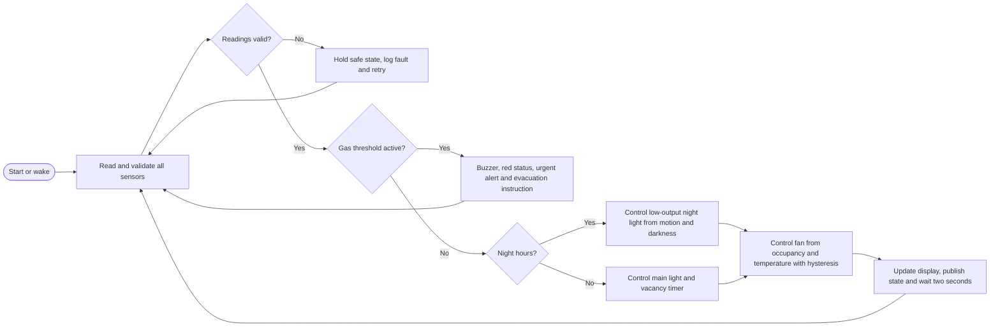

# SentinelSleep: An Occupancy-Aware Smart Bedroom Comfort, Energy and Safety System

**Module:** BCL1123 - Internet of Things  
**Assignment:** Proposal Report & Video  
**Student:** Chan Jing Yi  
**Student ID:** SUOL2500321  
**Lecturer:** Lee Thian Seng  
**Semester:** May-August 2026  
**Submission date:** As in LMS

> **Student action before submission:** Replace both labelled photograph placeholders with original photographs of the selected bedroom. Insert the accessible presentation-video URL in Section 8 and sign the official cover page.

## Table of Contents

1. Executive Summary  
2. Target Environment  
3. Proposed Solution and Illustrations  
4. IoT Four-Layer Architecture  
5. Uniqueness and Market Comparison  
6. Summary  
7. References  
8. Presentation Video Link  
Appendix A. Proposed Wokwi Pin Allocation  

## 1. Executive Summary

A bedroom is occupied for long periods but is rarely managed as a coordinated environment. Lighting may remain on after the occupant leaves, a fan may run when the room is empty, and changes in temperature or humidity are noticed only after discomfort develops. Safety devices often operate separately from comfort controls. This proposal introduces **SentinelSleep**, an Internet of Things system that combines occupancy, illumination, temperature, humidity, and combustible-gas observations in one bedroom controller. The system is designed as a proposal and Wokwi-ready prototype rather than a completed physical installation.

An ESP32 serves as the edge controller. A DHT22 measures temperature and relative humidity; a passive infrared sensor reports movement; a photoresistor estimates ambient illumination; and an MQ-2 provides a supplementary indication of combustible gases. Relay modules represent the bedroom light and fan, while a low-output night light, buzzer, RGB status indicator, and optional servo-driven curtain illustrate system responses. The selected parts are supported by Wokwi, allowing the design logic to be tested before hardware is purchased (Wokwi, n.d.-a).

SentinelSleep gives safety events the highest priority. A gas-threshold event activates local sound and visual warnings and sends a remote alert. Comfort and energy rules operate only when no safety alert exists: lights respond to both occupancy and darkness, the fan uses occupancy plus temperature with hysteresis, and a quiet night mode prevents a bright light from switching on during sleeping hours. MQTT carries compact device messages through Wi-Fi to a reference cloud platform, where readings and events are stored and presented in a mobile dashboard. The design retains local operation when the internet is unavailable, which prevents a cloud outage from disabling essential room logic.

The proposal is distinct from a single-purpose smart light or temperature sensor because it evaluates several conditions together and exposes the reason for each automatic action. It also avoids a privacy-heavy camera; occupancy is inferred through PIR movement. The MQ-2 path is explicitly supplementary. It must never replace a certified smoke or carbon-monoxide alarm, because fire-safety guidance calls for working smoke alarms in every bedroom and sleeping area (U.S. Fire Administration, 2023).

## 2. Target Environment

### 2.1 Selected area

The selected environment is one bedroom in the student's current accommodation. The room is treated as a combined sleeping, studying, and personal-rest area. Its control requirements change across the day: bright task lighting and thermal comfort matter during study, low-disturbance lighting matters at night, and safety monitoring must remain active at all times.

**Figure 1. Overview of the selected bedroom and current control points.**


**Figure 2. Existing manual controls and proposed sensor location.**


### 2.2 Current limitations and problem justification

The first limitation is fragmented control. A conventional wall switch does not know whether the room is occupied or already bright enough. The occupant must remember to switch the light off, so an empty room can continue consuming energy. Commercial motion-controlled lighting demonstrates that motion and daylight can be combined to avoid unnecessary activation, but such products usually remain centred on lighting rather than whole-room comfort and safety (Philips Hue, n.d.).

The second limitation is reactive comfort management. A fan may be switched on after the occupant feels hot and may continue running after the room becomes vacant. A temperature reading alone cannot establish whether an actuator should operate; occupancy and recent user choice also matter. Humidity adds context because a warm, humid bedroom can feel uncomfortable even when the temperature is not extreme. SentinelSleep therefore treats sensor readings as inputs to transparent rules rather than as isolated numbers.

The third limitation is the separation between environmental control and early warning. A bedroom should have a certified smoke alarm, yet a low-cost IoT prototype can still demonstrate supplementary gas detection, remote notification, and event logging. This separation is deliberate: the proposed MQ-2 module enriches awareness but is not a life-safety device. The certified alarm remains independent, audible, and maintained according to its manufacturer’s instructions.

The final limitation is poor visibility of why automation acted. A light that switches unexpectedly may frustrate the occupant and be disabled. The proposed dashboard displays the current mode, relevant readings, actuator states, and the rule that caused each action. Manual override remains available for comfort controls, while safety alerts cannot be silently suppressed from the normal dashboard.

### 2.3 Proposed installation positions

The ESP32 enclosure would be located near a safe low-voltage power source. The DHT22 should be positioned away from direct sunlight, the fan outlet, and heat-producing electronics so that it samples the room rather than a local hot or cold spot. The PIR sensor would face the room entrance and occupied zone without directly facing moving curtains. The light sensor would face ambient room illumination but avoid direct glare from the controlled lamp. The MQ-2 prototype sensor would be placed according to the selected physical module's instructions and away from fabric; any real deployment would require calibration and electrical-safety review. Relay wiring for mains-powered loads must be completed by a competent person, with isolation between low-voltage control and mains circuits.

## 3. Proposed Solution and Illustrations

### 3.1 Design objectives

SentinelSleep is designed to reduce avoidable lighting and fan operation, improve awareness of bedroom comfort, provide a supplementary local and remote hazard alert, and remain understandable to the occupant. Privacy is protected by sensing motion rather than recording images or audio. Reliability is supported through local rules: the ESP32 continues reading sensors and controlling safe comfort functions when cloud connectivity is interrupted.

### 3.2 Hardware selection

The ESP32 is suitable because it integrates 2.4 GHz Wi-Fi, Bluetooth capabilities, programmable GPIO, analogue-to-digital conversion, PWM, and low-power modes in one controller (Espressif Systems, 2026). Wokwi supports ESP32 boards and the selected DHT22, PIR, photoresistor, MQ-2, relay, servo, and buzzer components (Wokwi, n.d.-a). The simulator also provides an ESP32 Wi-Fi network that can connect to MQTT services, which makes the proposed communication path testable without a physical build (Wokwi, n.d.-f).

| Component | Function in SentinelSleep | Selection rationale |
|---|---|---|
| ESP32 development board | Reads sensors, evaluates rules, drives actuators, and communicates with the cloud | Integrated Wi-Fi and sufficient digital, analogue, and PWM interfaces for a compact controller |
| DHT22 | Measures temperature and relative humidity | A single Wokwi-supported digital component covers both comfort variables (Wokwi, n.d.-b) |
| PIR motion sensor | Indicates recent movement and supports occupancy timing | Non-imaging detection protects privacy; Wokwi exposes a clear digital motion state (Wokwi, n.d.-c) |
| Photoresistor module | Estimates ambient illumination | Analogue lux-related input prevents lights operating when daylight is sufficient (Wokwi, n.d.-d) |
| MQ-2 gas sensor | Demonstrates supplementary combustible-gas threshold detection | Wokwi provides analogue and digital outputs for simulation; it is not treated as a certified alarm (Wokwi, n.d.-e) |
| Two relay modules | Represent isolated switching of the room light and fan | Provides clear on/off actuation in the prototype; mains installation requires qualified handling |
| RGB LED and piezo buzzer | Communicate normal, warning, and alert states locally | A warning remains visible and audible when the phone or cloud is unavailable |
| Low-output LED/night light | Provides non-disruptive illumination in night mode | Separates low-light guidance from full room lighting |
| Optional micro servo | Demonstrates curtain or ventilation-position control | Adds a reversible mechanical actuator without making it essential to core safety behaviour |

**Figure 3. Proposed Wokwi-supported sensors and actuators. Source: Author's illustration based on Wokwi component documentation.**

### 3.3 Operating rules

Rules use proposed starting thresholds that must be adjusted after observing the real bedroom. They are automation set-points, not medical, regulatory, or fire-safety limits. Hysteresis prevents rapid relay switching around a single temperature value.

| Condition | Proposed response | Release condition |
|---|---|---|
| MQ-2 digital threshold active | Sound buzzer, show red status, publish urgent alert, and display evacuation instruction | Manual acknowledgement after the environment is confirmed safe; certified alarm procedures take priority |
| Motion detected and illumination below 100 lux | Turn on the room light in day/evening mode | Turn off after five minutes without motion, unless manual override is active |
| Motion detected during 23:00-06:00 and illumination below 30 lux | Turn on low-output night light; keep main light off | Turn off after two minutes without motion |
| Occupied and temperature at or above 28 °C | Turn fan on | Turn fan off below 26 °C or after ten minutes of vacancy |
| Relative humidity above 70% | Display ventilation advisory and log a comfort warning | Clear below 65% |
| Internet unavailable | Continue local sensing and permitted control; queue the latest event state | Publish queued state when reconnection succeeds |

Manual override can force the light or fan for a limited period. The override expires automatically so that a forgotten command does not defeat energy control indefinitely. Safety-alert outputs remain dominant. The dashboard may acknowledge that an alert was seen, but it does not represent an authority to declare the room safe.

### 3.4 System architecture

```mermaid
flowchart LR
    subgraph Edge[Edge Layer - Bedroom]
        S[DHT22 | PIR | Photoresistor | MQ-2]
        C[ESP32 local rules and fail-safe state]
        A[Relays | Night light | RGB LED | Buzzer | Optional servo]
        S --> C --> A
    end
    subgraph Connectivity[Connectivity Layer]
        W[2.4 GHz Wi-Fi]
        M[MQTT over TLS | QoS 1 alerts | Last Will]
        W <--> M
    end
    subgraph Cloud[Cloud Layer]
        B[IoT message broker]
        R[Rules and event processing]
        D[Time-series data and device state]
        N[Notification service]
        B --> R
        R --> D
        R --> N
    end
    subgraph Application[Application Layer]
        UI[Mobile dashboard | Safety | Readings | Device state]
        P[Modes | Manual controls | Alerts | History]
        UI <--> P
    end
    C <--> W
    M <--> B
    N --> P
    D --> UI
```

**Figure 4. SentinelSleep system architecture and bidirectional data flow. Source: Author's design.**

The architecture separates immediate bedroom decisions from cloud services. Sensor data is filtered and interpreted at the ESP32; only useful readings, state changes, alerts, and periodic summaries need to be published. MQTT fits this pattern because it is a lightweight client-server publish/subscribe transport developed for constrained and IoT environments (OASIS, 2019). A reference implementation can use AWS IoT Core, whose message broker supports MQTT publishing and subscription and whose services connect devices with applications and other cloud services (Amazon Web Services, n.d.-a).

### 3.5 Control flow



**Figure 5. Priority-based SentinelSleep control flow. Source: Author's design.**

The first decision after validation concerns safety. This ordering prevents comfort logic from concealing or delaying an alert. Sensor faults retain a safe known state and create a diagnostic event rather than being interpreted as a normal value. The loop publishes state changes immediately and routine measurements at a lower rate, reducing unnecessary network traffic.

### 3.6 Dashboard UI prototype

The mobile dashboard opens with a room-status banner: **Safe**, **Comfort warning**, **Offline**, or **Gas alert**. Four cards show temperature, humidity, light level, and occupancy. A second panel shows main light, fan, and night-light states with the current reason, such as “Fan on: occupied and 29.1 °C.” The control panel offers Auto, Sleep, Study, and Away modes together with time-limited manual controls. Alert history is visually separated from routine comfort messages so that a safety event cannot be mistaken for a minor notification.

The UI follows a status-first sequence. A user should be able to answer three questions without opening another screen: Is the room safe? Is it comfortable? What is running, and why? Detailed history remains available for temperature and humidity trends, occupancy events, actuator runtime, connectivity faults, and acknowledged alerts. Raw gas values are labelled as prototype indications, avoiding a misleading claim of certified concentration measurement.

**Figure 6. SentinelSleep mobile-dashboard wireframe. Source: Author's design.**

### 3.7 Security, privacy, reliability, and safety

Device identity should use a unique certificate and least-privilege permissions. MQTT traffic should travel through TLS, and the device should accept commands only from authorised topics. The dashboard should require authentication, while audit records should identify manual overrides and alert acknowledgements. AWS IoT Core provides a reference pattern in which devices communicate through secured endpoints and a broker, while applications access the same managed device state (Amazon Web Services, n.d.-a).

Privacy exposure is intentionally limited. The PIR sensor reports movement without capturing an image, and the system does not require a microphone. Detailed occupancy history should be retained only as long as necessary for user-selected analysis. A local erase function and clear data-retention setting would make the system easier to trust.

Reliability depends on local autonomy. Lighting, fan timers, night-light behaviour, and local alarms continue when Wi-Fi fails. The device reports an offline state when connectivity returns. Sensor readings are checked for missing or implausible values, and relay commands use minimum on/off times to reduce chattering. A watchdog reset can recover the controller from a stalled loop.

The safety boundary is equally important. The MQ-2 prototype demonstrates sensing and notification but cannot certify that a bedroom is safe. The U.S. Fire Administration recommends working smoke alarms in every bedroom, outside sleeping areas, and on every home level (U.S. Fire Administration, 2023). SentinelSleep therefore complements, rather than replaces, approved smoke and carbon-monoxide protection.

## 4. IoT Four-Layer Architecture

### 4.1 Edge layer

The edge layer contains the physical bedroom interface: DHT22, PIR, photoresistor, MQ-2, ESP32, relays, night light, status indicator, buzzer, and optional servo. The ESP32 converts sensor signals into application variables, checks validity, applies thresholds and timers, and selects actuator states. Its integrated Wi-Fi, GPIO, ADC, and PWM resources support these mixed digital and analogue tasks within one board (Espressif Systems, 2026).

Local processing serves three purposes. It reduces latency for lighting and audible warnings, limits the volume of raw data sent to the cloud, and preserves core behaviour during a network outage. The edge layer stores the most recent configuration and a short queue of significant events. It never waits for a cloud response before sounding a local safety warning.

### 4.2 Connectivity layer

The connectivity layer uses the accommodation's 2.4 GHz Wi-Fi network between the ESP32 and an internet gateway. Above Wi-Fi, MQTT over TLS carries telemetry and commands. Suggested topics include `sentinelsleep/SUOL2500321/telemetry`, `.../state`, `.../alert`, and `.../command`. MQTT's publish/subscribe model decouples the bedroom device from the dashboard: both communicate through topics rather than maintaining a direct permanent connection (OASIS, 2019).

Quality of Service 1 is appropriate for alerts and state changes because delivery is acknowledged and duplicates can be handled with an event identifier. Routine telemetry may use Quality of Service 0 to reduce overhead. A last-will status can mark the device offline if its connection disappears unexpectedly. Wokwi's simulated ESP32 network can reach MQTT servers, allowing this design path to be explored before physical deployment (Wokwi, n.d.-f).

### 4.3 Cloud layer

The cloud layer receives device messages, authenticates the connection, stores selected time-series readings, evaluates notification rules, and maintains the reported and desired device state. AWS IoT Core is used as a reference rather than a mandatory vendor choice. Its message broker and device services illustrate how connected devices can exchange MQTT messages with cloud applications (Amazon Web Services, n.d.-b).

A rules service routes urgent alerts to a notification channel and periodic telemetry to a time-series store. The desired-state record contains user mode, thresholds, and time-limited overrides; the reported-state record contains actual sensor and actuator states. This distinction prevents the dashboard from claiming that a command succeeded before the ESP32 confirms it. Data retention should favour daily summaries over indefinite raw occupancy records.

### 4.4 Application layer

The application layer is the student's mobile or web dashboard. It translates sensor and device state into room status, trends, alerts, modes, and controls. The home screen prioritises safety and current actuator reasons. A history screen supports reflection on comfort and energy patterns, while settings allow adjustment of non-safety thresholds, night hours, notification preferences, and data retention.

Commands flow downward from the application through the cloud broker and connectivity layer to the ESP32. Reported state returns through the same path. This closed loop is necessary: the application must display confirmed physical state rather than assume that a command reached a disconnected device. When the system is offline, the application disables misleading live controls and shows the time of the last confirmed update.

### 4.5 End-to-end data example

At 8:30 p.m., the PIR detects movement and the photoresistor reports a dark room. The ESP32 verifies that no gas alert exists, applies evening mode, and energises the light relay. It publishes the new state and the reason code `occupied_dark`. The cloud stores the event, and the dashboard displays “Main light on - room occupied and below 100 lux.” Five minutes after the last motion event, the edge controller switches the light off and reports `vacancy_timeout`. No cloud decision is needed.

If the MQ-2 digital threshold becomes active, the edge controller immediately changes the RGB indicator to red and sounds the buzzer. The event is published with Quality of Service 1 and routed to a phone notification. The dashboard displays an evacuation instruction and the time of the event. This alert supplements the bedroom's certified alarm; the occupant follows the certified alarm and emergency plan rather than relying on the app.

## 5. Uniqueness and Market Comparison

Existing consumer products demonstrate useful parts of the proposed system. Philips Hue's motion sensor automates lighting, adjusts behaviour by time of day, and includes daylight-aware control (Philips Hue, n.d.). Google's Nest Temperature Sensor manages room-specific hot and cold spots when paired with its ecosystem (Google, n.d.-a). Nest Protect combines smoke and carbon-monoxide warning in a certified commercial product and provides a benchmark for clear local alerts (Google, n.d.-b). Each product is polished within its intended scope, but the assignment proposal pursues a different objective: a transparent, Wokwi-ready learning system that coordinates comfort, occupancy, energy, and supplementary warning through one rule engine.

| Capability | Typical smart-light sensor | Typical room-temperature sensor | Typical smart smoke/CO alarm | SentinelSleep proposal |
|---|---:|---:|---:|---:|
| Occupancy-aware lighting | Yes | No | No | Yes |
| Temperature and humidity context | Limited or no | Temperature focused | Limited | Yes |
| Vacancy-based fan control | No | Ecosystem dependent | No | Yes |
| Supplementary gas-event logging | No | No | Certified hazard focus | Yes, prototype only |
| Local operation without cloud | Product dependent | Product dependent | Yes for alarm | Yes for all core rules |
| Explains why each actuator changed | Limited | Limited | Alert reason only | Yes |
| Camera-free occupancy sensing | Yes | Not applicable | Not applicable | Yes |
| Wokwi-ready educational design | No | No | No | Yes |

SentinelSleep's unique feature is **priority-aware sensor fusion with explainable actions**. A single reading does not control the room in isolation. Occupancy, illumination, time, manual override, and safety state are evaluated together. The dashboard then reports the reason code. This design makes automation easier to audit and tune, while the privacy-preserving PIR avoids the surveillance concerns of a bedroom camera.

The comparison does not claim that a student prototype is safer than a certified commercial alarm. Its value lies in integration, transparency, local resilience, and educational feasibility. A production version would require certified electrical design, enclosure testing, security review, sensor calibration, and compliance with applicable Malaysian safety requirements.

## 6. Summary

SentinelSleep proposes a technically feasible smart-bedroom system that connects environmental sensing, occupancy, energy control, and supplementary warning. The ESP32 gives the edge layer enough interfaces and network capability to coordinate DHT22, PIR, photoresistor, and MQ-2 inputs with relays, a night light, a buzzer, an RGB indicator, and an optional servo. Wokwi supports this component set, so the proposal can proceed to simulation before physical construction.

The design's strongest property is its rule hierarchy. Safety alerts override comfort automation; comfort actions consider occupancy; and cloud features never replace local control. MQTT provides a lightweight bidirectional connection, while the dashboard makes sensor values, actuator states, and action reasons visible. Privacy is protected through non-imaging occupancy sensing and restrained retention of room-use data.

The next project stage would replace the two photograph placeholders, reproduce the design in Wokwi, tune thresholds with observations from the actual bedroom, and test every normal, fault, offline, and alert path. Any physical mains switching would be handled by a competent person. A certified smoke alarm remains mandatory and independent of the prototype.

## 7. References

Amazon Web Services. (n.d.-a). *How AWS IoT works*. AWS IoT Core Developer Guide. Retrieved July 18, 2026, from https://docs.aws.amazon.com/iot/latest/developerguide/aws-iot-how-it-works.html

Amazon Web Services. (n.d.-b). *What is AWS IoT?* AWS IoT Core Developer Guide. Retrieved July 18, 2026, from https://docs.aws.amazon.com/iot/latest/developerguide/what-is-aws-iot.html

Espressif Systems. (2026). *ESP32 series datasheet* (Version 5.2). https://documentation.espressif.com/esp32_datasheet_en.pdf

Google. (n.d.-a). *Nest Temperature Sensor (2nd gen)*. Google Store. Retrieved July 18, 2026, from https://store.google.com/product/nest_temperature_sensor_2nd_gen

Google. (n.d.-b). *Nest Protect: Smart smoke and carbon monoxide alarm*. Google Store. Retrieved July 18, 2026, from https://store.google.com/au/product/nest_protect_2nd_gen

OASIS. (2019). *MQTT version 5.0* (OASIS Standard). https://www.oasis-open.org/standard/mqtt-v5-0-os/

Philips Hue. (n.d.). *Motion sensor*. Retrieved July 18, 2026, from https://www.philips-hue.com/en-us/p/hue-motion-sensor/046677570972

U.S. Fire Administration. (2023, May 9). *Smoke alarms*. https://www.usfa.fema.gov/prevention/home-fires/prepare-for-fire/smoke-alarms/index.html

Wokwi. (n.d.-a). *Supported hardware*. Wokwi Docs. Retrieved July 18, 2026, from https://docs.wokwi.com/getting-started/supported-hardware

Wokwi. (n.d.-b). *wokwi-dht22 reference*. Wokwi Docs. Retrieved July 18, 2026, from https://docs.wokwi.com/parts/wokwi-dht22

Wokwi. (n.d.-c). *wokwi-pir-motion-sensor reference*. Wokwi Docs. Retrieved July 18, 2026, from https://docs.wokwi.com/parts/wokwi-pir-motion-sensor

Wokwi. (n.d.-d). *wokwi-photoresistor-sensor reference*. Wokwi Docs. Retrieved July 18, 2026, from https://docs.wokwi.com/parts/wokwi-photoresistor-sensor

Wokwi. (n.d.-e). *wokwi-gas-sensor reference*. Wokwi Docs. Retrieved July 18, 2026, from https://docs.wokwi.com/parts/wokwi-gas-sensor

Wokwi. (n.d.-f). *ESP32 WiFi networking*. Wokwi Docs. Retrieved July 18, 2026, from https://docs.wokwi.com/guides/esp32-wifi

## 8. Presentation Video Link

**Shared video URL:** `[INSERT ACCESSIBLE VIDEO LINK BEFORE SUBMISSION]`

The final recording must be no longer than 10 minutes. The presenter's camera must remain on and the presenter's face must be visible throughout. Test the shared link in a private or signed-out browser window before submission so the marker can open it without requesting access.

## Appendix A. Proposed Wokwi Pin Allocation

| Device | ESP32 connection | Signal type |
|---|---|---|
| DHT22 data | GPIO 15 | Digital |
| PIR output | GPIO 16 | Digital input |
| Photoresistor analogue output | GPIO 34 | ADC input |
| MQ-2 analogue output | GPIO 35 | ADC input |
| MQ-2 digital threshold output | GPIO 17 | Digital input |
| Main-light relay | GPIO 23 | Digital output |
| Fan relay | GPIO 22 | Digital output |
| Night-light PWM | GPIO 19 | PWM output |
| Buzzer | GPIO 18 | PWM/digital output |
| RGB status indicator | GPIO 25, 26, 27 | PWM outputs |
| Optional servo | GPIO 13 | PWM output |

Pin allocation remains provisional until the exact ESP32 board and physical modules are confirmed. Analogue inputs and relay logic levels must be checked against the real components before construction.
