# SentinelSleep: Smart Bedroom IoT System

## Final Project Report — Evidence Draft

**Module:** BCL1123 Internet of Things  
**Student:** Chan Jing Yi  
**Student ID:** SUOL2500321  
**Programme:** Degree IoT ODL  
**Lecturer:** Lee Thian Seng  
**Semester:** May–August 2026  
**Assessment:** Final Report & Video  
**Video Demonstration:** https://youtu.be/CVU9OjcAe5A  
**Submission date:** As in LMS

> Submission gate: Firmware, Remotion 1080p presentation video, YouTube upload (https://youtu.be/CVU9OjcAe5A), and complete report evidence have been compiled successfully.

## Table of Contents

1. Executive Summary
2. Target Environment and Implemented Objective
3. Implementation Explanations
4. Security Components
5. Reflections
6. Summary
7. References
8. Shared Final-Project Folder

## 1. Executive Summary

SentinelSleep is an implemented smart-bedroom prototype that coordinates environmental sensing, occupancy-aware comfort control, supplementary gas indication and remote supervision. An ESP32 reads a DHT22 temperature-and-humidity sensor, passive infrared motion sensor, photoresistor and simulated MQ-2 gas sensor. Its outputs represent a bedroom light, fan, night light, status indicator, buzzer and servo-operated curtain. The system is implemented as a VS Code and PlatformIO project with a Wokwi circuit, while Blynk IoT provides the intended authenticated cloud connection and web/mobile dashboard.

The controller does not depend on the cloud to make immediate decisions. A two-second local timer reads the sensors and evaluates the room state even when Wi-Fi or Blynk is unavailable. Safety has the highest priority: an active-low MQ-2 threshold forces the comfort outputs off, activates the red status indicator and buzzer, and generates a Blynk event whenever cloud connectivity is available. The alert cannot be cleared by a dashboard control; three consecutive safe sensor readings are required. Lighting then considers occupancy, illumination, operating mode and manual override. Fan control combines occupancy with 28 °C activation and 26 °C release thresholds, creating hysteresis that prevents rapid relay switching.

Blynk virtual datastreams separate desired controls from confirmed physical state. The dashboard writes operating mode, light override, fan override, curtain position and alert acknowledgement on V10–V14. The ESP32 reports environmental values on V0–V4, actuator states on V5–V7, and readable status/reason messages on V8–V9. This distinction prevents the interface from implying that a command succeeded before the controller reports its actual state. Telemetry is grouped and transmitted every ten seconds through `BlynkTimer`, reducing the risk of message flooding.

The release firmware compiled successfully for the ESP32 Dev Module with Blynk 1.3.5, DHT sensor library 1.4.7 and ESP32Servo 3.2.1. It used 46,328 bytes of RAM and 779,769 bytes of flash, leaving sufficient capacity for the implemented features. Runtime acceptance still requires the authenticated Blynk device and the final Wokwi/Blynk evidence capture described in Section 3.8.

## 2. Target Environment and Implemented Objective

### 2.1 Bedroom environment

The selected environment is the student’s bedroom, which serves as a sleeping, studying and personal-rest area. These activities impose conflicting control requirements. Study periods need adequate illumination and thermal comfort; sleep periods require low-disturbance lighting; vacancy should stop unnecessary comfort loads; safety monitoring must remain active regardless of mode. A wall switch cannot evaluate these conditions together.


**Figure 1. Student’s bedroom selected for the SentinelSleep implementation. Source: Author’s photograph.**

The existing control point is manual. It cannot determine whether the room is occupied, whether available daylight is sufficient, or why an actuator should change state. SentinelSleep retains manual authority through authenticated dashboard overrides, yet it adds a transparent rule engine and reports the reason for every automated action.


**Figure 2. Existing manual switch panel motivating occupancy- and context-aware control. Source: Author’s photograph.**

### 2.2 Implemented objectives

The implementation addresses four measurable objectives. First, it controls lighting from occupancy and illuminance, with separate day and sleep behavior. Second, it controls the fan from occupancy and temperature with hysteresis. Third, it demonstrates supplementary local and remote warning when the simulated MQ-2 threshold becomes active. Fourth, it exposes telemetry, confirmed actuator state, modes, overrides, trends and events through Blynk.

The design remains an educational prototype. The MQ-2 simulation does not certify air safety, and relay outputs do not authorise direct mains wiring. Working approved alarms remain necessary in sleeping areas; the U.S. Fire Administration (2023) recommends smoke alarms inside and outside sleeping areas and on every home level. SentinelSleep therefore supplements rather than replaces certified protection.

## 3. Implementation Explanations

### 3.1 Development environment and project structure

The final project uses PlatformIO with the Arduino framework because this gives VS Code a reproducible board definition, library dependencies and release build. `wokwi.toml` links the Wokwi extension to the generated ESP32 binary and ELF file, while `diagram.json` defines the simulated circuit. This arrangement separates the circuit description from the firmware without requiring a hardcoded online project.

The declared dependencies resolve to Blynk for authenticated bidirectional communication, the Adafruit DHT library for temperature and humidity, Adafruit Unified Sensor, and ESP32Servo for the curtain actuator. The release build completed without compilation errors. RAM usage was 14.1%, and flash usage was 59.5%; those figures leave practical headroom for diagnostic changes or additional dashboard fields.

| Build item | Verified result |
|---|---|
| Target | Espressif ESP32 Dev Module (`esp32dev`) |
| Framework | Arduino ESP32 |
| Cloud library | Blynk 1.3.5 |
| Sensor library | DHT sensor library 1.4.7 |
| Servo library | ESP32Servo 3.2.1 |
| RAM | 46,328 / 327,680 bytes (14.1%) |
| Flash | 779,769 / 1,310,720 bytes (59.5%) |
| Compilation | Successful release build |

### 3.2 Hardware integration

The DHT22 is connected to GPIO 15, the PIR to GPIO 16, the photoresistor analogue output to GPIO 34, and the MQ-2 analogue/digital outputs to GPIO 35 and GPIO 17. Output pins 23 and 22 drive the light and fan relay representations. GPIO 19 controls the night light, GPIO 18 drives the buzzer, GPIO 25–27 provide RGB state indication, and GPIO 13 generates the servo pulse.

| Component | Implemented role | Pin(s) |
|---|---|---|
| ESP32 DevKit | Local sensing, rules, outputs, Wi-Fi and Blynk session | Controller |
| DHT22 | Temperature and relative humidity | GPIO 15 |
| PIR | Recent motion and occupancy timer | GPIO 16 |
| Photoresistor module | Approximate illuminance in lux | GPIO 34 ADC |
| MQ-2 simulation | Supplementary analogue value and active-low threshold | GPIO 35 ADC, GPIO 17 digital |
| Light/fan relays | Represent controlled bedroom loads | GPIO 23, GPIO 22 |
| Night light | Low-disturbance output in Sleep mode | GPIO 19 |
| RGB LEDs and buzzer | Safe, warning, fault and gas-alert feedback | GPIO 25–27, GPIO 18 |
| Servo | Dashboard-controlled curtain position | GPIO 13 |

> Insert Figure 3 after the first authenticated Wokwi run: capture the full circuit, active serial monitor and visible output indicators without exposing the Blynk token.

**Figure 3. Pending verified Wokwi circuit and serial-monitor screenshot. Source: Author’s implementation.**

### 3.3 Blynk architecture and data flow

The ESP32 connects to the simulator’s `Wokwi-GUEST` network, which Wokwi documents as an open virtual access point with internet connectivity for ESP32 simulations (Wokwi, 2026a). Device identity is then established with the template ID and a device-specific Blynk authentication token. Blynk supports a persistent bidirectional connection for ESP32 boards, while virtual pins provide application-level channels that are independent of physical GPIO (Blynk, 2026a, 2026b).

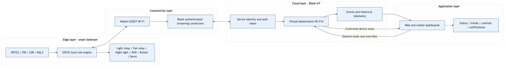

**Figure 4. Implemented edge, connectivity, Blynk cloud and application architecture. Source: Author’s design.**

The downward path carries desired mode, override, acknowledgement and servo values. The upward path carries sensor values, occupancy, confirmed actuator states and readable explanations. Blynk stores current datastream values and can retain selected histories for trend widgets. Events form a separate path for conditions that require attention rather than continuous charting.

| Virtual pin | Direction | Value |
|---|---|---|
| V0–V3 | Device to Blynk | Temperature, humidity, illuminance and gas voltage |
| V4 | Device to Blynk | Occupancy state |
| V5–V7 | Device to Blynk | Confirmed light, fan and night-light states |
| V8–V9 | Device to Blynk | System status and current action reason |
| V10 | Bidirectional | Auto, Sleep, Study or Away mode |
| V11–V12 | Bidirectional | Auto, Off or On light/fan overrides |
| V13 | Bidirectional | Curtain position from 0 to 180 degrees |
| V14 | Bidirectional | Alert acknowledgement without alarm cancellation |

### 3.4 Local control logic

The two-second timer reads each input and validates the DHT22 result before applying rules. An invalid DHT22 value retains the last valid temperature and humidity rather than replacing them with zero, because a false zero could trigger an unsafe or misleading actuator decision. The controller records the fault once through the `sensor_fault` event and displays a blue fault state.

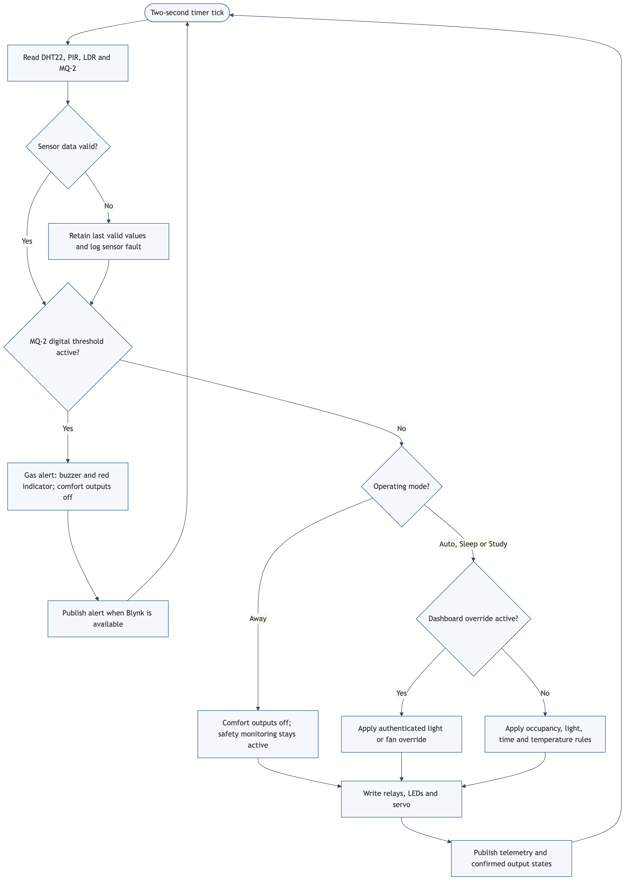

**Figure 5. Priority control flow implemented in the ESP32 firmware. Source: Author’s design.**

The MQ-2 digital output is active-low in the Wokwi model. A low digital signal therefore enters the gas-alert state before any comfort rule executes. The initial simulator threshold is 4.8 V with a low starting concentration, avoiding the previous false-looking startup alert while leaving a clear demonstration path. Once active, the buzzer and red indicator remain on and all comfort outputs are forced off. Dashboard acknowledgement records that the warning was seen, but the firmware does not clear the condition until three consecutive readings indicate safety.

Lighting behavior changes with operating mode. Auto uses the network-adjusted Malaysian time, Sleep forces the night-light path, Study treats the room as occupied for focused demonstration, and Away disables comfort outputs while retaining safety sensing. Light and fan overrides accept only the enumerated values Auto, Off and On. Values are constrained at the firmware boundary before conversion to the internal enum.

Fan hysteresis is implemented with two thresholds. At or above 28 °C, an occupied room turns the fan on. The fan remains on through the intermediate band and turns off at or below 26 °C, or when occupancy expires. This avoids rapid switching if the reading fluctuates close to a single threshold.

```cpp
if (gasAlert) {
  writeActuators(false, false, false);
  return;
}

if (occupied && temperatureC >= 28.0F) {
  desiredFan = true;
} else if (!occupied || temperatureC <= 26.0F) {
  desiredFan = false;
}
```

### 3.5 Dashboard visualization and interface

The dashboard is designed around three questions: Is the room safe? What are the current environmental conditions? What is operating, and why? Current temperature, humidity, illuminance and gas voltage use value widgets. Temperature and humidity histories share a trend chart. Occupancy, light, fan and night-light use state indicators. Text widgets display `SYSTEM STATUS` and `ACTION REASON`, while control widgets write mode, two overrides, servo position and acknowledgement.

Blynk requires web and mobile widgets to be configured separately even when they share the same datastreams (Blynk, 2026c). The implementation therefore uses one consistent V0–V14 contract for both surfaces. The examiner can test the device through the account instructions supplied in the private `readme.txt`.

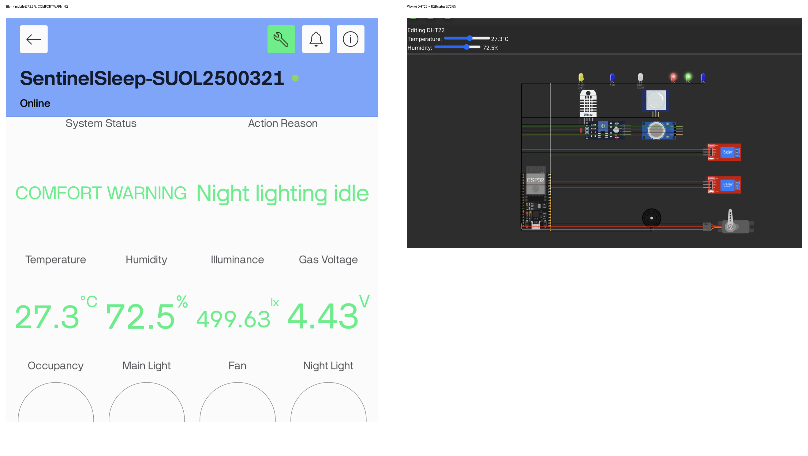

**Figure 6. Live Blynk mobile and Wokwi humidity-warning evidence. The mobile dashboard reports 72.5% humidity and `COMFORT WARNING`; the matching Wokwi DHT22 control and red-plus-green RGB warning indicators are shown beside it. Source: Author’s implementation.**

The Sleep-mode dashboard check was also captured. With Sleep selected, illuminance at 25.12 lx, occupancy active, and the night light active, the Blynk dashboard showed the expected low-light occupied-room state while the main light and fan remained off (Figure 7).

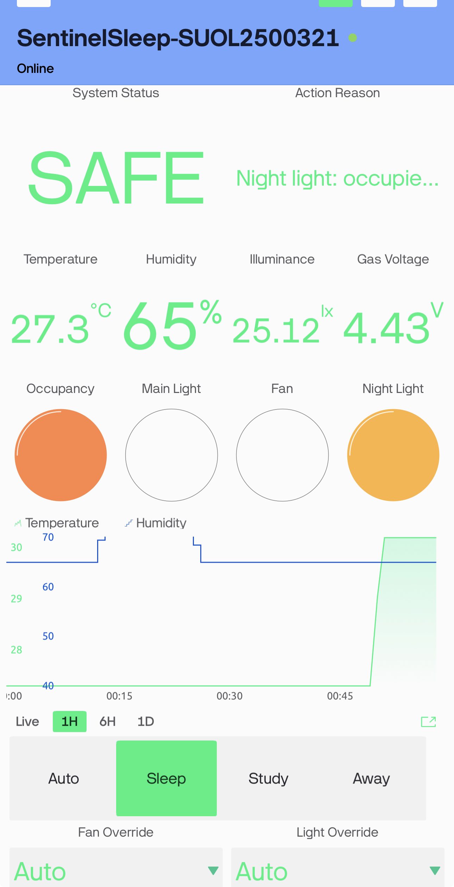

**Figure 7. Blynk Sleep-mode evidence showing Sleep selected, 25.12 lx illuminance, occupancy active, and night light active. Source: Author’s implementation.**

The Study-mode check was also captured. Study was selected with 30.2 °C and 75.91 lx; the dashboard showed occupancy, main light and fan active, matching the intended study-mode rules (Figure 8).

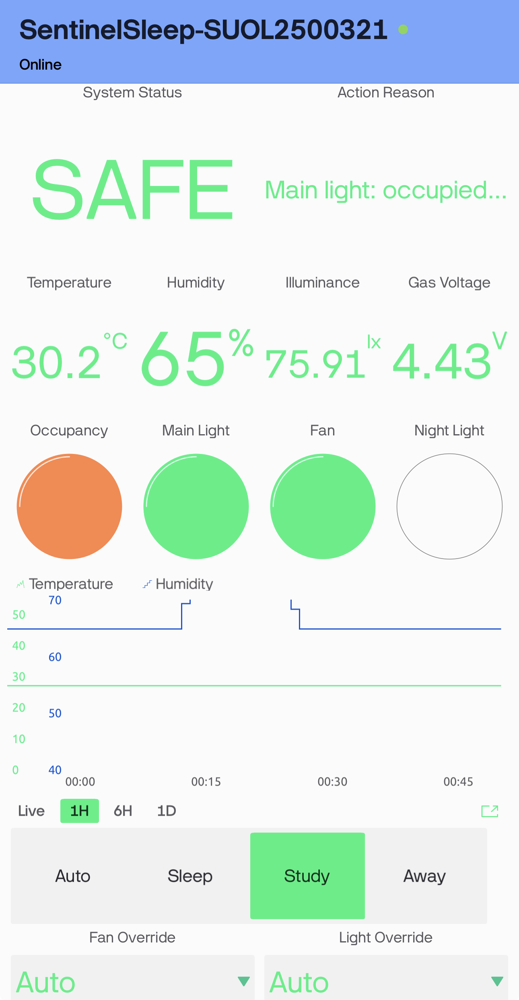

**Figure 8. Blynk Study-mode evidence showing Study selected, 30.2 °C, 75.91 lx, occupancy active, and main light/fan active. Source: Author’s implementation.**

The corresponding Wokwi views show the physical-output side of the same checks: the Sleep view is at 25 lux with the night-light indicator active, while the Study view is at 30.2 °C with the main-light and fan indicators active (Figures 9 and 10).

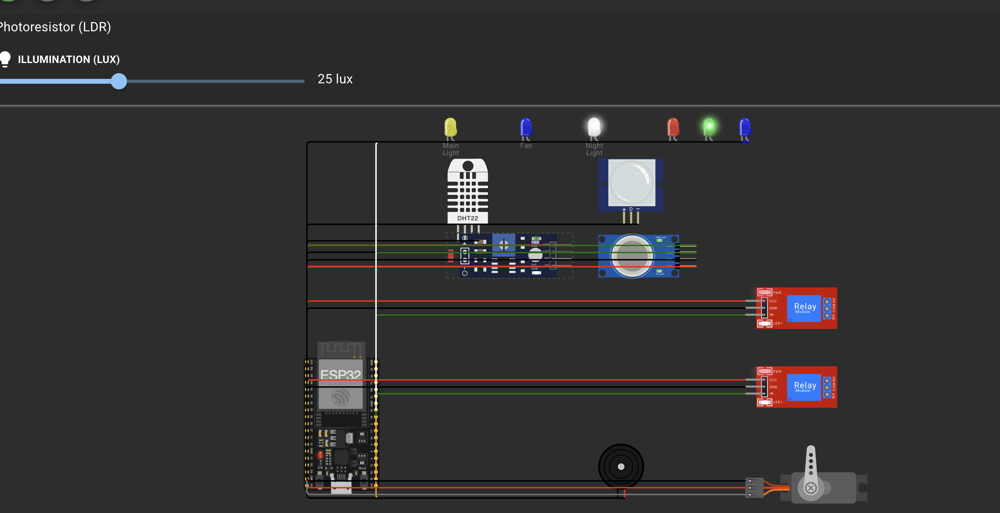

**Figure 9. Wokwi Sleep-mode evidence at 25 lux with the night-light indicator active. Source: Author’s implementation.**

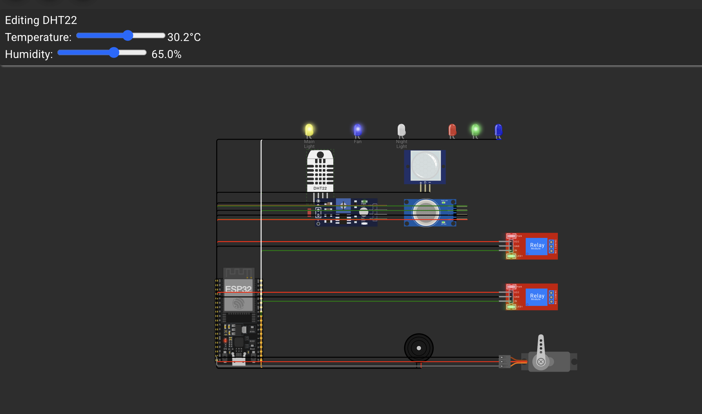

**Figure 10. Wokwi Study-mode evidence at 30.2 °C with the main-light and fan indicators active. Source: Author’s implementation.**

Away mode was then selected. The Blynk dashboard reported `Away mode disabled`, with the three comfort outputs off; the matching Wokwi view showed the main-light, fan and night-light outputs inactive (Figures 11 and 12).

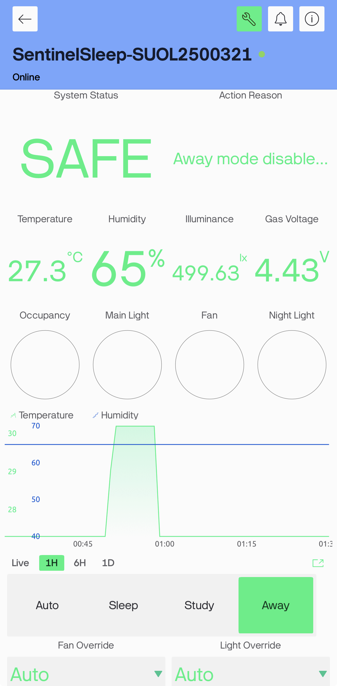

**Figure 11. Blynk Away-mode evidence showing Away selected and comfort outputs off. Source: Author’s implementation.**

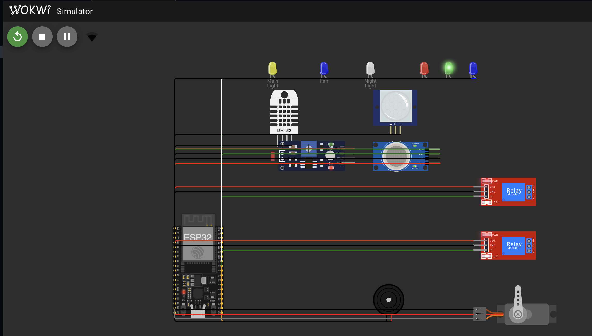

**Figure 12. Wokwi Away-mode evidence showing the comfort outputs inactive. Source: Author’s implementation.**

The Fan Override On check was also captured in Auto mode. The Blynk dashboard showed `On` for Fan Override and the Fan indicator active (Figure 13).

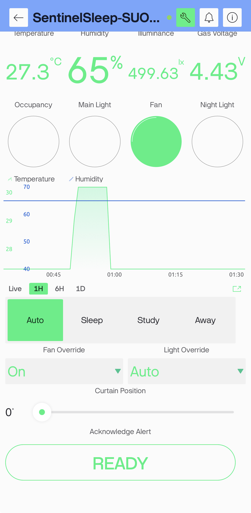

**Figure 13. Blynk evidence for Fan Override On, with the confirmed fan indicator active. Source: Author’s implementation.**

The paired Wokwi view confirms the fan indicator and relay are active. A representative Light Override On check was also captured: Blynk showed `On` with the Main Light active, and Wokwi showed the corresponding main-light indicator and relay active (Figures 14 and 15).

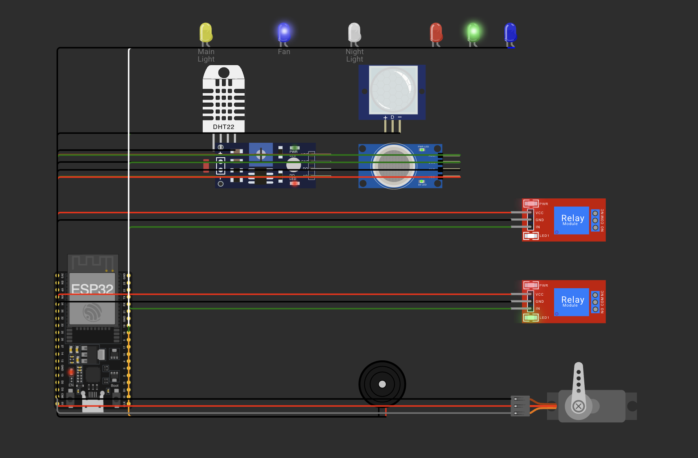

**Figure 14. Wokwi evidence for Fan Override On, with the fan indicator and relay active. Source: Author’s implementation.**

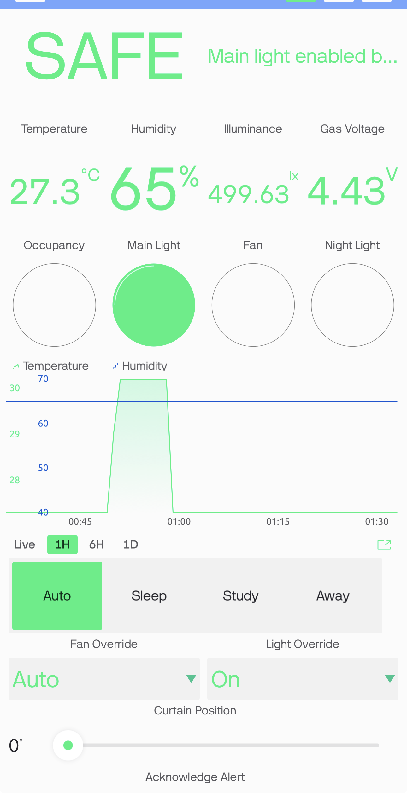

**Figure 15. Blynk evidence for Light Override On, with the Main Light indicator active. Source: Author’s implementation.**

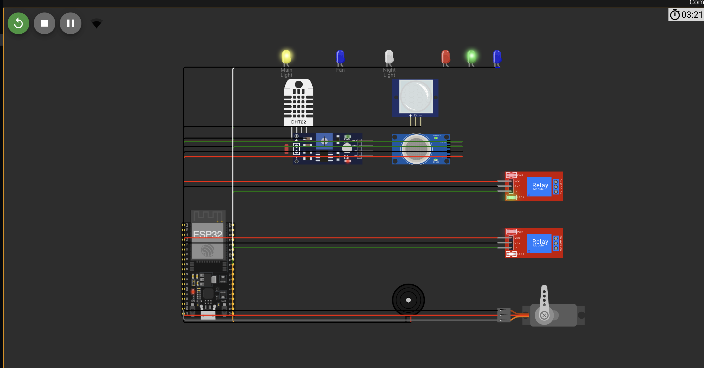

**Figure 16. Wokwi evidence for Light Override On, with the main-light indicator and relay active. Source: Author’s implementation.**

### 3.6 Cloud timing, events and reconnection

Sensor processing occurs every two seconds, while telemetry is grouped and uploaded every ten seconds. Blynk cautions against calling `virtualWrite` continuously inside the main loop because excessive messages may cause the cloud to disconnect the device (Blynk, 2026d). A timer-based schedule keeps the local loop responsive and bounds the network rate.

The project uses `gas_alert`, `humidity_warning`, `sensor_fault` and `device_reconnected` event codes. The gas and humidity events are latched so that one continuous condition does not generate repeated notifications. Descriptions contain the measured value when useful, but they never contain credentials. Reconnection attempts are time-bounded; local timers continue while cloud connection attempts occur.

For the recorded humidity test, the DHT22 was raised to 72.5%. This crossed the 70% warning threshold, changed V8 to `COMFORT WARNING`, and illuminated the red and green RGB channels together as the visual warning colour. The warning clears when humidity falls to 65% or below. The paired mobile/Wokwi evidence is Figure 6.

For the gas-safety test, the simulated MQ-2 concentration was raised to 6918 ppm, producing 4.81 V at V3 and activating the active-low digital threshold. The mobile dashboard reported `GAS ALERT`, while Wokwi showed the red alarm indicator and comfort outputs forced off. Holding the V14 acknowledgement button changed the action reason to confirm that the warning was seen; the alarm remained active until the gas input returned to safe levels. The paired gas evidence is stored in `assets/figure6_gas_alert_combined.png`.

After the MQ-2 value was reduced to the safe baseline, the controller required three consecutive safe reads before clearing the alarm. The recovery evidence shows V3 at 4.43 V, Blynk `SAFE`, and the normal green status state; this prevents a noisy single reading from immediately re-enabling comfort outputs.

### 3.7 Uniqueness of the implemented system

SentinelSleep’s distinctive feature is explainable priority-aware sensor fusion. A conventional motion light normally combines motion with a single illumination rule. SentinelSleep evaluates safety, operating mode, occupancy, light, temperature, manual intention and network condition in a defined order. The controller then publishes a short reason alongside confirmed actuator state. This makes a surprising action auditable instead of presenting automation as an unexplained switch.

Privacy also shapes the implementation. Occupancy is inferred through non-imaging PIR movement; no camera or microphone is needed for bedroom automation. The cloud receives a binary occupied/not-occupied value rather than visual or audio content. Local autonomy reduces both latency and dependence on a remote service.

### 3.8 Verification matrix

Static implementation checks, the PlatformIO build, Blynk connection and selected runtime evidence have passed. Remaining runtime rows stay open until their corresponding Wokwi/Blynk evidence is recorded.

| Scenario | Expected local result | Expected dashboard result | Current status |
|---|---|---|---|
| Baseline startup | Green state; comfort outputs off | Online device and normal telemetry | Pending live evidence |
| Dark occupied room | Main-light relay on | Occupancy/light values and reason agree | Pending live evidence |
| Hot occupied room | Fan on at 28 °C | Temperature trend and V6 state agree | Pending live evidence |
| Hysteresis | Fan remains on until 26 °C | Confirmed state follows release threshold | Pending live evidence |
| Humidity warning | Red and green RGB channels on together | 72.5% and COMFORT WARNING shown; paired evidence in Figure 6 | **PASS — live evidence captured** |
| Gas threshold | Red indicator, buzzer, outputs off | GAS ALERT at 4.81 V / 6918 ppm; paired evidence captured | **PASS — live evidence captured** |
| Acknowledge active alert | Local alarm remains active | Acknowledged reason shown; paired evidence captured | **PASS — live evidence captured** |
| Gas recovery | Alarm clears only after stable safe reads | 4.43 V and SAFE state shown; paired evidence captured | **PASS — live evidence captured** |
| Dashboard modes and overrides | Allowed output changes occur | Sleep, Study and Away paired evidence agree; representative Fan and Light Override On pairs agree | **PASS — representative mode and override evidence captured** |
| Curtain control | Servo moves 0–180 degrees | V13 position agrees | Pending live evidence |
| Wi-Fi interruption | Local logic continues | Offline then reconnect event | Pending live evidence |

## 4. Security Components

### 4.1 Device authentication and token protection

The Blynk template ID identifies the product definition, while the device auth token identifies the individual simulated controller. Blynk’s manual activation workflow treats the token as the device credential (Blynk, 2026a). The project therefore isolates live values in `include/secrets.h`, excludes that file from Git, and provides `secrets.example.h` for a safe public structure. The token must not appear in screenshots, serial output, report excerpts or the demonstration video.

The assessment requires examiner login credentials in `readme.txt`. That file belongs only in the private shared submission folder. It must not be pushed to the public repository. The user’s account password and the device auth token serve different purposes and should not be substituted for one another.

### 4.2 Transport and session handling

The Blynk library establishes the cloud session after Wi-Fi is available. This replaces the proposal’s unauthenticated public MQTT demonstration. The firmware uses `Blynk.config` plus bounded `Blynk.connect` attempts instead of a permanently blocking setup call, preserving local control during a cloud failure. The design relies on Blynk’s supported secure connection for ESP32 rather than sending telemetry to an open broker.

### 4.3 Input validation and control priority

Every dashboard enum is constrained to its documented range before use. Servo position is constrained to 0–180 degrees. Invalid DHT22 readings retain the last valid values and generate a fault status. Manual controls cannot bypass an active gas alert, and acknowledgement cannot clear the physical condition. These checks prevent malformed or stale cloud values from silently defeating local safety behavior.

### 4.4 Account and privacy controls

The examiner should receive only the access needed to view and test SentinelSleep. Blynk accounts and dashboard roles should be reviewed before sharing. The final shared Drive folder must use link access appropriate for assessment, while the credentials inside it must not be published elsewhere. Occupancy history should be retained only for the assessment period and removed when it is no longer needed.

### 4.5 Residual risks

Wokwi’s public gateway is suitable for learning but its traffic may be monitored; Wokwi explicitly advises against using sensitive information through the public gateway (Wokwi, 2026a). A production system would use a private network, a provisioned device identity, secure physical storage for credentials, tamper-resistant hardware and certified mains isolation. The simulated MQ-2 reading is not calibrated in parts per million and cannot support a safety certification.

## 5. Reflections

The implementation exposed how a plausible proposal can conceal integration problems. The original MQTT sketch transmitted sensor data, but it did not provide the bidirectional, authenticated dashboard required by the final brief. Replacing that path with Blynk required more than changing a server address: telemetry pins, control pins, confirmed state, event codes, reconnect timing and credential handling had to be designed as one interface.

The MQ-2 behavior was the clearest sensor challenge. Wokwi drives its digital output low when the converted sensor voltage exceeds the configured threshold. A threshold near the normal simulated voltage created an immediate warning that looked like a program fault. Printing both the raw ADC value and derived voltage, raising the demonstration threshold to 4.8 V, lowering the initial concentration and requiring three safe readings made the behavior explainable and stable. This issue showed why serial diagnostics must expose the physical quantity used by a comparator rather than an unexplained raw number.

Network failure also changed the firmware structure. A blocking connection call would make the demonstration appear frozen if the cloud were unavailable. The final design starts local timers first, attempts Wi-Fi and Blynk reconnection at bounded intervals, and calls `Blynk.run` only while connected. This is a better match for a room controller because lighting and local warning cannot wait for a remote service.

The dashboard introduced a subtle state-management problem. A button records what the user requested, not necessarily what the room is doing. Reporting actuator state on different virtual pins prevents the interface from claiming success during a disconnection or safety override. Publishing the action reason also makes threshold tuning easier because the user can see which rule won.

Simulation has limits. Relay modules, sensor models and the servo demonstrate logic, but they do not validate mains isolation, enclosure design, sensor calibration or long-term reliability. A physical continuation would use certified alarms, qualified electrical work and controlled tests. The Wokwi/Blynk runtime matrix remains the immediate acceptance gate for this academic prototype.

## 6. Summary

SentinelSleep converts the earlier smart-bedroom proposal into a compiled ESP32 implementation with a complete Wokwi circuit definition and an explicit Blynk interface. Local sensing and priority rules coordinate lighting, fan control, night behavior, supplementary gas indication and curtain position. The architecture continues operating when cloud connectivity is absent and distinguishes desired commands from confirmed physical state.

The successful PlatformIO release build establishes that the firmware and declared libraries are technically compatible. Security measures include device-specific authentication, gitignored secrets, bounded reconnects, rate-controlled uploads, enum validation and safety dominance over manual controls. Completion now depends on authenticated Blynk configuration, runtime evidence, the shared-folder URL and the student’s new face-visible live demonstration.

## 7. References

Blynk. (2026a). *Manual device activation*. https://docs.blynk.io/en/getting-started/activating-devices/manual-device-activation

Blynk. (2026b). *Virtual pins*. https://docs.blynk.io/en/blynk-library-firmware-api/virtual-pins

Blynk. (2026c). *Web dashboard*. https://docs.blynk.io/en/blynk.console/templates/dashboard

Blynk. (2026d). *Timers*. https://docs.blynk.io/en/blynk-library-firmware-api/blynk-timer

Blynk. (2026e). *Log event*. https://docs.blynk.io/en/blynk-library-firmware-api/log-event

Espressif Systems. (2026). *ESP32 series datasheet* (Version 5.2). https://documentation.espressif.com/esp32_datasheet_en.pdf

U.S. Fire Administration. (2023, May 9). *Smoke alarms*. https://www.usfa.fema.gov/prevention/home-fires/prepare-for-fire/smoke-alarms/index.html

Wokwi. (2026a). *ESP32 WiFi networking*. https://docs.wokwi.com/guides/esp32-wifi

Wokwi. (2026b). *Wokwi gas sensor reference*. https://docs.wokwi.com/parts/wokwi-gas-sensor

## 8. Video Demonstration & Shared Final-Project Folder

**YouTube Video Demonstration Link:** https://youtu.be/CVU9OjcAe5A  
**Shared Folder URL:** `[INSERT ACCESSIBLE GOOGLE DRIVE FOLDER LINK AFTER FINAL PACKAGE UPLOAD]`

The folder contains the DOCX report, PDF report, rendered 1080p MP4 presentation video (`20260807_SentinelSleep_Final_Presentation_1080p.mp4`), complete VS Code/Wokwi project source, and private `readme.txt`. Access must be tested in a signed-out browser before the LMS link is submitted.
