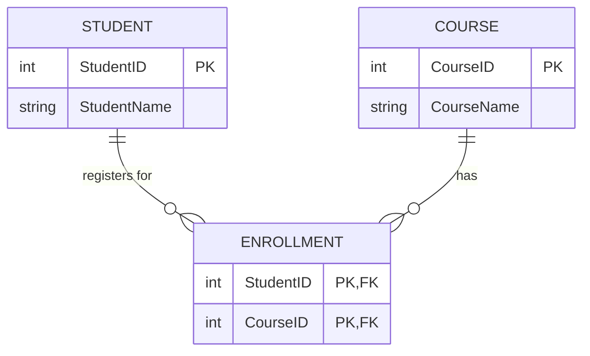

# May-Aug 2026 Test — Database Fundamentals
## Course Code: BCC1223

---

**Student Name:** Chan Jing Yi  
**Student ID:** SUOL2500321  
**Course Code:** BCC1223 Database Fundamentals  
**Date:** July 10, 2026  

---

## Part A: Conceptual Questions (20 Marks)

### Question 1: Explain the concept of data integrity and discuss THREE (3) types of integrity constraints. (4 marks)

Data integrity refers to the accuracy, completeness, and consistency of data stored within a database across its entire operational lifecycle. It represents a set of rules and mechanisms that prevent accidental or malicious data modification or corruption, ensuring that the database remains a reliable source of truth for application logic and business processes. 

To maintain this integrity, relational databases enforce specific constraints:

1. **Entity Integrity:** Mandates that each table must possess a primary key that is both unique and non-null. By preventing null values in primary key columns, entity integrity ensures that every tuple (row) within a relation can be uniquely identified and retrieved.
2. **Referential Integrity:** Governs the relationships between tables by ensuring that a foreign key value in a child table must match an existing primary key value in the referenced parent table, or be set to null. This prevents the creation of "orphan" records and maintains database consistency during insert, update, or delete operations.
3. **Domain Integrity:** Restricts the range, format, and data type of values permitted within a specific column. This constraint is typically enforced through data types (such as `INT`, `VARCHAR`), constraints (like `CHECK`, `NOT NULL`, `DEFAULT`), and lookup validation, ensuring that data conforms to defined business rules.

---

### Question 2: Define primary key, foreign key, and composite key with suitable examples. (3 marks)

Relational database models rely on key attributes to identify records and construct links between relations.

* **Primary Key (PK):** A column or combination of columns that uniquely identifies each row within a table. It must contain unique values and cannot contain null values.  
  * *Example:* In a `Student` table, `StudentID` (e.g., `1001`) serves as the primary key to distinguish individual students.
* **Foreign Key (FK):** An attribute in a table that references the primary key of another table, establishing a semantic link between the two relations.  
  * *Example:* In a `Student` table, a column named `CourseID` acts as a foreign key referencing the `CourseID` primary key of a `Course` table, indicating which program a student is enrolled in.
* **Composite Key:** A primary key consisting of two or more columns that together uniquely identify a record within a relation, used when a single column is insufficient.  
  * *Example:* In an `Enrollment` table, the combination of `(StudentID, CourseID)` forms a composite primary key, preventing a student from enrolling in the same course multiple times while uniquely identifying each registration record.

---

### Question 3: Draw a simple ERD of a student registration system with minimum requirements. (13 marks)

Below is the Entity-Relationship Diagram (ERD) representing a student registration system, modeled using Crow's Foot notation with exactly three entities, primary keys, foreign keys, and appropriate cardinality:



#### Diagram Explanation:
* **Entities:** The model consists of the `STUDENT`, `COURSE`, and `ENROLLMENT` entities, representing the minimum required schema.
* **Attributes:** Each entity defines at least two attributes, with key types clearly marked.
* **Relationships and Cardinality:**
  * A `STUDENT` may register for zero or many (`0..*`) `ENROLLMENT` records, while an `ENROLLMENT` must belong to exactly one (`1..1`) `STUDENT`.
  * A `COURSE` may be associated with zero or many (`0..*`) `ENROLLMENT` records, while an `ENROLLMENT` must reference exactly one (`1..1`) `COURSE`.
  * This models a many-to-many (M:N) relationship between `STUDENT` and `COURSE` resolved using `ENROLLMENT` as a associative entity.

---

## Part B: DDL (Data Definition Language) (35 Marks)

### Question 1: SQL to create Student table. (5 marks)

```sql
CREATE TABLE Student (
    StudentID INT PRIMARY KEY,
    Name VARCHAR(50) NOT NULL,
    Gender CHAR(1) NOT NULL,
    DateOfBirth DATE NOT NULL,
    CourseID INT,
    FOREIGN KEY (CourseID) REFERENCES Course(CourseID)
);
```

### Question 2: Modify Student table to add Email column. (5 marks)

```sql
ALTER TABLE Student
ADD Email VARCHAR(100);
```

### Question 3: Create Course table with constraints. (5 marks)

```sql
CREATE TABLE Course (
    CourseID INT PRIMARY KEY,
    CourseName VARCHAR(100) NOT NULL,
    CreditHour INT NOT NULL,
    CONSTRAINT chk_CreditHour CHECK (CreditHour BETWEEN 1 AND 6)
);
```

### Question 4: Alter Course table to ensure CreditHour cannot be null. (5 marks)

Depending on the SQL dialect, the syntax for modifying constraints varies. Both standard SQL and dialect-specific variations are provided:

```sql
-- Standard SQL / PostgreSQL / SQL Server
ALTER TABLE Course
ALTER COLUMN CreditHour INT NOT NULL;

-- MySQL Dialect
ALTER TABLE Course
MODIFY COLUMN CreditHour INT NOT NULL;
```

### Question 5: Drop both StudentInfo and Course tables from the database. (5 marks)

To maintain referential integrity, any referencing child tables must be dropped before dropping the referenced parent tables. If `StudentInfo` contains a foreign key referencing `Course`, it must be dropped first:

```sql
-- Drop child table containing the foreign key first
DROP TABLE IF EXISTS StudentInfo;

-- Drop parent table
DROP TABLE IF EXISTS Course;
```

### Question 6: Create Lecturer table with unique Email and CourseID referencing Course. (5 marks)

```sql
CREATE TABLE Lecturer (
    LecturerID INT PRIMARY KEY,
    Name VARCHAR(100) NOT NULL,
    Email VARCHAR(150) UNIQUE NOT NULL,
    CourseID INT,
    FOREIGN KEY (CourseID) REFERENCES Course(CourseID)
);
```

### Question 7: Create Enrolment table with a composite primary key. (5 marks)

```sql
CREATE TABLE Enrolment (
    StudentID INT,
    CourseID INT,
    EnrolmentDate DATE NOT NULL,
    PRIMARY KEY (StudentID, CourseID),
    FOREIGN KEY (StudentID) REFERENCES Student(StudentID),
    FOREIGN KEY (CourseID) REFERENCES Course(CourseID)
);
```

---

## Part C: SQL Query (DML and SELECT Queries) (45 Marks)

Queries are constructed based on the following relational schema:
* `Student(StudentID, Name, Gender, DateOfBirth, CourseID)`
* `Course(CourseID, CourseName, CreditHour)`
* `Enrollment(StudentID, CourseID, Grade)`

### 1. Retrieve the names of all female students enrolled in any course. (5 marks)

This query joins the `Student` table with the `Enrollment` table to ensure the student is enrolled in at least one course, filtering for female records.

```sql
SELECT DISTINCT s.Name 
FROM Student s
JOIN Enrollment e ON s.StudentID = e.StudentID
WHERE s.Gender = 'F';
```

### 2. Display all students’ names and their courses. (5 marks)

Depending on how courses are tracked, this relationship can be resolved in two ways. Both interpretations are documented below:

**Interpretation A (Enrolled courses via Enrollment table):** Matches students with courses they have explicitly registered for.
```sql
SELECT s.Name AS StudentName, c.CourseName
FROM Student s
JOIN Enrollment e ON s.StudentID = e.StudentID
JOIN Course c ON e.CourseID = c.CourseID;
```

**Interpretation B (Major program via Student.CourseID):** Matches students with their primary major department course.
```sql
SELECT s.Name AS StudentName, c.CourseName
FROM Student s
JOIN Course c ON s.CourseID = c.CourseID;
```

### 3. Retrieve the number of students enrolled in each course (display CourseName and TotalStudents). (5 marks)

Using a `LEFT JOIN` ensures that all courses are displayed, including those with zero enrolled students, returning a count of `0` rather than excluding them.

```sql
SELECT c.CourseName, COUNT(e.StudentID) AS TotalStudents
FROM Course c
LEFT JOIN Enrollment e ON c.CourseID = e.CourseID
GROUP BY c.CourseID, c.CourseName;
```

### 4. Write a query to list the students who obtained a Grade = 'A' in any course. (5 marks)

```sql
SELECT DISTINCT s.Name
FROM Student s
JOIN Enrollment e ON s.StudentID = e.StudentID
WHERE e.Grade = 'A';
```

### 5. Display the average CreditHour of all courses. (5 marks)

```sql
SELECT AVG(CreditHour) AS AverageCreditHour
FROM Course;
```

### 6. Write a query to show the youngest student’s name and date of birth. (5 marks)

The youngest student has the most recent (maximum) date of birth value. This subquery approach is ANSI SQL compliant and runs on any standard database engine:

```sql
SELECT Name, DateOfBirth
FROM Student
WHERE DateOfBirth = (SELECT MAX(DateOfBirth) FROM Student);
```

### 7. Retrieve a list of courses with more than FIVE (5) enrolled students. (5 marks)

The `HAVING` clause is utilized to filter aggregated groups after the `GROUP BY` operation.

```sql
SELECT c.CourseName, COUNT(e.StudentID) AS TotalStudents
FROM Course c
JOIN Enrollment e ON c.CourseID = e.CourseID
GROUP BY c.CourseID, c.CourseName
HAVING COUNT(e.StudentID) > 5;
```

### 8. Write a query to update a student’s grade in the Enrollment table to 'B+' where StudentID = 101. (5 marks)

```sql
UPDATE Enrollment
SET Grade = 'B+'
WHERE StudentID = 101;
```

### 9. Delete all enrollment records for a course with CourseID = 500. (5 marks)

```sql
DELETE FROM Enrollment
WHERE CourseID = 500;
```
