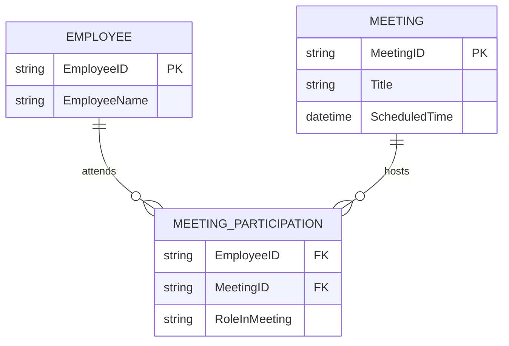
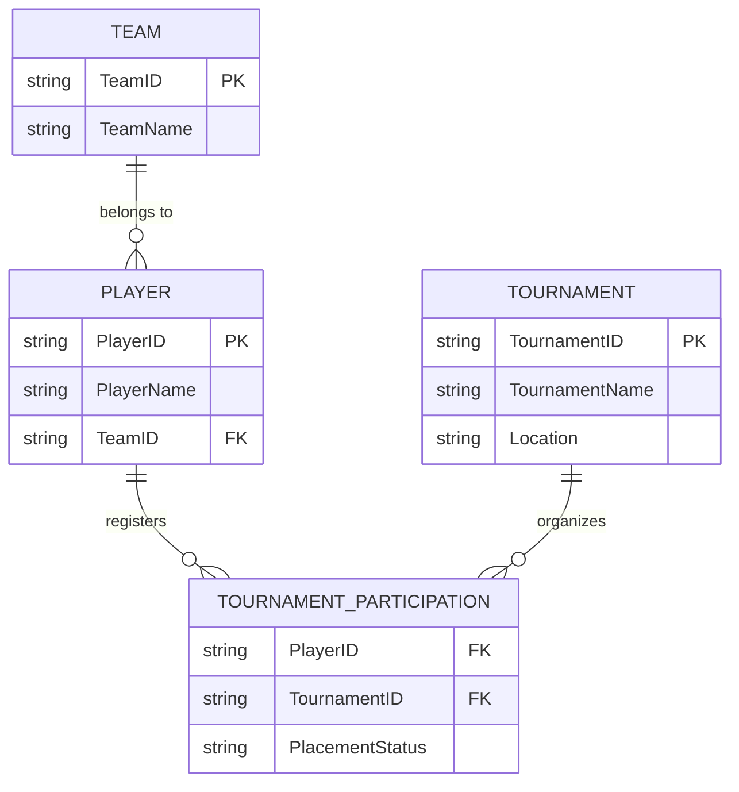
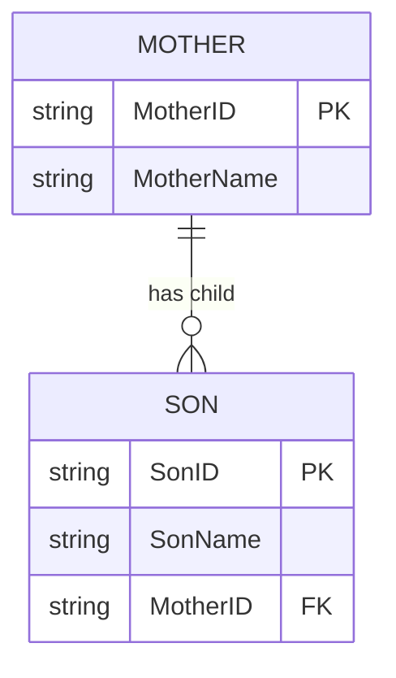
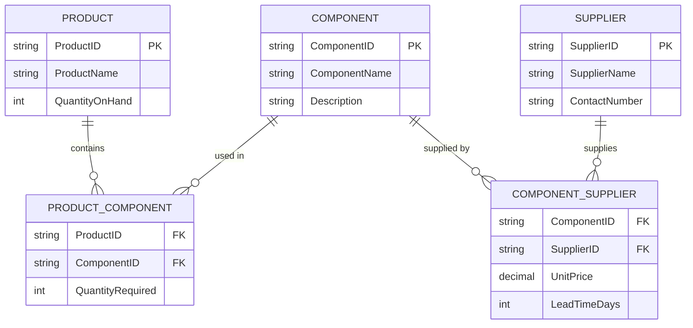
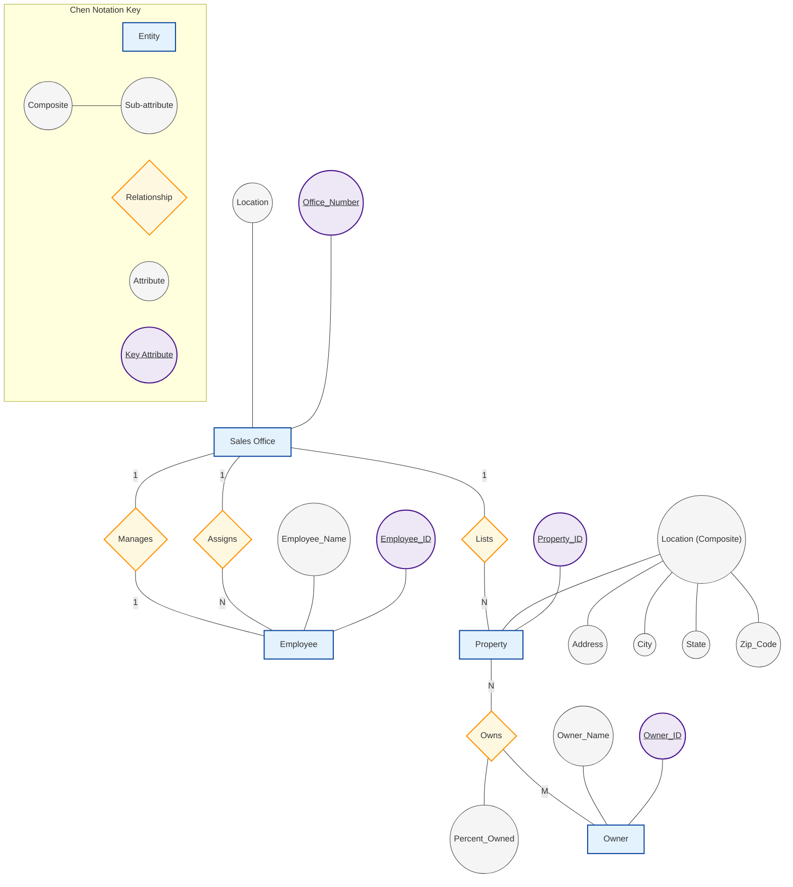

# Tutorial 3 — Entity-Relationship Modeling
## BCL1223 / BIT1223 Database Systems

---

**Student Name:** Chan Jing Yi  
**Student ID:** SUOL2500321  
**Course Code:** BCL1223 Database Fundamentals  
**Date:** July 10, 2026  

---

### Question 1: Definition and Role of the Entity-Relationship Diagram (ERD)

An Entity-Relationship Diagram (ERD) is a foundational conceptual modeling tool used in database design to represent the logical structure of a database. Originally introduced by Chen (1976), the Entity-Relationship (ER) model conceptualizes real-world enterprise environments in terms of entities, which represent distinct physical or abstract objects, attributes that describe these objects, and relationships that represent semantic associations between them. By abstracting the physical implementation details of the database, the ERD allows designers to focus on data semantics, business rules, and constraints without being constrained by specific database software or storage structures.

The ERD serves as a critical communication bridge between database designers, systems analysts, and non-technical stakeholders. It provides a visual language that helps verify user requirements and ensure that the database design accurately mirrors business operations before logical mapping and physical implementation begin. In modern software engineering, the ERD is also used to enforce business rules and constraints (such as cardinality and participation), ensuring data integrity at the conceptual level before the system catalog or schema is defined (Elmasri & Navathe, 2017).

---

### Question 2: Classification of Relationships in ERD

Relationships in Entity-Relationship modeling define how instances of different entities are semantically linked. They can be classified along two primary dimensions: **cardinality ratios** (the maximum number of relationship instances an entity can participate in) and **degree** (the number of participating entities). 

#### 1. One-to-One (1:1) Relationship
A One-to-One relationship exists when a single instance of Entity A is associated with at most one instance of Entity B, and conversely, a single instance of Entity B is associated with at most one instance of Entity A. An example is a company branch and its manager; a branch is managed by a single employee, and an employee can manage at most one branch at a time.

#### 2. One-to-Many (1:M) Relationship
A One-to-Many relationship occurs when a single instance of Entity A can be associated with multiple instances of Entity B, but each instance of Entity B is associated with exactly one instance of Entity A. This is the most common relationship type in database design. For example, a department employs multiple employees, but each employee belongs to only one department.

#### 3. Many-to-Many (M:N) Relationship
A Many-to-Many relationship occurs when an instance of Entity A can be associated with multiple instances of Entity B, and an instance of Entity B can simultaneously be associated with multiple instances of Entity A. For example, a student can enroll in multiple courses, and each course contains multiple enrolled students. In a relational database, an $M:N$ relationship cannot be implemented directly and must be resolved into two $1:M$ relationships using an associative (junction) entity.

#### 4. Unary (Recursive) Relationship
A Unary relationship, also known as a recursive relationship, is defined by its degree rather than cardinality. It occurs when a relationship exists between instances of the same entity type. In this scenario, the entity type plays two different roles in the same relationship. A common example is a management hierarchy where an employee supervises other employees; both the supervisor and the supervisee are instances of the same `EMPLOYEE` entity.

---

### Question 3: Entity Identification for a Restaurant Database

To model the operations of a restaurant, five core entities are identified to track customers, staff, physical infrastructure, menu offerings, and transactions.

1. **`CUSTOMER`**  
   Represents any patron who interacts with the restaurant, either by dining in, ordering takeout, or making a reservation.  
   *   *Primary Key:* `CustomerID`  
   *   *Attributes:* `CustomerName`, `PhoneNumber`, `EmailAddress`, `LoyaltyTier`

2. **`STAFF`**  
   Represents the restaurant's employees, including chefs, waitstaff, hosts, and managers. This entity tracks labor resources and operational responsibilities.  
   *   *Primary Key:* `StaffID`  
   *   *Attributes:* `StaffName`, `Role`, `HourlyRate`, `PhoneNumber`

3. **`MENU_ITEM`**  
   Represents the individual food and beverage items offered by the restaurant. It tracks item details, pricing, and category divisions.  
   *   *Primary Key:* `MenuItemID`  
   *   *Attributes:* `ItemName`, `Price`, `Category` (e.g., Appetizer, Main, Dessert, Drink), `IsAvailable`

4. **`DINING_TABLE`**  
   Represents the physical seating units in the restaurant dining area. It is used to manage reservations and table assignments.  
   *   *Primary Key:* `TableNumber`  
   *   *Attributes:* `SeatingCapacity`, `DiningSection` (e.g., Indoor, Patio, Bar), `Status` (e.g., Occupied, Vacant, Reserved)

5. **`CUSTOMER_ORDER`**  
   Represents the transaction record when a customer purchases menu items. It serves as the primary operational link between customers, staff, tables, and ordered items.  
   *   *Primary Key:* `OrderID`  
   *   *Attributes:* `OrderDateTime`, `TotalAmount`, `PaymentMethod` (e.g., Cash, Card), `TableNumber` (FK), `CustomerID` (FK), `StaffID` (FK)

---

### Question 4: Attribute Specifications for BUILDING, CAR, and T-SHIRT

Attributes represent the properties or characteristics of an entity type. Below are five distinct attributes defined for the `BUILDING`, `CAR`, and `T-SHIRT` entities, along with their data types and integrity constraints.

#### 1. `BUILDING` Entity
Tracks real estate assets or facilities within an organization.
*   **`BuildingID`** (Alphanumeric, Primary Key): Uniquely identifies each building in the system.
*   **`BuildingName`** (String, NOT NULL): The descriptive name of the facility (e.g., "Block A", "Engineering Hall").
*   **`PhysicalAddress`** (String, NOT NULL): The street address where the building is located.
*   **`NumberOfFloors`** (Integer, NOT NULL, Constraint: $>0$): The structural height of the building.
*   **`TotalUsableArea`** (Decimal, NOT NULL, Unit: $m^2$): The total floor area available for occupancy.

#### 2. `CAR` Entity
Tracks fleet vehicles or inventory items in a rental/dealership database.
*   **`VIN`** (Alphanumeric, Primary Key, length = 17): The unique Vehicle Identification Number assigned by manufacturers.
*   **`LicensePlateNumber`** (String, Unique, NOT NULL): The registration plate identifier issued by transport authorities.
*   **`Make`** (String, NOT NULL): The manufacturer of the vehicle (e.g., Toyota, Ford, BMW).
*   **`Model`** (String, NOT NULL): The specific product line name (e.g., Camry, Mustang, 3-Series).
*   **`YearOfManufacture`** (Integer, NOT NULL, Range: 1886 to current): The year the vehicle was assembled.

#### 3. `T-SHIRT` Entity
Tracks retail or manufacturing inventory in an e-commerce platform.
*   **`SKU`** (Alphanumeric, Primary Key): The Stock Keeping Unit used for inventory tracking.
*   **`SizeCode`** (String, NOT NULL, Constraint: IN ('XS', 'S', 'M', 'L', 'XL', 'XXL')): The size designation.
*   **`ColorName`** (String, NOT NULL): The shade name of the garment (e.g., "Navy Blue", "Charcoal Gray").
*   **`FabricComposition`** (String, NOT NULL): The material breakdown of the product (e.g., "100% Organic Cotton").
*   **`UnitPrice`** (Decimal, NOT NULL, Scale = 2): The retail selling price of the item.

---

### Question 5: Relationship Identification and Modeling

For each scenario, the underlying relationship type is identified, analyzed from an academic perspective, and mapped using Crow's Foot notation.

#### a) A student attend many classes on weekdays.
*   **Relationship Type:** Many-to-Many ($M:N$)
*   **Conceptual Analysis:** While the sentence focuses on a single student's action, database modeling must account for all instances. A single student attends multiple classes throughout the week, and each class is simultaneously attended by multiple students. Because this represents an $M:N$ relationship, implementing it directly in a relational model would violate the first normal form (1NF) due to multi-valued attributes. Consequently, it must be resolved using an associative entity, `CLASS_ATTENDANCE`, which contains composite foreign keys referencing both `STUDENT` and `CLASS`.

```mermaid
erDiagram
    STUDENT ||--o{ CLASS_ATTENDANCE : records
    CLASS ||--o{ CLASS_ATTENDANCE : schedules
    STUDENT {
        string StudentID PK
        string StudentName
    }
    CLASS {
        string ClassID PK
        string ClassName
        string Weekday
    }
    CLASS_ATTENDANCE {
        string StudentID FK
        string ClassID FK
        date DateAttended
    }
```

#### b) Many employees has join the company meeting.
*   **Relationship Type:** Many-to-Many ($M:N$)
*   **Conceptual Analysis:** An employee can participate in multiple corporate meetings over time, and a single meeting comprises multiple employee participants. This mutual multi-valued association requires a Many-to-Many structure. To maintain relational integrity and eliminate redundant details, an associative entity `MEETING_PARTICIPATION` is introduced to bridge `EMPLOYEE` and `MEETING`.



#### c) Many players in the Red Team have joined many tournament around the world.
*   **Relationship Type:** Many-to-Many ($M:N$)
*   **Conceptual Analysis:** A player joins multiple tournaments over their career, and a tournament is composed of many participating players. This creates an $M:N$ relationship between `PLAYER` and `TOURNAMENT`. The phrase "in the Red Team" establishes an additional $1:M$ relationship where a team owns multiple players, but each player belongs to only one team. The primary $M:N$ relationship is resolved via the associative entity `TOURNAMENT_PARTICIPATION`.



#### d) The mother has prepared breakfast to her son.
*   **Relationship Type:** One-to-Many ($1:M$) or Ternary ($M:N:P$)
*   **Conceptual Analysis:** This scenario can be modeled in two ways depending on the system's operational requirements. In a biological and familial context, a mother can have multiple children (including sons), but a son has exactly one biological mother. This represents a classic $1:M$ relationship. 
    However, if the database specifically tracks daily meal preparation events, this is best represented as an association where a `MOTHER` prepares a `MEAL` (Breakfast) for her `SON`. In a binary representation, we model a $1:M$ relationship between `MOTHER` and `SON` (where mother is the parent entity), and map the breakfast preparation as a dependent transaction. Below, we model the primary parent-child relationship.



---

### Question 6: Manufacturing Inventory ERD

A manufacturing company requires tracking of products, their constituent components, and the external suppliers who provide those components. 

#### 1. Entity and Attribute Design
To support these requirements, three primary entities and two associative entities are defined:
*   **`PRODUCT`**: Stores finished goods inventory.
    *   *Attributes:* `ProductID` (PK), `ProductName`, `QuantityOnHand`
*   **`COMPONENT`**: Represents raw parts or assemblies.
    *   *Attributes:* `ComponentID` (PK), `ComponentName`, `Description`
*   **`SUPPLIER`**: Tracks vendor information.
    *   *Attributes:* `SupplierID` (PK), `SupplierName`, `ContactNumber`
*   **`PRODUCT_COMPONENT` (Bill of Materials)**: Resolves the $M:N$ relationship between products and components.
    *   *Attributes:* `ProductID` (FK), `ComponentID` (FK), `QuantityRequired`
*   **`COMPONENT_SUPPLIER` (Supply Source)**: Resolves the $M:N$ relationship between components and suppliers.
    *   *Attributes:* `ComponentID` (FK), `SupplierID` (FK), `UnitPrice`, `LeadTimeDays`

#### 2. Relationship and Cardinality Analysis
*   **`PRODUCT` to `COMPONENT` ($M:N$):** A single product is assembled from multiple component parts. Conversely, a single component (e.g., a screw or a microchip) can be used in the assembly of multiple different products. This Many-to-Many relationship is decomposed by `PRODUCT_COMPONENT` using a composite primary key composed of `(ProductID, ComponentID)`.
*   **`COMPONENT` to `SUPPLIER` ($M:N$):** To ensure supply chain redundancy, each component can be sourced from one or more suppliers. At the same time, a supplier typically distributes many different components. This Many-to-Many relationship is decomposed by `COMPONENT_SUPPLIER` with a composite primary key composed of `(ComponentID, SupplierID)`.

#### 3. ERD Model (Crow's Foot Notation)
The diagram below illustrates the fully resolved relational schema for the manufacturing inventory tracking system.



---

### Question 7: Chen's Notation ERD for Real Estate Firm

For the real estate firm scenario, Chen's notation is used to represent the conceptual database schema. In Chen's notation:
*   **Entities** are represented by **Rectangles**.
*   **Attributes** are represented by **Ovals** connected to their respective entities.
*   **Primary Keys** (Identifiers) are indicated by **Underlined text** within ovals.
*   **Relationships** are represented by **Diamonds** connected to the participating entities.
*   **Composite Attributes** are shown as ovals branching into subordinate ovals.
*   **Cardinalities** (e.g., 1, N, M) are placed on the lines connecting entities to relationship diamonds.
*   **Relationship Attributes** are ovals connected directly to the relationship diamond.

#### 1. Architectural Rules and Cardinality Details
*   **Sales Office & Employee (Assigns):** A Sales Office has one-to-many employees ($1:N$). An employee is assigned to exactly one sales office. Participation is mandatory on both sides: an office must have at least one employee, and an employee must belong to one office.
*   **Sales Office & Employee (Manages):** A Sales Office is managed by exactly one employee, and an employee can manage at most one office (only the one they are assigned to). This is a $1:1$ relationship. Participation is mandatory for the Sales Office (must have a manager) but optional for the Employee (not all employees are managers).
*   **Sales Office & Property (Lists):** A Sales Office lists zero-to-many properties ($1:N$). A property must be listed with exactly one sales office. Participation is mandatory for the Property (must be listed) but optional for the Sales Office (an office may have no active listings).
*   **Property & Owner (Owns):** A Property has one-to-many owners, and an Owner can own one-to-many properties. This is a Many-to-Many ($M:N$) relationship. Participation is mandatory on both sides. The relationship contains a key attribute: `Percent_Owned` (representing the portion of the property owned by a specific owner).

#### 2. Visual Model (Chen's Notation Flowchart)
The diagram below illustrates the conceptual schema using the graphical standards established by Chen (1976).



#### 3. Notation Legend
The symbols and layout elements in the Chen's notation diagram represent specific logical constraints:

| Graphical Symbol | Meaning | Example in Diagram | Description |
| :--- | :--- | :--- | :--- |
| **Rectangle** | Entity Type | `Sales Office`, `Employee`, `Property`, `Owner` | A primary physical or abstract object stored in the database. |
| **Diamond** | Relationship Type | `Assigns`, `Manages`, `Lists`, `Owns` | A semantic association between two participating entities. |
| **Oval (Regular)** | Simple Attribute | `Location`, `Employee_Name`, `Owner_Name` | A basic property or characteristic describing an entity. |
| **Oval (Highlighted, Underlined)** | Key Attribute (Primary Key) | `Office_Number`, `Employee_ID`, `Property_ID`, `Owner_ID` | A unique identifier that guarantees tuple uniqueness. |
| **Branched Ovals** | Composite Attribute | `Location` $\rightarrow$ `Address`, `City`, `State`, `Zip_Code` | An attribute composed of several smaller sub-attributes. |
| **Oval on Relationship** | Relationship Attribute | `Percent_Owned` on `Owns` | An attribute that belongs to the association itself, rather than either entity. |
| **Connecting Line Labels** | Cardinality Ratios | `1` (One), `N` / `M` (Many) | Defines the numerical limits ($1:1$, $1:M$, $M:N$) of participating instances. |


---

### References

*   Chen, P. P. S. (1976). The entity-relationship model—toward a unified view of data. *ACM Transactions on Database Systems (TODS)*, 1(1), 9–36. https://doi.org/10.1145/320434.320440
*   Coronel, C., & Morris, S. (2018). *Database Systems: Design, Implementation, and Management* (13th ed.). Cengage Learning.
*   Elmasri, R., & Navathe, S. B. (2017). *Fundamentals of Database Systems* (7th ed.). Pearson.
