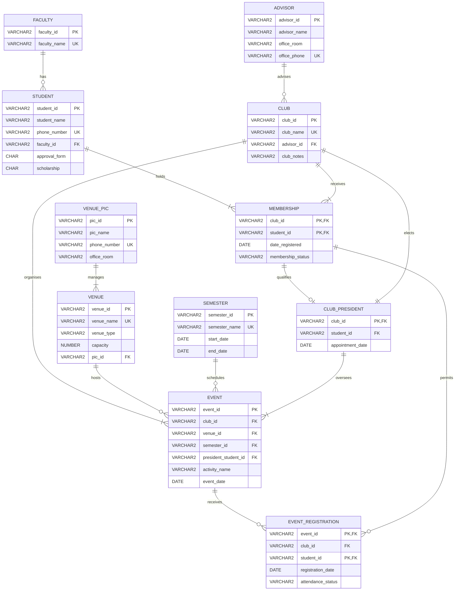

# SEGi Student Clubs and Societies Database

## BCL1223 Database Fundamentals — Continuous Assessment (40%)

**Student Name:** Chan Jing Yi  
**Student ID:** SUOL2500321  
**Programme:** Bachelor of Information Technology (Hons) / Bachelor of Computer Science  
**Submission Date:** 25 July 2026  
**Report Date:** 18 July 2026  

---

## Executive Summary

The Student Affairs Department requires a database that can coordinate club membership, faculty approval, advisors, elected presidents, venues and activities across academic semesters. The design developed in this report separates persistent objects from operational relationships: students and clubs are independent entities, while the date on which a student joins a club belongs to the `MEMBERSHIP` relationship. Event registration is modelled separately from club membership because attending an activity and belonging to its organising club represent different facts.

The implemented Oracle schema contains eleven normalized relations, 10 faculties, 30 students, 15 clubs, 50 memberships, 15 presidents, 10 venues, 45 events and 30 event registrations. Referential constraints enforce two rules that are easily lost in a purely diagrammatic design. A club president must already be a member of that club, and a student cannot register for an event unless the student belongs to the club that runs it. The complete script was executed twice on Oracle AI Database 26ai Free, version 23.26.2.0.0. Every object and row was recreated successfully; six deliberate invalid transactions were rejected, and all required queries returned meaningful results.

## Contents

1. Task 1 — Database Design  
2. Task 2 — Data Definition and Population  
3. Task 3 — Data Manipulation and Queries  
4. Task 4 — Demonstration Guide  
5. References  
6. Appendices  

---

# Task 1 — Database Design (40 Marks)

## 1.1 Requirements Interpretation

The case study contains several facts whose location is not explicit in the supplied data list. The registration date cannot be an attribute of `STUDENT`, because the same student may join several clubs on different dates. It also cannot be an attribute of `CLUB`, because different members join one club on different dates. The attribute is therefore stored in the associative entity `MEMBERSHIP`, which resolves the many-to-many relationship between students and clubs.

The event requirements imply two further entities. `SEMESTER` gives stable labels and date boundaries for cross-semester reporting. `EVENT_REGISTRATION` records students who sign up for events. Without that relation, the rule in Task 3 Question 6—every event registrant must be assigned to a club—cannot be represented or tested. This decomposition follows the relational design principle that each relation should describe one entity or one relationship, with non-key attributes dependent on its key (Elmasri & Navathe, 2016).

The supplied club examples were expanded to 15 credible student organisations. Names were informed by the active SEGi College Petaling Jaya clubs and societies page, while the database remains a fictional assessment dataset rather than a copy of operational college records (SEGi College Petaling Jaya, n.d.).

## 1.2 Entity Relationships and Multiplicities

**Table 1. Relationship summary**

| First entity | Multiplicity | Relationship | Second entity | Multiplicity | Business interpretation |
|---|---:|---|---|---:|---|
| `FACULTY` | 1 | has | `STUDENT` | 0..* | A faculty may have many students; each student belongs to exactly one faculty. |
| `STUDENT` | 1 | holds | `MEMBERSHIP` | 1..* | A participating student has one or more memberships; every membership belongs to one student. |
| `CLUB` | 1 | receives | `MEMBERSHIP` | 1..* | A club contains one or more members; every membership refers to one club. |
| `ADVISOR` | 1 | advises | `CLUB` | 0..* | An advisor may handle several clubs; each club has exactly one advisor. |
| `MEMBERSHIP` | 1 | qualifies | `CLUB_PRESIDENT` | 0..1 | A president appointment must use a valid membership; most memberships are not presidencies. |
| `CLUB` | 1 | elects | `CLUB_PRESIDENT` | 1 | Each club has one current president; a presidency belongs to one club. |
| `VENUE_PIC` | 1 | manages | `VENUE` | 1..* | A person in charge may manage venues; each venue has exactly one PIC. |
| `CLUB` | 1 | organises | `EVENT` | 1..* | A club runs one or more events; every event belongs to one club. |
| `VENUE` | 1 | hosts | `EVENT` | 0..* | A venue may host many events; each event uses one venue. |
| `SEMESTER` | 1 | schedules | `EVENT` | 0..* | A semester contains events; each event occurs in one semester. |
| `CLUB_PRESIDENT` | 1 | oversees | `EVENT` | 1..* | The elected president oversees the club's events. |
| `EVENT` | 1 | receives | `EVENT_REGISTRATION` | 0..* | An event may receive many registrations; each registration is for one event. |
| `MEMBERSHIP` | 1 | permits | `EVENT_REGISTRATION` | 0..* | Only a member of the organising club may register for its event. |

The phrase “one advisor can handle one or more clubs” defines an advisor’s possible workload, but it does not require every lecturer in the advisor master table to be assigned immediately. The physical model therefore permits zero clubs on the advisor side and requires one advisor on the club side. Minimum child counts such as “each club runs at least one event” cannot be guaranteed by a foreign key alone; the dataset and audit query establish three events per club, one in each modelled semester.

## 1.3 Normalization Rationale

The unstructured requirement list contains repeating groups: a student may list several clubs, an advisor may list several assigned clubs, and a club may list many events. Storing these values in single columns would violate first normal form because the values would not be atomic. Creating `MEMBERSHIP`, `EVENT` and `EVENT_REGISTRATION` gives each occurrence its own row.

The composite-key relations satisfy second normal form. In `MEMBERSHIP`, `date_registered` and `membership_status` describe the complete pair `(club_id, student_id)` rather than only one part. In `EVENT_REGISTRATION`, the registration date and attendance status describe the student’s registration for a particular event. Advisor details are not repeated in `CLUB`; venue PIC details are not repeated in `VENUE`; faculty names are not repeated in `STUDENT`. These separations remove transitive dependencies and place the design in third normal form.

Two purposeful key copies appear in `EVENT_REGISTRATION`: `club_id` accompanies `event_id`, and the same `club_id` accompanies `student_id`. This value is not an uncontrolled duplicate. It enables two composite foreign keys to prove that the selected event belongs to the club and that the selected student is a member of that same club. The design trades one constrained key copy for enforceable cross-relationship integrity.

## 1.4 Data Dictionary

Oracle’s relational tables are defined with `CREATE TABLE`; enabled primary-key, unique, foreign-key and check constraints cause invalid changes to fail rather than allowing contradictory data (Oracle, 2026a). The lengths below reflect identifiers and values required by the case study while retaining room for realistic names and notes.

**Table 2. Final database data dictionary**

| Entity | Attribute | Oracle data type | Key / constraint | Null rule and purpose |
|---|---|---|---|---|
| `FACULTY` | `faculty_id` | `VARCHAR2(6)` | PK | Not null; stable faculty identifier. |
|  | `faculty_name` | `VARCHAR2(100)` | UNIQUE | Not null; official faculty name. |
| `STUDENT` | `student_id` | `VARCHAR2(6)` | PK, CHECK | Not null; exactly two letters followed by four digits. |
|  | `student_name` | `VARCHAR2(100)` | — | Not null; full name. |
|  | `phone_number` | `VARCHAR2(20)` | UNIQUE | Not null; contact number. |
|  | `faculty_id` | `VARCHAR2(6)` | FK → `FACULTY` | Not null; owning faculty. |
|  | `approval_form` | `CHAR(1)` | CHECK Y/N | Not null, default N; faculty approval received. |
|  | `scholarship` | `CHAR(1)` | CHECK Y/N | Not null, default N; scholarship indicator. |
| `ADVISOR` | `advisor_id` | `VARCHAR2(6)` | PK | Not null; lecturer identifier. |
|  | `advisor_name` | `VARCHAR2(100)` | — | Not null; lecturer name. |
|  | `office_room` | `VARCHAR2(10)` | — | Not null; room such as R2.1. |
|  | `office_phone` | `VARCHAR2(20)` | UNIQUE | Not null; internal contact number. |
| `CLUB` | `club_id` | `VARCHAR2(6)` | PK | Not null; club identifier. |
|  | `club_name` | `VARCHAR2(100)` | UNIQUE | Not null; club name. |
|  | `advisor_id` | `VARCHAR2(6)` | FK → `ADVISOR` | Not null; assigned advisor. |
|  | `club_notes` | `VARCHAR2(500)` | — | Nullable; purpose or administrative notes. |
| `MEMBERSHIP` | `club_id` | `VARCHAR2(6)` | PK, FK → `CLUB` | Not null; membership’s club. |
|  | `student_id` | `VARCHAR2(6)` | PK, FK → `STUDENT` | Not null; membership’s student. |
|  | `date_registered` | `DATE` | DEFAULT | Not null; date the student joined this club. |
|  | `membership_status` | `VARCHAR2(10)` | CHECK | Not null; ACTIVE or INACTIVE. |
| `CLUB_PRESIDENT` | `club_id` | `VARCHAR2(6)` | PK, composite FK | Not null; exactly one current president row per club. |
|  | `student_id` | `VARCHAR2(6)` | Composite FK → `MEMBERSHIP` | Not null; elected student must be a club member. |
|  | `appointment_date` | `DATE` | — | Not null; election or appointment date. |
| `VENUE_PIC` | `pic_id` | `VARCHAR2(6)` | PK | Not null; PIC identifier. |
|  | `pic_name` | `VARCHAR2(100)` | — | Not null; PIC name. |
|  | `phone_number` | `VARCHAR2(20)` | UNIQUE | Not null; PIC contact number. |
|  | `office_room` | `VARCHAR2(10)` | — | Not null; PIC office location. |
| `VENUE` | `venue_id` | `VARCHAR2(6)` | PK | Not null; room/hall identifier. |
|  | `venue_name` | `VARCHAR2(100)` | UNIQUE | Not null; display name. |
|  | `venue_type` | `VARCHAR2(30)` | CHECK | Not null; classroom, laboratory, hall, studio or outdoor. |
|  | `capacity` | `NUMBER(4)` | CHECK > 0 | Not null; safe planning capacity. |
|  | `pic_id` | `VARCHAR2(6)` | FK → `VENUE_PIC` | Not null; responsible PIC. |
| `SEMESTER` | `semester_id` | `VARCHAR2(8)` | PK | Not null; semester identifier. |
|  | `semester_name` | `VARCHAR2(30)` | UNIQUE | Not null; report heading. |
|  | `start_date` | `DATE` | CHECK pair | Not null; semester opening date. |
|  | `end_date` | `DATE` | CHECK pair | Not null; later than `start_date`. |
| `EVENT` | `event_id` | `VARCHAR2(8)` | PK | Not null; event number. |
|  | `club_id` | `VARCHAR2(6)` | FK → `CLUB` | Not null; organising club. |
|  | `venue_id` | `VARCHAR2(6)` | FK → `VENUE` | Not null; booked venue. |
|  | `semester_id` | `VARCHAR2(8)` | FK → `SEMESTER` | Not null; reporting semester. |
|  | `president_student_id` | `VARCHAR2(6)` | Composite FK → `CLUB_PRESIDENT` | Not null; president responsible for the event. |
|  | `activity_name` | `VARCHAR2(150)` | — | Not null; activity title. |
|  | `event_date` | `DATE` | — | Not null; required by Task 3 Question 4. |
| `EVENT_REGISTRATION` | `event_id` | `VARCHAR2(8)` | PK, composite FK → `EVENT` | Not null; selected event. |
|  | `club_id` | `VARCHAR2(6)` | Composite FK | Not null; common club linking event and member. |
|  | `student_id` | `VARCHAR2(6)` | PK, composite FK → `MEMBERSHIP` | Not null; registered club member. |
|  | `registration_date` | `DATE` | DEFAULT | Not null; sign-up date. |
|  | `attendance_status` | `VARCHAR2(10)` | CHECK | Not null; REGISTERED, ATTENDED or ABSENT. |

## 1.5 Complete Entity–Relationship Diagram



**Figure 1. Complete logical ERD in Crow’s Foot notation.** The two associative entities resolve the student–club and student–event many-to-many relationships. `CLUB_PRESIDENT` makes the election rule visible and enforceable rather than leaving “president” as an unverified text field.

---

# Task 2 — Data Definition Language (30 Marks)

## 2.1 Oracle Schema and Constraints (15 Marks)

The database schema was implemented in Oracle using named primary-key, foreign-key, unique, check and not-null constraints. Naming each constraint allows an Oracle error to be traced to the business rule that rejected the operation. The following extract shows the two most consequential junction structures.

```sql
CREATE TABLE membership (
    club_id            VARCHAR2(6),
    student_id         VARCHAR2(6),
    date_registered    DATE DEFAULT SYSDATE NOT NULL,
    membership_status  VARCHAR2(10) DEFAULT 'ACTIVE' NOT NULL,
    CONSTRAINT pk_membership PRIMARY KEY (club_id, student_id),
    CONSTRAINT fk_membership_club FOREIGN KEY (club_id)
        REFERENCES club (club_id) ON DELETE CASCADE,
    CONSTRAINT fk_membership_student FOREIGN KEY (student_id)
        REFERENCES student (student_id) ON DELETE CASCADE,
    CONSTRAINT ck_membership_status
        CHECK (membership_status IN ('ACTIVE', 'INACTIVE'))
);

CREATE TABLE event_registration (
    event_id           VARCHAR2(8),
    club_id            VARCHAR2(6),
    student_id         VARCHAR2(6),
    registration_date  DATE DEFAULT SYSDATE NOT NULL,
    attendance_status  VARCHAR2(10) DEFAULT 'REGISTERED' NOT NULL,
    CONSTRAINT pk_event_registration PRIMARY KEY (event_id, student_id),
    CONSTRAINT fk_registration_event FOREIGN KEY (event_id, club_id)
        REFERENCES event (event_id, club_id) ON DELETE CASCADE,
    CONSTRAINT fk_registration_member FOREIGN KEY (club_id, student_id)
        REFERENCES membership (club_id, student_id),
    CONSTRAINT ck_attendance_status
        CHECK (attendance_status IN ('REGISTERED', 'ATTENDED', 'ABSENT'))
);
```

Oracle applies enabled constraints to subsequent data changes. A primary key combines uniqueness with a non-null requirement, a foreign key requires a matching parent key, and a check constraint evaluates a stated domain condition (Oracle, 2026a). `ON DELETE CASCADE` is restricted to dependent records whose meaning disappears with the parent—memberships when a club or student is deleted, and registrations when an event is deleted. Master records such as advisors, venues and semesters use Oracle’s default restrictive behaviour so that referenced history cannot be removed accidentally.

Eight explicit indexes support foreign-key joins and integrity checks. Primary-key and unique constraints already create their own supporting indexes, so duplicating those indexes would waste storage without improving the model.

## 2.2 Data Population (15 Marks)

`INSERT ALL` statements keep the seed data readable while inserting independent, realistic rows. Operational tables exceed ten rows; `SEMESTER` contains three rows because only three consecutive teaching periods are required for the requested cross-tab report.

**Table 3. Live Oracle row-count evidence**

| Table | Rows | Table | Rows |
|---|---:|---|---:|
| `FACULTY` | 10 | `ADVISOR` | 10 |
| `VENUE_PIC` | 10 | `SEMESTER` | 3 |
| `STUDENT` | 30 | `CLUB` | 15 |
| `VENUE` | 10 | `MEMBERSHIP` | 50 |
| `CLUB_PRESIDENT` | 15 | `EVENT` | 45 |
| `EVENT_REGISTRATION` | 30 | **Total** | **228** |

Each club has exactly three events—one in May–August 2026, one in September–December 2026 and one in January–April 2027. The integrity audit returned zero event registrations without a matching club membership.

```text
Oracle AI Database 26ai Free Release 23.26.2.0.0
INVALID_EVENT_REGISTRATIONS
---------------------------
                          0
EVENTS_OUTSIDE_SEMESTER
-----------------------
                      0
```

### Constraint Rejection Evidence

The script attempts six invalid changes inside recoverable savepoints. A successful test means Oracle rejected the change and preserved the valid dataset.

```text
PASS - malformed student ID rejected (-2290)
PASS - invalid approval status rejected (-2290)
PASS - duplicate club membership rejected (-1)
PASS - club with missing advisor rejected (-2291)
PASS - president who is not a member of the club rejected (-2291)
PASS - event registration by a non-member rejected (-2291)
```

This evidence distinguishes declared rules from working rules. The composite foreign key on `CLUB_PRESIDENT` rejects a president outside the club, while the pair of registration foreign keys rejects a student who belongs to another club but not to the event’s organiser.

---

# Task 3 — Data Manipulation Language and Queries (30 Marks)

Oracle `SELECT` statements use joins to reconstruct related facts from normalized tables. Column aliases give report-friendly headings, while `ORDER BY`, grouping and `PIVOT` shape each result for its operational user (Oracle, 2026b).

## 3.1 Student Phone List (5 Marks)

```sql
SELECT DISTINCT s.student_id, s.student_name, s.phone_number
FROM student s
JOIN membership m ON m.student_id = s.student_id
ORDER BY s.student_name;
```

The inner join excludes students who have never enrolled in a club. `DISTINCT` prevents a student with several memberships from appearing repeatedly, and alphabetical ordering supports quick lookup.

**Table 4. Verified phone-list result (30 rows)**

| Student ID | Student name | Phone | Student ID | Student name | Phone |
|---|---|---|---|---|---|
| aa1001 | Adam Abdullah | 012-810-1001 | pp1016 | Pravin Prakash | 012-810-1016 |
| aa1027 | Amirul Anwar | 012-810-1027 | qq1017 | Qistina Qamar | 012-810-1017 |
| bb1028 | Bella Bahar | 012-810-1028 | rr1018 | Rachel Raj | 012-810-1018 |
| bb1002 | Brenda Balan | 012-810-1002 | ss1019 | Syafiq Salleh | 012-810-1019 |
| cc1029 | Caleb Chan | 012-810-1029 | tt1020 | Tan Tze Wei | 012-810-1020 |
| cc1003 | Chong Cai Wen | 012-810-1003 | uu1021 | Umair Usman | 012-810-1021 |
| dd1004 | Devi Krishnan | 012-810-1004 | vv1022 | Vanessa Voon | 012-810-1022 |
| dd1030 | Diyana Daud | 012-810-1030 | ww1023 | Wong Wai Kit | 012-810-1023 |
| ee1005 | Ethan Elias | 012-810-1005 | xx1024 | Xavier Xian | 012-810-1024 |
| ff1006 | Farah Faisal | 012-810-1006 | yy1025 | Yasmin Yusof | 012-810-1025 |
| gg1007 | Gan Hui Min | 012-810-1007 | zz1026 | Zara Zainal | 012-810-1026 |
| hh1008 | Harith Hakim | 012-810-1008 | ii1009 | Irene Ismail | 012-810-1009 |
| jj1010 | Jason Jamil | 012-810-1010 | kk1011 | Kavitha Kumar | 012-810-1011 |
| ll1012 | Lee Li Ann | 012-810-1012 | mm1013 | Muhammad Malik | 012-810-1013 |
| nn1014 | Nur Nabila | 012-810-1014 | oo1015 | Ong Ooi Wei | 012-810-1015 |

## 3.2 Advisors Assigned to More Than One Club (5 Marks)

```sql
SELECT a.advisor_id,
       a.advisor_name,
       COUNT(c.club_id) AS number_of_clubs,
       LISTAGG(c.club_name, '; ')
           WITHIN GROUP (ORDER BY c.club_name) AS assigned_clubs
FROM advisor a
JOIN club c ON c.advisor_id = a.advisor_id
GROUP BY a.advisor_id, a.advisor_name
HAVING COUNT(c.club_id) > 1
ORDER BY a.advisor_name;
```

`GROUP BY` produces one workload group per advisor. `HAVING` is evaluated after the count and retains only workloads above one club; `LISTAGG` preserves the club identities that a count alone would hide.

**Table 5. Verified multi-club advisor result**

| Advisor | Number of clubs | Assigned clubs |
|---|---:|---|
| Dr. Aisha Rahman | 3 | Cybersecurity Club; Information Technology Club; Robotics Club |
| Dr. Kelvin Wong | 2 | Accounting Club; Photography Club |
| Mr. Daniel Lee | 2 | Dance Club; Debate Club |
| Ms. Nur Izzati | 2 | Entrepreneurship Club; Music Club |

## 3.3 Missing Faculty Approval Forms (5 Marks)

```sql
SELECT s.student_id,
       s.student_name,
       s.phone_number,
       'Faculty Approval Form' AS missing_form
FROM student s
WHERE s.approval_form = 'N'
  AND EXISTS (
      SELECT 1 FROM membership m WHERE m.student_id = s.student_id
  )
ORDER BY s.student_name;
```

The correlated `EXISTS` condition limits the calling list to students who have actually joined a club. The constant output column identifies the required document rather than forcing staff to infer it from a one-character flag.

**Table 6. Verified missing-form result**

| Student ID | Student name | Phone | Missing form |
|---|---|---|---|
| cc1029 | Caleb Chan | 012-810-1029 | Faculty Approval Form |
| cc1003 | Chong Cai Wen | 012-810-1003 | Faculty Approval Form |
| ee1005 | Ethan Elias | 012-810-1005 | Faculty Approval Form |
| hh1008 | Harith Hakim | 012-810-1008 | Faculty Approval Form |
| kk1011 | Kavitha Kumar | 012-810-1011 | Faculty Approval Form |
| nn1014 | Nur Nabila | 012-810-1014 | Faculty Approval Form |
| qq1017 | Qistina Qamar | 012-810-1017 | Faculty Approval Form |
| tt1020 | Tan Tze Wei | 012-810-1020 | Faculty Approval Form |
| ww1023 | Wong Wai Kit | 012-810-1023 | Faculty Approval Form |
| zz1026 | Zara Zainal | 012-810-1026 | Faculty Approval Form |

## 3.4 Advisor, Club and Event Schedule (5 Marks)

```sql
SELECT a.advisor_name,
       c.club_name,
       e.activity_name,
       s.semester_name,
       TO_CHAR(e.event_date, 'DD-MON-YYYY') AS event_date
FROM advisor a
JOIN club c ON c.advisor_id = a.advisor_id
JOIN event e ON e.club_id = c.club_id
JOIN semester s ON s.semester_id = e.semester_id
ORDER BY a.advisor_name, e.event_date, c.club_name;
```

The four-table join produces 45 verified schedule rows. Table 7 compresses those rows by club while retaining every event and date; the uncompressed Oracle result remains in the accompanying output file.

**Table 7. Verified advisor and three-semester event schedule**

| Advisor | Club | May–Aug 2026 | Sep–Dec 2026 | Jan–Apr 2027 |
|---|---|---|---|---|
| Dr. Aisha Rahman | Information Technology | Python Coding Clinic — 06-Jun | Web Application Hackathon — 12-Sep | Database Design Sprint — 16-Jan |
| Dr. Aisha Rahman | Robotics | Line-Following Robot Lab — 20-Jun | Drone Navigation Challenge — 10-Oct | Robotics Open Day — 13-Feb |
| Dr. Aisha Rahman | Cybersecurity | Phishing Defence Workshop — 18-Jul | Capture-the-Flag Practice — 05-Dec | Secure Coding Clinic — 10-Apr |
| Dr. Kelvin Wong | Accounting | Budgeting Challenge — 14-Jun | Tax Literacy Seminar — 03-Oct | Investment Case Competition — 06-Feb |
| Dr. Kelvin Wong | Photography | Portrait Photography Lab — 28-Jun | Night Photography Walk — 31-Oct | Documentary Photo Exhibition — 06-Mar |
| Mr. Daniel Lee | Dance | Cultural Dance Workshop — 07-Jun | Contemporary Dance Clinic — 19-Sep | Traditional Dance Exchange — 23-Jan |
| Mr. Daniel Lee | Debate | Interfaculty Debate — 21-Jun | Public Speaking Bootcamp — 17-Oct | Policy Debate Finals — 20-Feb |
| Ms. Nur Izzati | Music | Campus Music Showcase — 13-Jun | Acoustic Night — 26-Sep | Battle of the Bands — 30-Jan |
| Ms. Nur Izzati | Entrepreneurship | Student Startup Pitch — 27-Jun | Social Enterprise Forum — 24-Oct | Business Model Workshop — 27-Feb |
| Ms. Priya Nair | Environmental | Campus Recycling Drive — 04-Jul | Tree Planting Day — 07-Nov | Earth Hour Campaign — 13-Mar |
| Mr. Hafiz Osman | Sports | Interclub Sports Day — 05-Jul | Wellness Fun Run — 14-Nov | Campus Badminton Open — 20-Mar |
| Dr. Siti Hamidah | Volunteer | Community Care Packing — 11-Jul | Food Bank Collection — 21-Nov | Volunteer Leadership Forum — 27-Mar |
| Mr. Marcus Tan | Drama | One-Act Play Festival — 12-Jul | Stagecraft Workshop — 28-Nov | Student Theatre Premiere — 03-Apr |
| Ms. Joanne Lim | Culinary | Malaysian Cuisine Workshop — 19-Jul | Healthy Baking Lab — 12-Dec | Sustainable Cooking Challenge — 17-Apr |
| Dr. Farid Iskandar | Chess | Rapid Chess Tournament — 25-Jul | Team Chess League — 19-Dec | Intercollege Chess Cup — 24-Apr |

## 3.5 Events per Advisor and Semester (5 Marks)

The first sentence of the question asks how many clubs each advisor handles, but its required cell definition asks for the number of events. The query follows the explicit cell definition and counts events. Oracle’s `PIVOT` clause rotates semester values into columns, matching the requested spreadsheet layout (Oracle, 2026b).

```sql
SELECT advisor_name,
       NVL(may_aug_2026, 0) AS may_aug_2026,
       NVL(sep_dec_2026, 0) AS sep_dec_2026,
       NVL(jan_apr_2027, 0) AS jan_apr_2027
FROM (
    SELECT a.advisor_name, s.semester_name, e.event_id
    FROM advisor a
    LEFT JOIN club c ON c.advisor_id = a.advisor_id
    LEFT JOIN event e ON e.club_id = c.club_id
    LEFT JOIN semester s ON s.semester_id = e.semester_id
)
PIVOT (
    COUNT(event_id)
    FOR semester_name IN (
        'May-Aug 2026' AS may_aug_2026,
        'Sep-Dec 2026' AS sep_dec_2026,
        'Jan-Apr 2027' AS jan_apr_2027
    )
)
ORDER BY advisor_name;
```

**Table 8. Verified Oracle pivot result**

| Advisor | May–Aug 2026 | Sep–Dec 2026 | Jan–Apr 2027 |
|---|---:|---:|---:|
| Dr. Aisha Rahman | 3 | 3 | 3 |
| Dr. Farid Iskandar | 1 | 1 | 1 |
| Dr. Kelvin Wong | 2 | 2 | 2 |
| Dr. Siti Hamidah | 1 | 1 | 1 |
| Mr. Daniel Lee | 2 | 2 | 2 |
| Mr. Hafiz Osman | 1 | 1 | 1 |
| Mr. Marcus Tan | 1 | 1 | 1 |
| Ms. Joanne Lim | 1 | 1 | 1 |
| Ms. Nur Izzati | 2 | 2 | 2 |
| Ms. Priya Nair | 1 | 1 | 1 |
| **Column total** | **15** | **15** | **15** |

The 15-event total in every semester reconciles with the 45 rows stored in `EVENT`.

## 3.6 Clubs and Their Assigned Students (5 Marks)

```sql
SELECT c.club_name,
       s.student_id,
       s.student_name,
       TO_CHAR(m.date_registered, 'DD-MON-YYYY') AS date_registered
FROM club c
JOIN membership m ON m.club_id = c.club_id
JOIN student s ON s.student_id = m.student_id
WHERE m.membership_status = 'ACTIVE'
ORDER BY c.club_name, s.student_name;
```

The query uses `MEMBERSHIP` as the authoritative club assignment. The database separately checks every event registration against that table; the orphan audit returned zero.

**Table 9. Verified club assignments (50 membership rows summarized)**

| Club | Assigned students |
|---|---|
| Accounting | Amirul Anwar; Devi Krishnan; Yasmin Yusof; Zara Zainal |
| Chess | Ong Ooi Wei; Tan Tze Wei; Umair Usman |
| Culinary | Nur Nabila; Rachel Raj; Syafiq Salleh |
| Cybersecurity | Muhammad Malik; Pravin Prakash; Qistina Qamar |
| Dance | Brenda Balan; Syafiq Salleh; Tan Tze Wei; Umair Usman |
| Debate | Adam Abdullah; Brenda Balan; Farah Faisal |
| Drama | Lee Li Ann; Nur Nabila; Ong Ooi Wei |
| Entrepreneurship | Chong Cai Wen; Devi Krishnan; Gan Hui Min |
| Environmental | Gan Hui Min; Harith Hakim; Irene Ismail |
| Information Technology | Adam Abdullah; Pravin Prakash; Qistina Qamar; Rachel Raj |
| Music | Chong Cai Wen; Vanessa Voon; Wong Wai Kit; Xavier Xian |
| Photography | Ethan Elias; Farah Faisal; Harith Hakim |
| Robotics | Bella Bahar; Caleb Chan; Diyana Daud; Ethan Elias |
| Sports | Irene Ismail; Jason Jamil; Kavitha Kumar |
| Volunteer | Kavitha Kumar; Lee Li Ann; Muhammad Malik |

---

# Task 4 — Demonstration Guide

During the Week 11 demonstration, the completed report and the populated Oracle database should be open and ready for inspection. The demonstration can proceed in four short stages: show the ERD and explain the two junction tables; inspect the named constraints; show the row counts and rejection-test passes; run Tasks 3.2, 3.3 and 3.5 as representative join, correlated-subquery and pivot queries. This sequence connects the conceptual model to its physical implementation and then to the reports required by Student Affairs.

---

# References

Elmasri, R., & Navathe, S. B. (2016). *Fundamentals of database systems* (7th ed.). Pearson. https://www.pearson.com/en-us/subject-catalog/p/Elmasri-Fundamentals-of-Database-Systems-7th-Edition/P200000003546/9780133970777

Oracle. (2026a). *CREATE TABLE*. Oracle AI Database SQL Language Reference. https://docs.oracle.com/en/database/oracle/oracle-database/26/sqlrf/CREATE-TABLE.html

Oracle. (2026b). *SELECT*. Oracle AI Database SQL Language Reference. https://docs.oracle.com/en/database/oracle/oracle-database/26/sqlrf/SELECT.html

SEGi College Petaling Jaya. (n.d.). *Student clubs & societies*. https://colleges.segi.edu.my/petalingjaya/student-clubs-societies/

---

# Appendices

## Appendix A — Verification Statement

The SQL script was executed repeatedly from an empty student schema on Oracle AI Database 26ai Free 23.26.2.0.0 on 18 July 2026. The repeated execution proved that the cleanup blocks and rebuild sequence are rerunnable. Eleven tables, eight explicit foreign-key indexes and 228 seed rows were created. All six rejection tests passed, all clubs returned three events, the event-registration orphan count was zero, every event date fell within its referenced semester, and the six assessment queries completed without Oracle errors.
