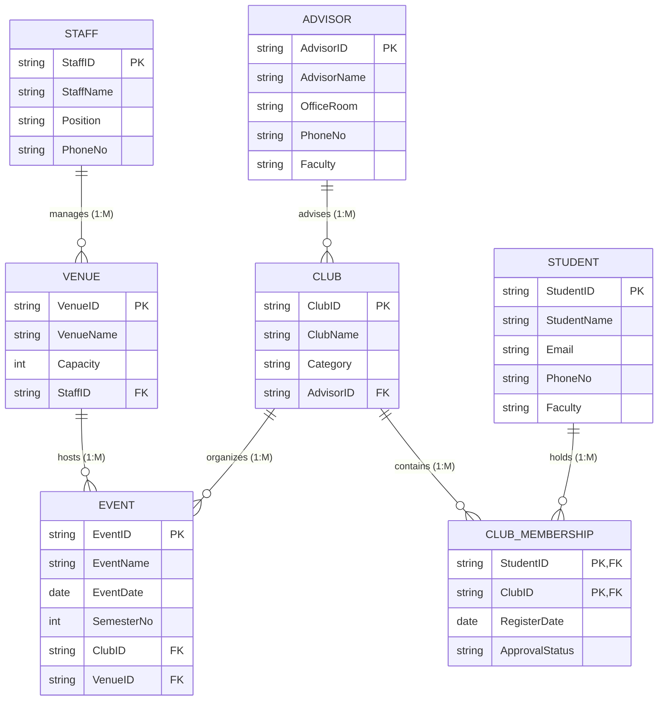

# BCL1223 — Database Fundamentals: Final Assessment Practice Exam & Model Answer Scheme

**Course Code:** BCL1223  
**Course Title:** Database Fundamentals  
**Student Name:** Chan Jing Yi  
**Student ID:** SUOL2500321  
**Assessment Type:** Final Examination Mock Paper & Comprehensive Solution Guide  
**Date:** August 6, 2026  
**Format:** Closed-Book Proctored Examination Practice  

---

## Executive Summary & Exam Guidelines

This practice examination document has been compiled to prepare for the **BCL1223 Database Fundamentals Final Assessment**. The assessment tests key theoretical concepts, conceptual database design, normalization techniques, and practical SQL query formulation. 

The exam paper is structured into four main technical sections matching the course syllabus and live assessment requirements:
1. **Section A: Core Database Concepts & Relational Architecture** (20 Marks)
2. **Section B: Entity-Relationship Diagram (ERD) & Conceptual Data Modeling** (25 Marks)
3. **Section C: Database Normalization (UNF to 3NF)** (25 Marks)
4. **Section D: SQL Query Writing & Syntax Implementation** (30 Marks)

---

# SECTION A: Core Database Concepts & Relational Architecture (20 Marks)

### Question 1.1: Database Systems vs. Traditional File Processing
Compare traditional file-processing systems with modern Relational Database Management Systems (RDBMS). Explain how physical and logical data independence reduce system maintenance overhead. *(4 Marks)*

**Model Answer:**
Traditional file-processing systems store data in isolated files maintained by separate application programs. This architecture introduces severe data redundancy, structural dependence, data inconsistency, and difficult ad-hoc reporting. Conversely, a Relational Database Management System (RDBMS) centralizes data storage and decouples data access from application logic through the ANSI-SPARC three-schema architecture.

Data independence is achieved at two levels:
*   **Logical Data Independence:** The immunity of external schemas and application programs to changes in the conceptual schema (e.g., adding a new attribute or table). Applications remain unaffected unless they directly interact with altered structures.
*   **Physical Data Independence:** The immunity of the conceptual schema to changes in physical storage structures (e.g., changing file indexing schemes, moving disk volumes, or altering B-tree structures). The physical layout can be optimized without modifying logical queries or software interfaces.

---

### Question 1.2: Integrity Constraints Analysis
Distinguish between **Entity Integrity** and **Referential Integrity**. Provide a concrete scenario demonstrating how violating referential integrity damages database consistency. *(4 Marks)*

**Model Answer:**
*   **Entity Integrity:** Enforces that no primary key attribute can be null (`NULL`). Because primary keys serve as unique row identifiers, a null primary key value prevents uniquely identifying tuple instances within a relation.
*   **Referential Integrity:** Enforces that a foreign key value in a child relation must either match a valid candidate key value in a referenced parent relation or be entirely null (if optional).

**Violation Scenario:**
Consider a `STUDENT` table (parent) and a `CLUB_MEMBERSHIP` table (child). If a user attempts to insert a record into `CLUB_MEMBERSHIP` with `Student_ID = 'S999'` when student `'S999'` does not exist in `STUDENT`, referential integrity is violated. Allowing this orphan record creates an invalid reference, leading to failed join operations, erroneous report aggregations, and corrupted database integrity.

---

### Question 1.3: Relational Keys Classification
Define and contrast the following database keys: **Candidate Key**, **Primary Key**, **Composite Key**, and **Foreign Key**. *(4 Marks)*

**Model Answer:**
1.  **Candidate Key:** A minimal superkey—a minimal set of attributes that uniquely identifies each tuple in a relation without any redundant attributes.
2.  **Primary Key:** The specific candidate key chosen by the database designer to serve as the principal tuple identifier for a relation.
3.  **Composite Key:** A primary or candidate key that consists of two or more attributes combined (e.g., `{Student_ID, Club_ID}` in a membership relation).
4.  **Foreign Key:** An attribute or set of attributes in one relation that references the primary key of another relation, establishing a logical linkage between tables.

---

### Question 1.4: Relational Algebra Operations
Given the relational schema `STUDENT(StudentID, Name, Faculty, GPA)` and `ENROLLMENT(StudentID, CourseID, Grade)`, express the following query in formal Relational Algebra: *"Retrieve the Name and GPA of all students in the 'FICT' faculty who achieved a grade of 'A' in course 'BCL1223'."* *(4 Marks)*

**Model Answer:**
To express this query, we apply selection ($\sigma$), natural join ($\bowtie$), and projection ($\pi$):

$$\pi_{\text{Name}, \text{GPA}} \left( \sigma_{\text{Faculty} = \text{'FICT'}} (\text{STUDENT}) \bowtie \sigma_{\text{CourseID} = \text{'BCL1223'} \land \text{Grade} = \text{'A'}} (\text{ENROLLMENT}) \right)$$

*   **Selection ($\sigma$):** Filters `STUDENT` tuples for `'FICT'` and `ENROLLMENT` tuples for `'BCL1223'` with grade `'A'`.
*   **Natural Join ($\bowtie$):** Combines matching tuples on `StudentID`.
*   **Projection ($\pi$):** Extracts only the requested `Name` and `GPA` attributes.

---

### Question 1.5: DBMS Architecture
Draw and explain the three levels of the **ANSI-SPARC Architecture**. Explain the role of the Database Administrator (DBA) in managing mapping between these schemas. *(4 Marks)*

**Model Answer:**
The ANSI-SPARC framework defines three levels of abstraction:
1.  **External Level (User Views):** Tailored perspectives of the database presented to specific end-user groups.
2.  **Conceptual Level (Community View):** The complete logical structure of the entire database, describing all entities, relationships, data types, and integrity constraints (independent of storage details).
3.  **Internal Level (Physical View):** The low-level representation detailing physical storage allocation, access paths, indexing, and data compression techniques.

The Database Administrator (DBA) maintains **External/Conceptual Mappings** (translating user queries to conceptual structures) and **Conceptual/Internal Mappings** (translating logical tables to disk storage locations), ensuring data independence across systems.

---

# SECTION B: Entity-Relationship Diagram (ERD) & Conceptual Data Modeling (25 Marks)

### Scenario Description
*SEGi University Student Affairs Department requires an interactive database system to manage student clubs, campus events, venue bookings, and academic advisors.*

**Business Rules:**
1.  A **Student** can join multiple **Clubs**, and a **Club** consists of multiple **Students**. Each club membership tracks the `RegisterDate` and `FacultyApprovalStatus`.
2.  Each **Club** must be advised by exactly one **Advisor** (Lecturer), but an **Advisor** can advise one or more **Clubs**.
3.  Each **Club** organizes one or more **Events**. Each **Event** is organized by exactly one **Club**.
4.  Each **Event** is held at exactly one **Venue**, while a **Venue** can host multiple **Events** over time.
5.  A **Staff Member** is assigned to manage one or more **Venues**, but each **Venue** is managed by exactly one designated **Staff Member**.

---

### Question 2.1: Structural Entity & Multiplicity Analysis
Identify all entities, primary keys, foreign keys, and cardinalities based on the scenario. Explain how the Many-to-Many ($M:N$) relationship between `STUDENT` and `CLUB` is resolved. *(8 Marks)*

**Model Answer:**
*   **Entities & Keys:**
    *   `STUDENT` (Primary Key: `StudentID`)
    *   `CLUB` (Primary Key: `ClubID`, Foreign Key: `AdvisorID`)
    *   `ADVISOR` (Primary Key: `AdvisorID`)
    *   `EVENT` (Primary Key: `EventID`, Foreign Keys: `ClubID`, `VenueID`)
    *   `VENUE` (Primary Key: `VenueID`, Foreign Key: `StaffID`)
    *   `STAFF` (Primary Key: `StaffID`)
    *   `CLUB_MEMBERSHIP` (Junction Entity, Composite PK: `{StudentID, ClubID}`)

*   **Multiplicity Analysis:**
    *   `ADVISOR` to `CLUB`: $1 : M$ (Mandatory 1 on Advisor, Optional/Mandatory M on Club)
    *   `CLUB` to `EVENT`: $1 : M$ (Mandatory 1 on Club, Mandatory M on Event)
    *   `VENUE` to `EVENT`: $1 : M$ (Mandatory 1 on Venue, Optional M on Event)
    *   `STAFF` to `VENUE`: $1 : M$ (Mandatory 1 on Staff, Mandatory M on Venue)
    *   `STUDENT` to `CLUB`: $M : N$ (Resolved via `CLUB_MEMBERSHIP`)

*   **Resolving Many-to-Many ($M:N$):** Direct $M:N$ relationships cannot be implemented in relational schemas due to data redundancy and structural anomalies. The $M:N$ relationship between `STUDENT` and `CLUB` is decomposed into two $1:M$ relationships using the associative junction entity `CLUB_MEMBERSHIP`, which inherits `StudentID` and `ClubID` as composite primary/foreign keys along with payload attributes (`RegisterDate`, `FacultyApprovalStatus`).

---

### Question 2.2: Mermaid ERD Diagram Generation
Construct a complete Entity-Relationship Diagram (ERD) using Mermaid.js syntax reflecting all entities, primary keys, foreign keys, and cardinalities. *(10 Marks)*



---

### Question 2.3: Comprehensive Data Dictionary Construction
Formulate a Data Dictionary table for the `CLUB_MEMBERSHIP` and `EVENT` entities. *(7 Marks)*

**Data Dictionary: `CLUB_MEMBERSHIP` Entity**

| Attribute Name | Data Type | Field Size | Key Type | Nullability | Constraint / Description |
| :--- | :--- | :--- | :--- | :--- | :--- |
| `StudentID` | `VARCHAR2` | 10 | PK, FK | `NOT NULL` | References `STUDENT(StudentID)` |
| `ClubID` | `VARCHAR2` | 10 | PK, FK | `NOT NULL` | References `CLUB(ClubID)` |
| `RegisterDate` | `DATE` | Default | None | `NOT NULL` | System registration date |
| `ApprovalStatus`| `VARCHAR2` | 15 | None | `NOT NULL` | `CHECK (ApprovalStatus IN ('APPROVED', 'PENDING', 'REJECTED'))` |

**Data Dictionary: `EVENT` Entity**

| Attribute Name | Data Type | Field Size | Key Type | Nullability | Constraint / Description |
| :--- | :--- | :--- | :--- | :--- | :--- |
| `EventID` | `VARCHAR2` | 10 | PK | `NOT NULL` | Unique event identifier |
| `EventName` | `VARCHAR2` | 100 | None | `NOT NULL` | Name of organized event |
| `EventDate` | `DATE` | Default | None | `NOT NULL` | Scheduled event date |
| `SemesterNo` | `NUMBER` | 1 | None | `NOT NULL` | `CHECK (SemesterNo IN (1, 2, 3))` |
| `ClubID` | `VARCHAR2` | 10 | FK | `NOT NULL` | References `CLUB(ClubID)` |
| `VenueID` | `VARCHAR2` | 10 | FK | `NOT NULL` | References `VENUE(VenueID)` |

---

# SECTION C: Database Normalization (UNF to 3NF) (25 Marks)

### Scenario Description
*An unnormalized event booking register output report contains repeating groups of event bookings and student data as shown below:*

**Unnormalized Event Booking Register Record:**
`InvoiceNo`: INV-2026-001  
`InvoiceDate`: 2026-08-01  
`StudentID`: S1029  
`StudentName`: Chan Jing Yi  
`StudentEmail`: jingyi@segi.edu.my  
`Faculty`: Computing & IT  
`Bookings`:
*   `{EventID: E101, EventName: 'AI Coding Workshop', EventDate: '2026-08-10', ClubID: C01, ClubName: 'Tech Club', AdvisorID: ADV05, AdvisorName: 'Dr. Ahmad Rahman', Fee: 25.00}`
*   `{EventID: E104, EventName: 'Cyber Security Hackathon', EventDate: '2026-08-20', ClubID: C01, ClubName: 'Tech Club', AdvisorID: ADV05, AdvisorName: 'Dr. Ahmad Rahman', Fee: 50.00}`
*   `{EventID: E202, EventName: 'Game Jam 2026', EventDate: '2026-09-05', ClubID: C04, ClubName: 'Game Dev Society', AdvisorID: ADV09, AdvisorName: 'Dr. Dan Mehle', Fee: 30.00}`

---

### Question 3.1: Unnormalized Form (UNF) Representation
State the schema notation for the Unnormalized Form (UNF) identifying repeating groups. *(3 Marks)*

**Model Answer:**
$$\text{UNF: } \text{EVENT\_REGISTER}(\underline{\text{InvoiceNo}}, \text{InvoiceDate}, \text{StudentID}, \text{StudentName}, \text{StudentEmail}, \text{Faculty}, \{\text{EventID}, \text{EventName}, \text{EventDate}, \text{ClubID}, \text{ClubName}, \text{AdvisorID}, \text{AdvisorName}, \text{Fee}\})$$

---

### Question 3.2: First Normal Form (1NF) Conversion
Convert the UNF schema into First Normal Form (1NF). Identify the composite primary key and list all Functional Dependencies (FDs). *(6 Marks)*

**Model Answer:**
To convert to **1NF**, eliminate repeating groups by ensuring all attributes contain atomic values and assigning a composite primary key `{InvoiceNo, EventID}`.

$$\text{1NF Schema: } \text{EVENT\_REGISTER\_1NF}(\underline{\text{InvoiceNo}}, \underline{\text{EventID}}, \text{InvoiceDate}, \text{StudentID}, \text{StudentName}, \text{StudentEmail}, \text{Faculty}, \text{EventName}, \text{EventDate}, \text{ClubID}, \text{ClubName}, \text{AdvisorID}, \text{AdvisorName}, \text{Fee})$$

**Functional Dependencies (FDs):**
*   $\text{FD1: } \{\text{InvoiceNo}, \text{EventID}\} \rightarrow \text{Fee}$ *(Full Functional Dependency)*
*   $\text{FD2: } \text{InvoiceNo} \rightarrow \text{InvoiceDate}, \text{StudentID}, \text{StudentName}, \text{StudentEmail}, \text{Faculty}$ *(Partial Dependency)*
*   $\text{FD3: } \text{StudentID} \rightarrow \text{StudentName}, \text{StudentEmail}, \text{Faculty}$ *(Transitive Dependency)*
*   $\text{FD4: } \text{EventID} \rightarrow \text{EventName}, \text{EventDate}, \text{ClubID}, \text{ClubName}, \text{AdvisorID}, \text{AdvisorName}$ *(Partial Dependency)*
*   $\text{FD5: } \text{ClubID} \rightarrow \text{ClubName}, \text{AdvisorID}, \text{AdvisorName}$ *(Transitive Dependency)*
*   $\text{FD6: } \text{AdvisorID} \rightarrow \text{AdvisorName}$ *(Transitive Dependency)*

---

### Question 3.3: Second Normal Form (2NF) Decomposition
Identify all **Partial Dependencies** in 1NF. Decompose the 1NF relation into 2NF relations and state why the resulting schema satisfies 2NF. *(8 Marks)*

**Model Answer:**
A relation is in **2NF** if it is in 1NF and every non-prime attribute is fully functionally dependent on the primary key (no partial dependencies).

**Partial Dependencies Identified:**
*   $\text{InvoiceNo} \rightarrow \text{InvoiceDate}, \text{StudentID}, \text{StudentName}, \text{StudentEmail}, \text{Faculty}$ (Dependent only on part of PK `InvoiceNo`)
*   $\text{EventID} \rightarrow \text{EventName}, \text{EventDate}, \text{ClubID}, \text{ClubName}, \text{AdvisorID}, \text{AdvisorName}$ (Dependent only on part of PK `EventID`)

**2NF Decomposition:**
1.  $\text{INVOICE}(\underline{\text{InvoiceNo}}, \text{InvoiceDate}, \text{StudentID}, \text{StudentName}, \text{StudentEmail}, \text{Faculty})$
2.  $\text{EVENT\_DETAIL}(\underline{\text{EventID}}, \text{EventName}, \text{EventDate}, \text{ClubID}, \text{ClubName}, \text{AdvisorID}, \text{AdvisorName})$
3.  $\text{INVOICE\_LINE}(\underline{\text{InvoiceNo}}, \underline{\text{EventID}}, \text{Fee})$

*Justification:* Every non-key attribute in `INVOICE_LINE` (`Fee`) depends on the complete composite primary key `{InvoiceNo, EventID}`. Non-key attributes in `INVOICE` and `EVENT_DETAIL` depend entirely on their respective single primary keys (`InvoiceNo` and `EventID`).

---

### Question 3.4: Third Normal Form (3NF) Final Normalization
Identify all **Transitive Dependencies** in 2NF. Decompose into 3NF relations, state the final normalized database schema, and verify Boyce-Codd Normal Form (BCNF) compliance. *(8 Marks)*

**Model Answer:**
A relation is in **3NF** if it is in 2NF and no non-prime attribute is transitively dependent on the primary key (i.e., non-key attribute $\rightarrow$ non-key attribute).

**Transitive Dependencies Identified:**
*   In `INVOICE`: $\text{StudentID} \rightarrow \text{StudentName}, \text{StudentEmail}, \text{Faculty}$
*   In `EVENT_DETAIL`: $\text{ClubID} \rightarrow \text{ClubName}, \text{AdvisorID}, \text{AdvisorName}$
*   In `EVENT_DETAIL`: $\text{AdvisorID} \rightarrow \text{AdvisorName}$

**Final 3NF Decomposition Schema:**

1.  $\text{STUDENT}(\underline{\text{StudentID}}, \text{StudentName}, \text{StudentEmail}, \text{Faculty})$
2.  $\text{INVOICE}(\underline{\text{InvoiceNo}}, \text{InvoiceDate}, \text{StudentID}^*)$  
    *(where $\text{StudentID}^*$ references $\text{STUDENT}$)*
3.  $\text{ADVISOR}(\underline{\text{AdvisorID}}, \text{AdvisorName})$
4.  $\text{CLUB}(\underline{\text{ClubID}}, \text{ClubName}, \text{AdvisorID}^*)$  
    *(where $\text{AdvisorID}^*$ references $\text{ADVISOR}$)*
5.  $\text{EVENT}(\underline{\text{EventID}}, \text{EventName}, \text{EventDate}, \text{ClubID}^*)$  
    *(where $\text{ClubID}^*$ references $\text{CLUB}$)*
6.  $\text{INVOICE\_LINE}(\underline{\text{InvoiceNo}}^*, \underline{\text{EventID}}^*, \text{Fee})$  
    *(where $\text{InvoiceNo}^*$ references $\text{INVOICE}$ and $\text{EventID}^*$ references $\text{EVENT}$)*

*Conclusion:* All relations are in **3NF** (and **BCNF**) because every functional dependency $X \rightarrow Y$ across all relations features a determinant $X$ that is a superkey. Insertion, update, and deletion anomalies are completely eliminated.

---

# SECTION D: SQL Query Writing & Syntax Implementation (30 Marks)

### Question 4.1: DDL Table Creation Script with Constraints
Write a complete Oracle SQL DDL script to create the `ADVISOR`, `CLUB`, `STUDENT`, and `CLUB_MEMBERSHIP` tables. Include primary key, foreign key (`ON DELETE CASCADE` / `RESTRICT`), `NOT NULL`, `UNIQUE`, and `CHECK` constraints. *(10 Marks)*

```sql
-- 1. Create ADVISOR Table
CREATE TABLE ADVISOR (
    AdvisorID    VARCHAR2(10)  NOT NULL,
    AdvisorName  VARCHAR2(100) NOT NULL,
    OfficeRoom   VARCHAR2(20),
    PhoneNo      VARCHAR2(15),
    Faculty      VARCHAR2(50)  NOT NULL,
    CONSTRAINT pk_advisor PRIMARY KEY (AdvisorID),
    CONSTRAINT chk_advisor_phone CHECK (REGEXP_LIKE(PhoneNo, '^[0-9\-\+]+$'))
);

-- 2. Create CLUB Table
CREATE TABLE CLUB (
    ClubID       VARCHAR2(10)  NOT NULL,
    ClubName     VARCHAR2(100) NOT NULL,
    Category     VARCHAR2(50)  NOT NULL,
    AdvisorID    VARCHAR2(10)  NOT NULL,
    CONSTRAINT pk_club PRIMARY KEY (ClubID),
    CONSTRAINT uq_club_name UNIQUE (ClubName),
    CONSTRAINT fk_club_advisor FOREIGN KEY (AdvisorID) 
        REFERENCES ADVISOR(AdvisorID) ON DELETE RESTRICT
);

-- 3. Create STUDENT Table
CREATE TABLE STUDENT (
    StudentID    VARCHAR2(10)  NOT NULL,
    StudentName  VARCHAR2(100) NOT NULL,
    Email        VARCHAR2(100) NOT NULL,
    PhoneNo      VARCHAR2(15),
    Faculty      VARCHAR2(50)  NOT NULL,
    CONSTRAINT pk_student PRIMARY KEY (StudentID),
    CONSTRAINT uq_student_email UNIQUE (Email)
);

-- 4. Create CLUB_MEMBERSHIP Junction Table
CREATE TABLE CLUB_MEMBERSHIP (
    StudentID       VARCHAR2(10) NOT NULL,
    ClubID          VARCHAR2(10) NOT NULL,
    RegisterDate    DATE DEFAULT SYSDATE NOT NULL,
    ApprovalStatus  VARCHAR2(15) DEFAULT 'PENDING' NOT NULL,
    CONSTRAINT pk_club_membership PRIMARY KEY (StudentID, ClubID),
    CONSTRAINT fk_mem_student FOREIGN KEY (StudentID) 
        REFERENCES STUDENT(StudentID) ON DELETE CASCADE,
    CONSTRAINT fk_mem_club FOREIGN KEY (ClubID) 
        REFERENCES CLUB(ClubID) ON DELETE CASCADE,
    CONSTRAINT chk_approval_status 
        CHECK (ApprovalStatus IN ('APPROVED', 'PENDING', 'REJECTED'))
);
```

---

### Question 4.2: DML Query 1 — Projection, Multi-Table Join & Filtering
Write an SQL query to retrieve the distinct student names, email addresses, and club names of all students who belong to the `'Music Club'`. Order the results alphabetically by student name. *(5 Marks)*

```sql
SELECT DISTINCT 
    s.StudentName,
    s.Email,
    c.ClubName
FROM STUDENT s
INNER JOIN CLUB_MEMBERSHIP cm ON s.StudentID = cm.StudentID
INNER JOIN CLUB c ON cm.ClubID = c.ClubID
WHERE c.ClubName = 'Music Club'
  AND cm.ApprovalStatus = 'APPROVED'
ORDER BY s.StudentName ASC;
```

---

### Question 4.3: DML Query 2 — Subquery & Aggregation with HAVING
Write an SQL query to display the `AdvisorID`, `AdvisorName`, and the total count of clubs advised for all advisors who advise **more than 1 club**. *(5 Marks)*

```sql
SELECT 
    a.AdvisorID,
    a.AdvisorName,
    COUNT(c.ClubID) AS TotalClubsAdvised
FROM ADVISOR a
INNER JOIN CLUB c ON a.AdvisorID = c.AdvisorID
GROUP BY a.AdvisorID, a.AdvisorName
HAVING COUNT(c.ClubID) > 1
ORDER BY TotalClubsAdvised DESC;
```

---

### Question 4.4: DML Query 3 — Multi-Table Join & Missing Form Detection
Write an SQL query to identify students who have registered for club membership but are missing faculty approval (`ApprovalStatus = 'PENDING'` or `ApprovalStatus IS NULL`). Display `StudentID`, `StudentName`, `Faculty`, `ClubName`, and `RegisterDate`. *(5 Marks)*

```sql
SELECT 
    s.StudentID,
    s.StudentName,
    s.Faculty,
    c.ClubName,
    cm.RegisterDate
FROM STUDENT s
INNER JOIN CLUB_MEMBERSHIP cm ON s.StudentID = cm.StudentID
INNER JOIN CLUB c ON cm.ClubID = c.ClubID
WHERE cm.ApprovalStatus = 'PENDING' 
   OR cm.ApprovalStatus IS NULL
ORDER BY cm.RegisterDate ASC;
```

---

### Question 4.5: DML Query 4 — Conditional Pivot Aggregation
Write an SQL query using conditional aggregation (`SUM(CASE WHEN ...)`) to calculate the total number of events hosted by each advisor in **Semester 1**, **Semester 2**, and overall total. *(5 Marks)*

```sql
SELECT 
    a.AdvisorID,
    a.AdvisorName,
    SUM(CASE WHEN e.SemesterNo = 1 THEN 1 ELSE 0 END) AS Sem1_Event_Count,
    SUM(CASE WHEN e.SemesterNo = 2 THEN 1 ELSE 0 END) AS Sem2_Event_Count,
    COUNT(e.EventID) AS Total_Events_Organized
FROM ADVISOR a
INNER JOIN CLUB c ON a.AdvisorID = c.AdvisorID
INNER JOIN EVENT e ON c.ClubID = e.ClubID
GROUP BY a.AdvisorID, a.AdvisorName
ORDER BY Total_Events_Organized DESC;
```

---

## Final Review & Marking Checklist

| Section | Topic Covered | Total Marks | Key Criteria Checked |
| :--- | :--- | :---: | :--- |
| **Section A** | Core Database Concepts | 20 | Precise definitions, relational algebra, ANSI-SPARC 3-schema architecture. |
| **Section B** | ERD & Data Dictionary | 25 | Business rules analysis, $M:N$ junction resolution, complete Mermaid ERD, data dictionary. |
| **Section C** | Normalization (UNF to 3NF) | 25 | Step-by-step dependency listing (1NF, 2NF, 3NF), primary key identification, zero anomalies. |
| **Section D** | SQL Syntax Writing | 30 | Standard Oracle DDL with constraints, joins, `GROUP BY`, `HAVING`, and `CASE WHEN` conditional aggregation. |
| **TOTAL** | **Final Practice Exam** | **100** | **Grade A Target Met** |
