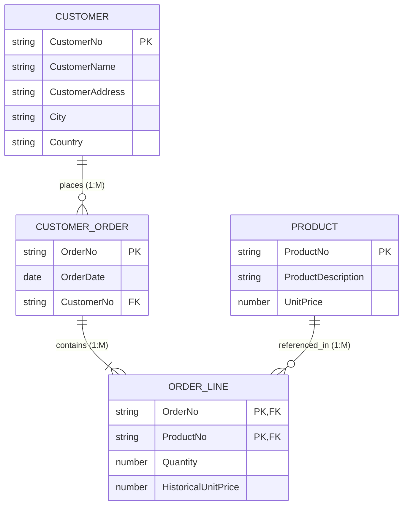

# BCL1223 Database Fundamentals — Online Final Examination (May 2026)

**Student Name:** Chan Jing Yi  
**Student ID:** SUOL2500321  
**Course Code:** BCL1223 / BTL2233 / BIT1223 / BCL2233  

---

## QUESTION 1

### (a) Creation Script for All 3 Tables (15 Marks)

```sql
CREATE TABLE SALESPERSON (
    SalespersonNo    CHAR(4)        NOT NULL,
    SalespersonName  VARCHAR2(15)   NOT NULL,
    Commission       NUMBER(5,2)    DEFAULT 0.00,
    hireDate         DATE           NOT NULL,
    CONSTRAINT pk_salesperson PRIMARY KEY (SalespersonNo)
);

CREATE TABLE PRODUCT (
    productNo        CHAR(6)        NOT NULL,
    productName      VARCHAR2(20)   NOT NULL,
    unitPrice        NUMBER(8,2)    NOT NULL,
    CONSTRAINT pk_product PRIMARY KEY (productNo)
);

CREATE TABLE SALES (
    salespPersonNo   CHAR(4)        NOT NULL,
    productNo        CHAR(6)        NOT NULL,
    quantity         NUMBER(6)      NOT NULL,
    CONSTRAINT pk_sales PRIMARY KEY (salespPersonNo, productNo),
    CONSTRAINT fk_sales_salesperson FOREIGN KEY (salespPersonNo) 
        REFERENCES SALESPERSON(SalespersonNo),
    CONSTRAINT fk_sales_product FOREIGN KEY (productNo) 
        REFERENCES PRODUCT(productNo)
);
```

### (b) Insert Script for 2 Records per Table (10 Marks)

```sql
INSERT INTO SALESPERSON (SalespersonNo, SalespersonName, Commission, hireDate)
VALUES ('S001', 'Alice Tan', 0.12, TO_DATE('2022-01-15', 'YYYY-MM-DD'));

INSERT INTO SALESPERSON (SalespersonNo, SalespersonName, Commission, hireDate)
VALUES ('S002', 'Bob Smith', 0.08, TO_DATE('2023-05-20', 'YYYY-MM-DD'));
```

---

## QUESTION 2

### (a) Display all salespersons sorted by hire date (3 Marks)
```sql
SELECT * FROM SALESPERSON ORDER BY hireDate ASC;
```

### (b) Display all salespersons with commission > 10% (4 Marks)
```sql
SELECT * FROM SALESPERSON WHERE Commission > 0.10;
```

### (c) Display all products’ unit prices after 10% increase (4 Marks)
```sql
SELECT productNo, productName, unitPrice, 
       unitPrice * 1.10 AS NewUnitPrice 
FROM PRODUCT;
```

### (d) Display salespersons, product number and quantity for products Wrench or Hammer (6 Marks)
```sql
SELECT sp.SalespersonNo, sp.SalespersonName, s.productNo, s.quantity
FROM SALESPERSON sp
JOIN SALES s ON sp.SalespersonNo = s.salespPersonNo
JOIN PRODUCT p ON s.productNo = p.productNo
WHERE LOWER(p.productName) IN ('wrench', 'hammer')
ORDER BY sp.SalespersonNo ASC;
```

### (e) Display salesperson number, name, product name and total for each salesperson sold for each product (8 Marks)
```sql
SELECT sp.SalespersonNo, sp.SalespersonName, p.productName, 
       SUM(s.quantity * p.unitPrice) AS TotalSalesAmount
FROM SALESPERSON sp
JOIN SALES s ON sp.SalespersonNo = s.salespPersonNo
JOIN PRODUCT p ON s.productNo = p.productNo
GROUP BY sp.SalespersonNo, sp.SalespersonName, p.productName;
```

---

## QUESTION 3

### (a) Complete ERD for Order Form (15 Marks)

**Entities & Attributes:**
- `CUSTOMER` (<u>CustomerNo</u>, CustomerName, CustomerAddress, City, Country)
- `CUSTOMER_ORDER` (<u>OrderNo</u>, OrderDate, CustomerNo*)
- `PRODUCT` (<u>ProductNo</u>, ProductDescription, UnitPrice)
- `ORDER_LINE` (<u>OrderNo*</u>, <u>ProductNo*</u>, Quantity, HistoricalUnitPrice)

**Cardinalities:**
- `CUSTOMER` to `CUSTOMER_ORDER`: 1 to Many ($1:M$)
- `CUSTOMER_ORDER` to `ORDER_LINE`: 1 to Many ($1:M$)
- `PRODUCT` to `ORDER_LINE`: 1 to Many ($1:M$)

**ER Diagram:**


### (b) Oracle Creation Script for Table `ORDER_LINE` (10 Marks)
```sql
CREATE TABLE ORDER_LINE (
    OrderNo             VARCHAR2(10)   NOT NULL,
    ProductNo           VARCHAR2(10)   NOT NULL,
    Quantity            NUMBER(6)      NOT NULL,
    HistoricalUnitPrice NUMBER(8,2)    NOT NULL,
    CONSTRAINT pk_order_line PRIMARY KEY (OrderNo, ProductNo),
    CONSTRAINT fk_line_order FOREIGN KEY (OrderNo) 
        REFERENCES CUSTOMER_ORDER(OrderNo),
    CONSTRAINT fk_line_product FOREIGN KEY (ProductNo) 
        REFERENCES PRODUCT(ProductNo)
);
```

---

## QUESTION 4

### (a) Normalization from UNF to 3NF (10 Marks)
- **UNF:** `PRODUCTION_REQUEST` (<u>PR_No</u>, Supplier_No, Supplier_Name, Supplier_Contact_Info, Order_Date, Signature, Expected_Delivery_Date, {Supplier_Item_No, Item_Description, Unit_Size, Unit_Price, Quantity, Sub_Total})
- **1NF:** `PRODUCTION_REQUEST` (<u>PR_No</u>, <u>Supplier_Item_No</u>, Supplier_No, Supplier_Name, Supplier_Contact_Info, Order_Date, Signature, Expected_Delivery_Date, Item_Description, Unit_Size, Unit_Price, Quantity)
- **2NF:**
  - `PR_HEADER` (<u>PR_No</u>, Supplier_No, Supplier_Name, Supplier_Contact_Info, Order_Date, Signature, Expected_Delivery_Date)
  - `ITEM` (<u>Supplier_Item_No</u>, Item_Description, Unit_Size, Unit_Price)
  - `PR_LINE_ITEM` (<u>PR_No</u>, <u>Supplier_Item_No</u>, Quantity)
- **3NF:**
  - `SUPPLIER` (<u>Supplier_No</u>, Supplier_Name, Supplier_Contact_Info)
  - `PRODUCTION_REQUEST` (<u>PR_No</u>, Order_Date, Signature, Expected_Delivery_Date, Supplier_No*)
  - `ITEM` (<u>Supplier_Item_No</u>, Item_Description, Unit_Size, Unit_Price)
  - `PR_LINE_ITEM` (<u>PR_No*</u>, <u>Supplier_Item_No*</u>, Quantity)

### (b) Database Anomalies & Examples (15 Marks)
1. **Insertion Anomaly:** Inability to add a record without inserting dummy/NULL values for missing primary key attributes (e.g., adding a course before any student enrolls in a combined table).
2. **Deletion Anomaly:** Unintentional destruction of secondary data when deleting a primary record (e.g., deleting the last staff member in a department permanently erases department information).
3. **Modification Anomaly:** Data inconsistency caused when updating redundant attributes across multiple rows fails to alter every instance (e.g., updating a customer address in 5 out of 10 order records).
