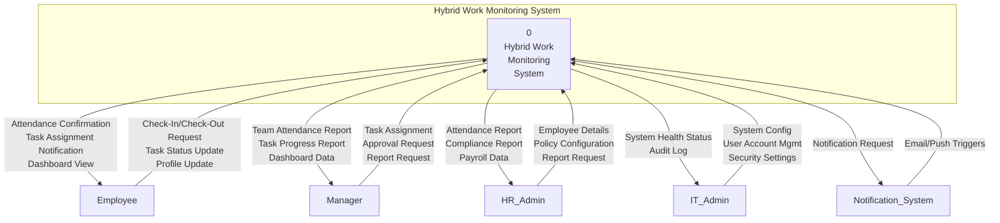
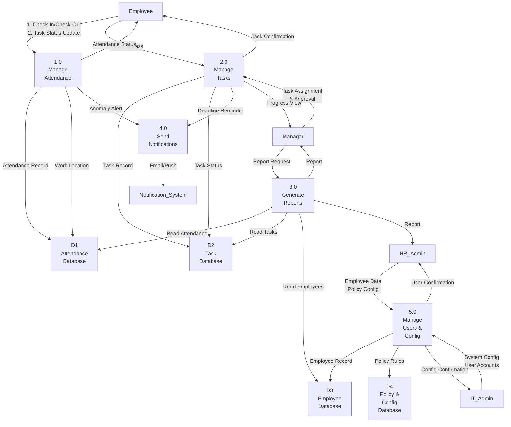
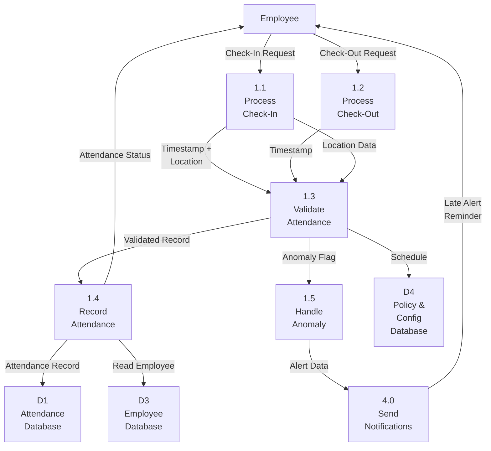

# BCL1233 — System Analysis and Design
## Assignment 2: Process Modeling for a Hybrid Work Monitoring System

---

## 1. Context Diagram (15 marks)

### a) & b) & c) Context Diagram



### d) Explanation of System Boundary and External Entities (120 words)

The system boundary of the Hybrid Work Monitoring System encompasses all core functionalities including attendance tracking, task management, reporting, and notification generation. Four external entities interact with the system:

- **Employee** — the primary end-user who checks in/out, updates task status, and views personal attendance records.
- **Manager** — oversees team productivity by assigning tasks, monitoring real-time progress, and requesting performance reports.
- **HR Administrator** — manages employee records, configures attendance policies, and generates compliance and payroll reports.
- **IT Administrator** — handles system configuration, user account management, security settings, and monitors system health.

The **Notification System** is an external subsystem that delivers email and in-app push notifications triggered by the main system for deadlines, reminders, and status changes.

---

## 2. Data Flow Diagram (DFD) Level 0 (25 marks)

### a) Level 0 DFD



### b) Description of Main Processes

| Process | Description |
|---|---|
| **1.0 Manage Attendance** | Handles employee check-in and check-out operations, captures timestamps and geolocation, validates attendance against scheduled hours, flags anomalies (late arrival, missed check-out), and records attendance data. |
| **2.0 Manage Tasks** | Enables managers to create and assign tasks with deadlines and priority. Employees update task status (Not Started, In Progress, Completed) with progress notes. The process tracks task completion and notifies relevant parties. |
| **3.0 Generate Reports** | Retrieves data from attendance, task, and employee databases to generate on-demand reports including attendance summaries, productivity analytics, task completion rates, and compliance reports for managers and HR. |
| **4.0 Send Notifications** | Triggers automated notifications (email and in-app) for events such as missed check-in, task deadline reminders, task assignments, and approval requests via the external notification system. |
| **5.0 Manage Users & Config** | Maintains employee profiles, user roles and permissions, system configuration settings, attendance policy rules, and handles account creation, modification, and deactivation. |

### c) Data Stores and Their Purposes

| Data Store | Purpose |
|---|---|
| **D1 — Attendance Database** | Stores all attendance records including EmployeeID, date, check-in/check-out timestamps, work location (office/remote), and attendance status (On Time, Late, Early Leave). |
| **D2 — Task Database** | Stores task details including TaskID, title, description, assigned employee, deadline, priority, status, and progress notes. |
| **D3 — Employee Database** | Stores employee master data including EmployeeID, name, department, role, schedule, contact information, and manager assignment. |
| **D4 — Policy & Config Database** | Stores system configuration parameters such as grace period limits, work schedule templates, notification thresholds, and role-based access permissions. |

---

## 3. Data Flow Diagram (DFD) Level 1 — Manage Attendance (25 marks)

### a) Decomposition of Process 1.0 (Manage Attendance)



### b) Description of Subprocesses

| Subprocess | Description |
|---|---|
| **1.1 Process Check-In** | Receives the check-in request from the employee, captures the current timestamp and device geolocation, and passes the data to the validation process. |
| **1.2 Process Check-Out** | Receives the check-out request from the employee, captures the timestamp, and forwards it for validation and recording. |
| **1.3 Validate Attendance** | Compares check-in time against the employee's scheduled start time from the Policy & Config database. Determines attendance status (On Time / Late) and checks for anomalies such as missed check-out after 30+ minutes. |
| **1.4 Record Attendance** | Writes the validated attendance record (EmployeeID, date, check-in/check-out times, location, status) to the Attendance Database and confirms the status back to the employee. |
| **1.5 Handle Anomaly** | For flagged anomalies (late check-in, missing check-out), generates alert data and forwards it to the Send Notifications process for delivery to the employee and manager. |

---

## 4. Use Case Diagram (20 marks)

### a) & b) & c) Use Case Diagram

```mermaid
graph TD
    subgraph "Hybrid Work Monitoring System"
        UC1["Check In / Check Out"]
        UC2["View Personal Attendance"]
        UC3["Manage Tasks"]
        UC4["View Dashboard"]
        UC5["Generate Reports"]
        UC6["Manage User Accounts"]
        UC7["Configure System Settings"]
        UC8["View Audit Log"]
        UC9["Login / Authenticate"]
    end

    Employee --> UC1
    Employee --> UC2
    Employee --> UC3
    Manager --> UC3
    Manager --> UC4
    Manager --> UC5
    HR_Admin["HR Administrator"] --> UC5
    HR_Admin --> UC6
    IT_Admin["IT Administrator"] --> UC6
    IT_Admin --> UC7
    IT_Admin --> UC8

    UC3 ..-> UC9 : <<include>>
    UC1 ..-> UC9 : <<include>>
    UC2 ..-> UC9 : <<include>>
    UC4 ..-> UC9 : <<include>>
    UC5 ..-> UC9 : <<include>>

    UC4 -.-> UC2 : <<extend>>
    UC3 -.-> UC1 : <<extend>>
```

### Actors and Use Cases Explanation

| Actor | Description |
|---|---|
| **Employee** | Primary user who checks in/out, views attendance, and manages assigned tasks. |
| **Manager** | Assigns and monitors tasks, views team dashboard, and generates performance reports. |
| **HR Administrator** | Generates compliance and payroll reports; manages employee user accounts. |
| **IT Administrator** | Creates and deactivates user accounts, configures system settings, and monitors audit logs. |

**Relationships:**
- **<<include>>** — All use cases that require user identity verification include the **Login / Authenticate** use case, as it is mandatory before any system interaction.
- **<<extend>>** — The **View Dashboard** use case may optionally extend to **View Personal Attendance** for detailed drill-down. **Manage Tasks** may extend to **Check In / Check Out** for integrated daily workflow.

---

## 5. Use Case Description — Check In / Check Out (15 marks)

| Element | Description |
|---|---|
| **Use Case Name** | Check In / Check Out |
| **ID** | UC-01 |
| **Type** | Primary / Essential |
| **Primary Actor** | Employee |
| **Stakeholders** | Employee — wants quick and accurate attendance recording<br>Manager — needs real-time visibility of team attendance<br>HR — requires accurate attendance data for payroll and compliance |
| **Brief Description** | The employee records their arrival (Check-In) and departure (Check-Out) through the system. The system automatically captures the timestamp, date, and geolocation, validates against the scheduled work hours, flags anomalies, and stores the record in the attendance database. |
| **Importance Level** | High |
| **Trigger** | Employee begins workday (Check-In) or ends workday (Check-Out) |
| **Preconditions** | 1. Employee has an active account with assigned work schedule.<br>2. Employee is authenticated (logged in).<br>3. System time zone is correctly configured.<br>4. Network connectivity is available. |
| **Relationships** | <<include>> Login / Authenticate |

### Main Flow (Normal Scenario)

| Step | Actor Action | System Response |
|---|---|---|
| 1 | Employee navigates to the Check-In page on the web portal or mobile app. | System displays the Check-In interface showing current date and time. |
| 2 | Employee taps the **Check-In** button. | System captures the current timestamp and detects the device geolocation. |
| 3 | — | System classifies location as "Office" or "Remote". |
| 4 | — | System compares check-in time against the employee's scheduled start time from the Policy database. |
| 5 | — | If check-in time is within the grace period: System marks status as "On Time". |
| 6 | — | System records the attendance record (EmployeeID, Date, Check-In Time, Location, Status) in the Attendance Database. |
| 7 | — | System displays a green confirmation banner: "Check-In Successful — On Time". |
| 8 | (Throughout the day) Employee works and updates task status as needed. | — |
| 9 | At the end of the workday, Employee navigates to the Check-Out page and taps **Check-Out**. | System captures the current timestamp. |
| 10 | — | System calculates total hours worked and updates the attendance record with Check-Out Time. |
| 11 | — | System displays a summary: "Check-Out Successful — Hours Worked: 8h 15m". |
| 12 | — | Manager's dashboard updates in real time with the latest attendance status. |

### Alternative Flows

| Flow | Step | Description |
|---|---|---|
| **A1: Late Check-In** | 5a | If check-in time exceeds the scheduled start time beyond the grace period: System marks status as "Late". System sends a notification to the employee requesting a reason for late arrival. |
| **A2: Missed Check-Out** | 9a | If the employee does not check out within 30 minutes after the scheduled end time: System sends an automated reminder notification. If still no check-out after 60 minutes: System flags the record and notifies the manager. |
| **A3: Location Unavailable** | 2a | If geolocation detection fails (e.g., GPS disabled): System prompts the employee to manually select their work location (Office / Remote). The record is flagged for manual verification by HR. |
| **A4: Network Failure** | 2b | If network connectivity is lost during check-in: System caches the request and syncs automatically when connectivity is restored. The employee sees a message: "Check-In saved offline and will sync automatically." |

### Postconditions

| Item | Description |
|---|---|
| **Success Postcondition** | A complete attendance record is created in the Attendance Database with: EmployeeID, Date, Check-In Time, Check-Out Time, Location, Status. The record is visible in real time on the manager's dashboard and included in the next HR attendance report. |
| **Failure Postcondition** | No attendance record is created. The system logs the error and, if applicable, preserves the queued request for retry. The employee is informed of the failure and advised to retry. |

---

### References

Dennis, A., Wixom, B. H., & Tegarden, D. P. (2012). *Systems Analysis and Design with UML* (4th ed.). John Wiley & Sons.

Shelly, G. B., & Rosenblatt, H. J. (2016). *Systems Analysis and Design* (10th ed.). Cengage Learning.
