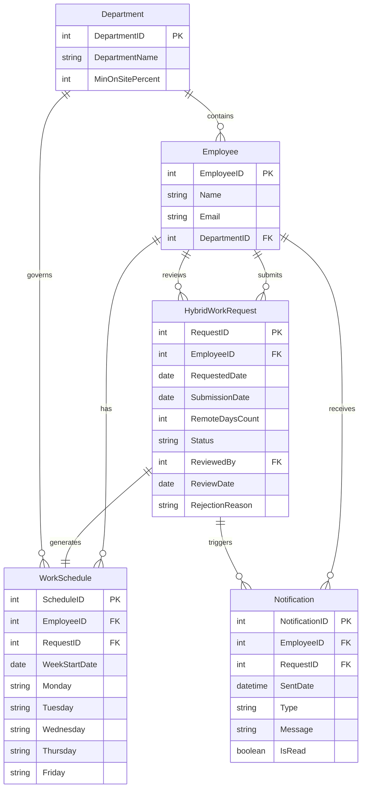

# BCL1233 — System Analysis and Design
## Assignment 3: Logic and Data Modeling for a Hybrid Work Monitoring System

**Student Name:** Chan Jing Yi
**Student ID:** SUOL2500321
**Course:** Bachelor of Computer Science (ODL)
**Submission Date:** July 2026

---

## Section 1: Logic Modeling (40 marks)

### 1.1 Analysis of Business Rules

The Hybrid Work Schedule Approval Process is governed by four distinct business rules. Each rule imposes a specific constraint that must be evaluated before a hybrid work request can be approved or rejected.

| Rule | Description | Type |
|---|---|---|
| BR-01 | Employees may work remotely for a maximum of three days per week. | Capacity constraint (individual) |
| BR-02 | Requests must be submitted at least two days before the requested date. | Timing constraint |
| BR-03 | Supervisor approval is required for all requests. | Authorization constraint |
| BR-04 | Each department must maintain at least 50% on-site staff availability. | Capacity constraint (departmental) |

A Decision Table was selected to model these rules because it exhaustively enumerates all condition combinations, eliminates ambiguity, and is particularly well-suited to scenarios where multiple binary conditions must be evaluated in parallel to determine an outcome.

### 1.2 Decision Table

#### Conditions

| ID | Condition | Values |
|---|---|---|
| C1 | Is the request submitted at least two days before the requested date? | Y / N |
| C2 | Would approving this request keep the employee's remote work days at three or fewer per week? | Y / N |
| C3 | Does the supervisor approve the request? | Y / N |
| C4 | Would approving this request keep the department's on-site staffing at or above 50%? | Y / N |

#### Actions

| ID | Action |
|---|---|
| A1 | Approve the request and update the employee's work schedule |
| A2 | Reject the request and send a notification to the employee |

#### Reduced Decision Table

| | Rule 1 | Rule 2 | Rule 3 | Rule 4 | Rule 5 |
|---|---|---|---|---|---|
| **Conditions** | | | | | |
| C1: Submitted ≥ 2 days before? | N | Y | Y | Y | Y |
| C2: Remote days ≤ 3 per week? | — | N | Y | Y | Y |
| C3: Supervisor approves? | — | — | N | Y | Y |
| C4: Department ≥ 50% on-site? | — | — | — | N | Y |
| **Actions** | | | | | |
| A1: Approve and update schedule | | | | | X |
| A2: Reject and notify employee | X | X | X | X | |

*Note: "—" indicates that the condition is irrelevant (a "don't care" state) for that rule.*

**Rule Descriptions**

| Rule | Scenario | Outcome |
|---|---|---|
| 1 | The employee failed to submit the request at least two days in advance. Regardless of all other conditions, the request cannot proceed. | Rejected |
| 2 | The request was submitted on time but would cause the employee to exceed three remote work days in the week. | Rejected |
| 3 | The request is valid under C1 and C2, but the supervisor does not approve it. | Rejected |
| 4 | The supervisor approved the request, but approving it would drop the department's on-site staffing below the 50% threshold. | Rejected |
| 5 | All four conditions are satisfied. The request is approved, the employee's schedule is updated, and a confirmation notification is sent. | Approved |

### 1.3 Explanation of the Selected Logic Model

A decision table is a structured modeling technique that maps combinations of conditions to corresponding actions. Each column, or rule, represents a unique scenario defined by the truth values of the conditions. The technique is especially valuable in system analysis because it forces the analyst to consider every possible combination, revealing gaps or contradictions that might otherwise go unnoticed.

For the Hybrid Work Schedule Approval Process, the decision table captures the interplay between individual constraints (remote day limit), procedural constraints (advance notice), human judgment (supervisor approval), and organizational constraints (department staffing). The table clarifies that a request can be rejected at four distinct checkpoints, and only when all checks pass does approval occur. This explicit traceability makes the decision table a natural bridge between the business rules provided by stakeholders and the system logic that developers will implement.

---

## Section 2: Entity Relationship Diagram — ERD (35 marks)

### 2.1 Entity Identification

The following entities were identified by analysing the Hybrid Work Schedule Approval Process and its associated business rules:

| Entity | Description |
|---|---|
| Employee | A staff member who may submit hybrid work requests and be assigned a work schedule |
| Department | An organisational unit with a mandated minimum on-site staffing percentage |
| HybridWorkRequest | A formal request submitted by an employee to work remotely on specific dates |
| WorkSchedule | The approved weekly schedule indicating the work location for each day |
| Notification | A record of a system-generated message sent to an employee regarding request status |

### 2.2 Entity Relationship Diagram

### 2.3 Entity and Attribute Details

#### Department
| Attribute | Type | PK/FK | Description |
|---|---|---|---|
| DepartmentID | INT | PK | Unique identifier for each department |
| DepartmentName | VARCHAR(100) | — | Name of the department |
| MinOnSitePercent | INT | — | Minimum percentage of staff that must be on-site (enforces BR-04) |

#### Employee
| Attribute | Type | PK/FK | Description |
|---|---|---|---|
| EmployeeID | INT | PK | Unique identifier for each employee |
| Name | VARCHAR(100) | — | Full name of the employee |
| Email | VARCHAR(150) | — | Corporate email address for notifications |
| DepartmentID | INT | FK | References the department the employee belongs to |

#### HybridWorkRequest
| Attribute | Type | PK/FK | Description |
|---|---|---|---|
| RequestID | INT | PK | Unique identifier for each request |
| EmployeeID | INT | FK | References the employee who submitted the request |
| RequestedDate | DATE | — | The specific date for which remote work is requested |
| SubmissionDate | DATE | — | The date the request was submitted (used to evaluate BR-02) |
| RemoteDaysCount | INT | — | Number of remote work days requested for that week (used to evaluate BR-01) |
| Status | VARCHAR(20) | — | Current status: Pending, Approved, or Rejected |
| ReviewedBy | INT | FK | References the EmployeeID of the supervisor who reviewed the request |
| ReviewDate | DATE | — | The date the supervisor made the approval decision |
| RejectionReason | VARCHAR(255) | — | Reason provided if the request is rejected |

#### WorkSchedule
| Attribute | Type | PK/FK | Description |
|---|---|---|---|
| ScheduleID | INT | PK | Unique identifier for each schedule record |
| EmployeeID | INT | FK | References the employee whose schedule this is |
| RequestID | INT | FK | References the approved request that generated this schedule |
| WeekStartDate | DATE | — | The Monday of the scheduled week |
| Monday | VARCHAR(10) | — | Work location for Monday (Office/Remote/Leave) |
| Tuesday | VARCHAR(10) | — | Work location for Tuesday |
| Wednesday | VARCHAR(10) | — | Work location for Wednesday |
| Thursday | VARCHAR(10) | — | Work location for Thursday |
| Friday | VARCHAR(10) | — | Work location for Friday |

#### Notification
| Attribute | Type | PK/FK | Description |
|---|---|---|---|
| NotificationID | INT | PK | Unique identifier for each notification |
| EmployeeID | INT | FK | References the employee who receives the notification |
| RequestID | INT | FK | References the request that triggered the notification |
| SentDate | DATETIME | — | Timestamp of when the notification was sent |
| Type | VARCHAR(20) | — | Notification type: Approved, Rejected, or Reminder |
| Message | VARCHAR(500) | — | Human-readable notification content |
| IsRead | BOOLEAN | — | Whether the employee has viewed the notification |

### 2.4 Relationship Summary

| Relationship | Parent | Child | Cardinality | Description |
|---|---|---|---|---|
| Contains | Department | Employee | 1:M | One department contains many employees |
| Submits | Employee | HybridWorkRequest | 1:M | One employee submits many requests |
| Reviews | Employee | HybridWorkRequest | 1:M | One supervisor reviews many requests |
| Has | Employee | WorkSchedule | 1:M | One employee has multiple weekly schedules |
| Receives | Employee | Notification | 1:M | One employee receives many notifications |
| Generates | HybridWorkRequest | WorkSchedule | 1:1 | One approved request generates one schedule entry |
| Triggers | HybridWorkRequest | Notification | 1:M | One request triggers one or more notifications |
| Governs | Department | WorkSchedule | 1:M | One department's rules govern many schedule entries |

---

## Section 3: Data Dictionary (15 marks)

### 3.1 Data Dictionary

#### Entity: Department

| Attribute Name | Description | Data Type | Key Type | Validation Rules |
|---|---|---|---|---|
| DepartmentID | Unique identifier for each department | INT | PK | Auto-increment; not null |
| DepartmentName | Name of the department | VARCHAR(100) | — | Not null; must be unique; max 100 characters |
| MinOnSitePercent | Minimum percentage of staff that must work on-site | INT | — | Not null; value between 0 and 100; default 50 |

#### Entity: Employee

| Attribute Name | Description | Data Type | Key Type | Validation Rules |
|---|---|---|---|---|
| EmployeeID | Unique identifier for each employee | INT | PK | Auto-increment; not null |
| Name | Full name of the employee | VARCHAR(100) | — | Not null; max 100 characters |
| Email | Corporate email address | VARCHAR(150) | — | Not null; must be unique; valid email format |
| DepartmentID | References the department the employee belongs to | INT | FK | Not null; must exist in Department table |

#### Entity: HybridWorkRequest

| Attribute Name | Description | Data Type | Key Type | Validation Rules |
|---|---|---|---|---|
| RequestID | Unique identifier for each request | INT | PK | Auto-increment; not null |
| EmployeeID | References the employee who submitted the request | INT | FK | Not null; must exist in Employee table |
| RequestedDate | The date for which remote work is requested | DATE | — | Not null; must be a future date |
| SubmissionDate | The date the request was submitted | DATE | — | Not null; must be on or before RequestedDate minus 2 days (BR-02) |
| RemoteDaysCount | Number of remote days requested in the same week | INT | — | Not null; must be between 1 and 3 (BR-01) |
| Status | Current status of the request | VARCHAR(20) | — | Not null; must be 'Pending', 'Approved', or 'Rejected'; default 'Pending' |
| ReviewedBy | References the supervisor who reviewed the request | INT | FK | Nullable until reviewed; must exist in Employee table |
| ReviewDate | Date the supervisor made the decision | DATE | — | Nullable until reviewed; must be on or after SubmissionDate |
| RejectionReason | Explanation if the request was rejected | VARCHAR(255) | — | Nullable; required only if Status = 'Rejected' |

#### Entity: WorkSchedule

| Attribute Name | Description | Data Type | Key Type | Validation Rules |
|---|---|---|---|---|
| ScheduleID | Unique identifier for each schedule record | INT | PK | Auto-increment; not null |
| EmployeeID | References the employee | INT | FK | Not null; must exist in Employee table |
| RequestID | References the approved request | INT | FK | Not null; must exist in HybridWorkRequest table |
| WeekStartDate | The Monday of the scheduled week | DATE | — | Not null; must be a Monday |
| Monday | Work location for Monday | VARCHAR(10) | — | Not null; must be 'Office', 'Remote', or 'Leave' |
| Tuesday | Work location for Tuesday | VARCHAR(10) | — | Not null; must be 'Office', 'Remote', or 'Leave' |
| Wednesday | Work location for Wednesday | VARCHAR(10) | — | Not null; must be 'Office', 'Remote', or 'Leave' |
| Thursday | Work location for Thursday | VARCHAR(10) | — | Not null; must be 'Office', 'Remote', or 'Leave' |
| Friday | Work location for Friday | VARCHAR(10) | — | Not null; must be 'Office', 'Remote', or 'Leave' |

#### Entity: Notification

| Attribute Name | Description | Data Type | Key Type | Validation Rules |
|---|---|---|---|---|
| NotificationID | Unique identifier for each notification | INT | PK | Auto-increment; not null |
| EmployeeID | References the recipient employee | INT | FK | Not null; must exist in Employee table |
| RequestID | References the triggering request | INT | FK | Not null; must exist in HybridWorkRequest table |
| SentDate | Timestamp of when the notification was sent | DATETIME | — | Not null; default current timestamp |
| Type | Category of the notification | VARCHAR(20) | — | Not null; must be 'Approved', 'Rejected', or 'Reminder' |
| Message | Content of the notification | VARCHAR(500) | — | Not null; max 500 characters |
| IsRead | Whether the notification has been viewed | BOOLEAN | — | Not null; default false |

---

## Section 4: Model Validation and Integration (10 marks)

### 4.1 Role of the Logic Model in the Approval Process

The decision table defines the precise evaluation sequence governing every hybrid work request. Each of the four business rules maps directly to a condition in the table, and every possible combination is accounted for across the five rules. This eliminates ambiguity during implementation: a developer translating the table into code knows exactly which checks to perform, in what logical order, and what action to take for each outcome. Without the decision table, the interaction of timing constraints (BR-02), individual limits (BR-01), managerial judgement (BR-03), and departmental staffing rules (BR-04) would be open to subjective interpretation, increasing the risk of inconsistent approval decisions.

### 4.2 Relationship Between the ERD, Data Dictionary, and Assignment 1 Requirements

The ERD and data dictionary operationalise the functional requirements documented in Assignment 1. Requirement FR-01 (Digital Check-In/Check-Out) is supported by the WorkSchedule entity, which records the approved location for each day and enables the check-in process to validate whether the employee is at their assigned location. FR-03 (Notification Engine) is realised through the Notification entity, which stores every system-generated message triggered by request approvals and rejections. Non-functional requirement NFR-01 (99.5% uptime) influenced the data dictionary design by mandating that all key validation rules (such as the check that ReviewDate follows SubmissionDate) be enforced at the database level rather than solely in application logic, reducing the risk of data corruption during brief outages. The data dictionary provides the implementation-level detail — data types, key constraints, and validation rules — that transforms the conceptual entities from the ERD into a precise database schema specification.

### 4.3 Relationship Between This Assignment's Models and Assignment 2's Process Models

The models developed here integrate directly with the process models from Assignment 2. The HybridWorkRequest entity corresponds to data flows entering Process 5.0 (Manage Users & Config), where policy rules are maintained, and Process 4.0 (Send Notifications), which is triggered whenever a request reaches a final status. The WorkSchedule entity feeds into the Attendance Database (D1), which Process 1.0 (Manage Attendance) reads during check-in to validate the employee's expected work location. The Department entity aligns with the Policy & Config Database (D4), storing the 50% on-site minimum rule referenced by the context diagram's external entities. Together, these models form a consistent chain: the context diagram and DFDs established *what* the system does, the decision table specifies *how* the approval logic works, and the ERD with data dictionary defines *what data* the system needs to store to support those processes.

---

## References

Dennis, A., Wixom, B. H., & Tegarden, D. P. (2012). *Systems Analysis and Design with UML: An Object-Oriented Approach* (4th ed.). John Wiley & Sons.

Shelly, G. B., & Rosenblatt, H. J. (2016). *Systems Analysis and Design* (10th ed.). Cengage Learning.

McConnell, S. (2004). *Code Complete: A Practical Handbook of Software Construction* (2nd ed.). Microsoft Press.
