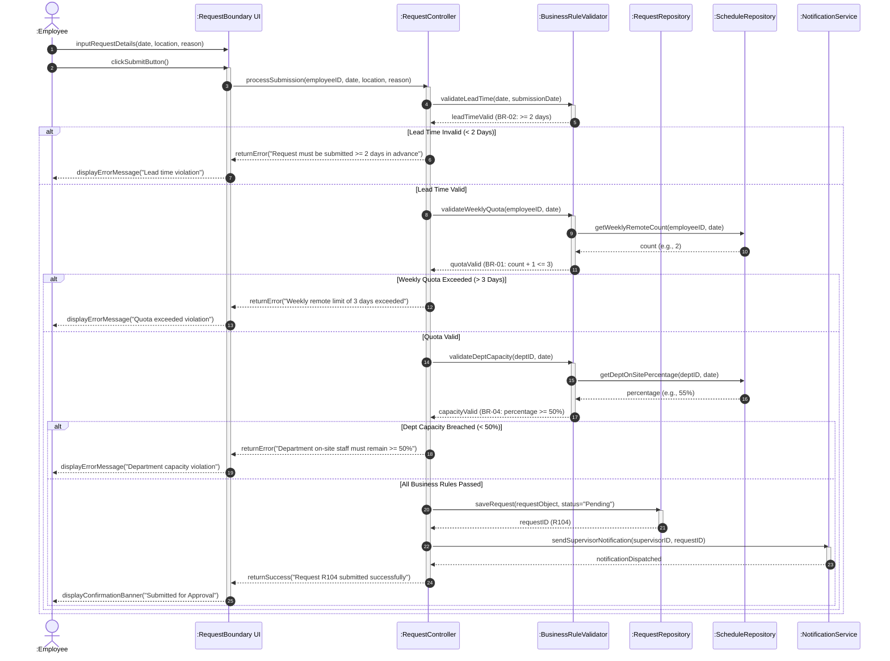
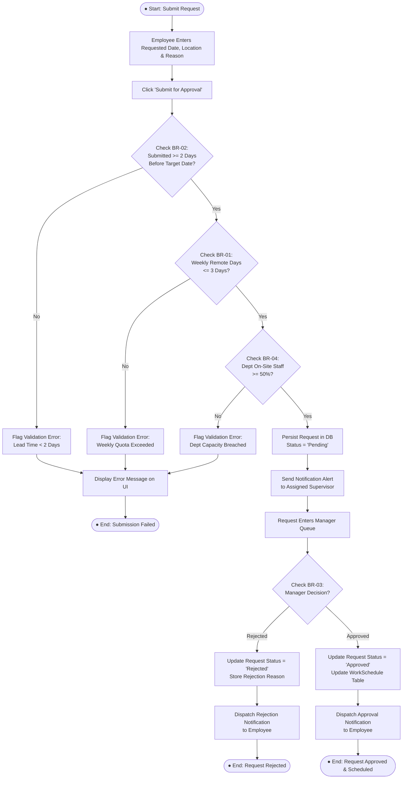

# BCL1233 — System Analysis and Design
## Final Project: System Design and UML for a Hybrid Work Monitoring System

**Student Name:** Chan Jing Yi  
**Student ID:** SUOL2500321  
**Course:** Bachelor of Computer Science (ODL)  
**Institution:** SEGi University — Faculty of Engineering, Built Environment, and Information Technology (FOEBEIT)  
**Submission Date:** August 2026  

---

## Executive Summary

This final project delivers a comprehensive system design specification for the **Hybrid Work Monitoring System (HWMS)**, building directly upon the analytical foundation established in Assignments 1, 2, and 3. The objective is to translate user requirements, process models (DFDs), and logic/data models (ERDs and Decision Tables) into production-ready design artefacts. The document is structured into four core analytical sections: User Interface (UI) Design featuring low-fidelity wireframes, Unified Modeling Language (UML) structural and behavioral diagrams, rigorous Test Case Design covering valid and boundary exception paths, and a cross-artefact Traceability Matrix coupled with a reflective engineering evaluation.

---

## Part A: User Interface Design (30 Marks)

User interface design forms the primary interaction touchpoint between organizational stakeholders and system functionality. In accordance with the system requirements defined in Assignment 1, three key functional screens have been designed as low-fidelity wireframes: **Submit Hybrid Work Request**, **Approve Hybrid Work Request**, and **Employee Check-in/Check-out**.

---

### Wireframe 1: Submit Hybrid Work Request

#### Interface Wireframe Design


```
+-----------------------------------------------------------------------------------+
|  HWMS Portal | Home | My Requests | Check-In | Tasks | Reports | [User: J. Chan]   |
+-----------------------------------------------------------------------------------+
|                                                                                   |
|  HOME > MY REQUESTS > SUBMIT NEW HYBRID WORK REQUEST                              |
|                                                                                   |
|  +-----------------------------------------------------------------------------+  |
|  | SUBMIT HYBRID WORK REQUEST                                                  |  |
|  +-----------------------------------------------------------------------------+  |
|  |                                                                             |  |
|  |  Employee Name:  [ Chan Jing Yi (ID: SUOL2500321)                         ] |  |
|  |  Department:     [ Software Engineering (On-Site Min: 50%)                ] |  |
|  |                                                                             |  |
|  |  Requested Date: [ 2026-08-15 ] (Calendar Picker)                          |  |
|  |                                                                             |  |
|  |  Work Location:  (o) Remote / Home     ( ) Satellite Office                |  |
|  |                                                                             |  |
|  |  Current Week Quota Status:                                                 |  |
|  |  [||||||||||||||||||||||                    ] 2 of 3 Remote Days Used       |  |
|  |                                                                             |  |
|  |  Reason / Justification:                                                    |  |
|  |  +-----------------------------------------------------------------------+  |  |
|  |  | Sprint delivery phase. Working on core API refactoring.               |  |  |
|  |  +-----------------------------------------------------------------------+  |  |
|  |                                                                             |  |
|  |  +-----------------------------------------------------------------------+  |  |
|  |  | ALERT: Request must be submitted at least 2 days prior to date.       |  |  |
|  |  +-----------------------------------------------------------------------+  |  |
|  |                                                                             |  |
|  |  [ Cancel Request ]                             [ SUBMIT FOR APPROVAL ]     |  |
|  |                                                                             |  |
|  +-----------------------------------------------------------------------------+  |
|                                                                                   |
+-----------------------------------------------------------------------------------+
```

#### Explanation of Purpose and Interface Components

The **Submit Hybrid Work Request** screen serves as the initial entry portal for employees seeking authorization to work remotely. Its architectural purpose is to capture employee requests while enforcing business rules at the user interface boundary prior to backend processing.

*   **Screen Title & Breadcrumb Navigation:** Located at the upper container, the title "Submit Hybrid Work Request" and hierarchical breadcrumb trail (`Home > My Requests > Submit New`) establish context and support user orientation.
*   **Top Navigation Bar:** Provides global navigation across core system modules (Home, My Requests, Check-In, Tasks, Reports, User Profile).
*   **Form Input Fields:** 
    *   *Employee Details (Read-Only):* Automatically populated from session state to prevent identity spoofing.
    *   *Requested Date Picker:* Interactive calendar element constrained to future dates.
    *   *Location Radio Selectors:* Explicit choice between Home and Satellite Office.
    *   *Weekly Quota Gauge:* A visual progress bar displaying the employee's current remote days used against the three-day weekly threshold (BR-01), giving immediate visual feedback before submission.
    *   *Reason Text Area:* Multi-line text field requiring justification for managerial review.
*   **Action Buttons:** Primary `[ SUBMIT FOR APPROVAL ]` button styled with high visual weight, complemented by a secondary `[ Cancel Request ]` button to safely abort the transaction.
*   **Validation Alert Box:** Context-sensitive message container displaying real-time policy rules (e.g., BR-02 requirement of 2 days' advance notice) or immediate client-side error warnings.

---

### Wireframe 2: Approve Hybrid Work Request (Manager View)

#### Interface Wireframe Design


```
+-----------------------------------------------------------------------------------+
|  HWMS Portal | Dashboard | Team Requests | Attendance | Tasks | [User: Manager A.] |
+-----------------------------------------------------------------------------------+
|                                                                                   |
|  DASHBOARD > TEAM REQUESTS > PENDING APPROVALS                                    |
|                                                                                   |
|  +-----------------------------------------------------------------------------+  |
|  | PENDING HYBRID WORK REQUESTS APPROVAL QUEUE                                 |  |
|  +-----------------------------------------------------------------------------+  |
|  |  Filter Department: [ Software Engineering v ]    Date: [ All Upcoming v ]  |  |
|  |                                                                             |  |
|  |  Department Staffing Overview for Target Week:                              |  |
|  |  Mon: 70% On-Site | Tue: 60% On-Site | Wed: 50% On-Site | Thu/Fri: 80% On-Site |  |
|  |                                                                             |  |
|  |  +------+-------------------+------------+--------+------------+---------+  |  |
|  |  | ReqID| Employee Name     | Target Date| Remote | Dept Availability |  |  |
|  |  +------+-------------------+------------+--------+------------+---------+  |  |
|  |  | R104 | Chan Jing Yi      | 2026-08-15 | 3/3    | 55% On-Site| ACTION  |  |  |
|  |  | R105 | Alex Wong         | 2026-08-15 | 2/3    | 45% (WARNING) | ACTION|  |  |
|  |  +------+-------------------+------------+--------+------------+---------+  |  |
|  |                                                                             |  |
|  |  SELECTED REQUEST DETAILS (ReqID: R104):                                    |  |
|  |  Reason: "Sprint delivery phase. Working on core API refactoring."         |  |  |
|  |  Rejection Reason Input (Mandatory if Rejecting):                            |  |
|  |  [                                                                       ]  |  |
|  |                                                                             |  |
|  |  +-----------------------------------------------------------------------+  |  |
|  |  | CONFIRMATION: Approving R104 will set department availability to 50%.|  |  |
|  |  +-----------------------------------------------------------------------+  |  |
|  |                                                                             |  |
|  |  [ REJECT REQUEST ]                                [ APPROVE REQUEST ]      |  |  |
|  +-----------------------------------------------------------------------------+  |
|                                                                                   |
+-----------------------------------------------------------------------------------+
```

#### Explanation of Purpose and Interface Components

The **Approve Hybrid Work Request** screen provides supervisors with a decision-support environment to evaluate, approve, or reject pending team requests while ensuring compliance with departmental operational constraints.

*   **Screen Title & Filter Controls:** Clear header with drop-down filters allowing managers to filter by department, date range, or request status.
*   **Department Staffing Overview Gauge:** Real-time summary metrics presenting daily on-site staffing percentages across the week. This directly assists managers in evaluating Business Rule BR-04 (minimum 50% on-site presence).
*   **Request Queue Table:** Tabular listing displaying key attributes: Request ID, Employee Name, Requested Date, Current Weekly Remote Count, and Department Availability Impact. Rows breaching constraints are highlighted with warning indicators.
*   **Detailed View & Rejection Input Panel:** Context panel presenting the employee's justification. Includes a dedicated text field for entering mandatory feedback if a request is rejected.
*   **Action Controls & Confirmation Messages:** Distinct green `[ APPROVE REQUEST ]` and red `[ REJECT REQUEST ]` buttons. A confirmation banner displays real-time impact warnings (e.g., verifying that approval preserves the 50% threshold).

---

### Wireframe 3: Employee Check-in/Check-out

#### Interface Wireframe Design


```
+-----------------------------------------------------------------------------------+
|  HWMS Portal | Home | Attendance | My Tasks | Notifications (2) | [User: J. Chan] |
+-----------------------------------------------------------------------------------+
|                                                                                   |
|  HOME > DAILY ATTENDANCE & CHECK-IN                                               |
|                                                                                   |
|  +-----------------------------------------------------------------------------+  |
|  | DAILY ATTENDANCE MONITOR                                                    |  |
|  +-----------------------------------------------------------------------------+  |
|  |                                                                             |  |
|  |                      CURRENT SYSTEM DATE & TIME                             |  |
|  |                      Wednesday, 15 August 2026                              |  |
|  |                             08:45:12 AM                                     |  |
|  |                                                                             |  |
|  |  Scheduled Location Today: [ REMOTE / HOME WORK ] (Approved via Req #R104)  |  |
|  |  Detected Geolocation:     [ 3.1390° N, 101.6869° E - Verified Home Zone ]   |  |
|  |                                                                             |  |
|  |  +-----------------------------------------------------------------------+  |  |
|  |  |                                                                       |  |  |
|  |  |                       [  CHECK IN NOW  ]                              |  |  |
|  |  |                   (Active Window: 08:30 - 09:00 AM)                   |  |  |
|  |  +-----------------------------------------------------------------------+  |  |
|  |                                                                             |  |
|  |  Today's Attendance Status:                                                 |  |  |
|  |  Check-In Time:  [ 08:45 AM ] - Status: ON-TIME                             |  |  |
|  |  Check-Out Time: [ Pending   ]                                              |  |  |
|  |                                                                             |  |
|  |  +-----------------------------------------------------------------------+  |  |
|  |  | STATUS: Check-In recorded successfully at 08:45 AM (Location: Remote).  |  |  |
|  |  +-----------------------------------------------------------------------+  |  |
|  |                                                                             |  |
|  +-----------------------------------------------------------------------------+  |
|                                                                                   |
+-----------------------------------------------------------------------------------+
```

#### Explanation of Purpose and Interface Components

The **Employee Check-in/Check-out** screen enables real-time attendance recording and location verification, operationalizing Functional Requirement FR-01.

*   **Real-Time Clock & Calendar Container:** High-visibility digital clock displaying current server date and time to establish audit precision.
*   **Schedule & Geolocation Verification Panel:** Displays the employee's pre-approved work location for the day alongside GPS/IP-derived location coordinates to confirm policy compliance.
*   **Primary Action Button:** Prominent state-aware toggle button (`[ CHECK IN NOW ]` transitioning to `[ CHECK OUT NOW ]` after successful check-in).
*   **Daily Log Summary:** Tabular summary showing recorded Check-In timestamp, Check-Out timestamp, and system-calculated punctuality status (e.g., ON-TIME vs. LATE).
*   **System Response Banner:** Dynamic alert container providing feedback (e.g., green success message upon recording, or amber warning if checking in past the scheduled start window).

---

## Part B: UML Modelling (20 Marks)

UML modeling provides structural and behavioral abstraction for the system. The core function selected for deep-dive object-oriented analysis is **Submit Hybrid Work Request**, which encapsulates complex multi-step validations across business rules BR-01 through BR-04.

---

### 1. Sequence Diagram

The Sequence Diagram models object interactions sequentially over time, illustrating how boundary, control, and entity objects collaborate to process a hybrid work request.



#### Technical Explanation of Sequence Diagram

The sequence diagram models the object interaction pipeline across six software entities:

1.  **Actor & Boundary Layer:** The `:Employee` initiates `inputRequestDetails()` and triggers `clickSubmitButton()` on the `:RequestBoundary UI`. The UI packages the parameters and dispatches `processSubmission()` to the controller.
2.  **Controller Layer:** The `:RequestController` orchestrates validation logic by delegating sequential verification tasks to the `:BusinessRuleValidator`.
3.  **Sequential Business Rule Validation Pipeline:**
    *   *Step 3–6 (BR-02 Lead Time):* Evaluates requested date against submission timestamp. If lead time is less than two days, execution short-circuits and returns a validation exception to the UI.
    *   *Step 7–11 (BR-01 Quota Check):* Queries `:ScheduleRepository` for current weekly remote days. If adding the requested day exceeds three days, submission is blocked.
    *   *Step 12–16 (BR-04 Department Capacity):* Queries `:ScheduleRepository` to compute projected on-site percentage. If availability falls below 50%, an error is raised.
4.  **Persistence & Notification:** Upon successful validation across all rules (Step 17), the controller invokes `saveRequest()` on `:RequestRepository` with initial status `"Pending"`. It then triggers `:NotificationService` to dispatch an asynchronous push/email alert to the supervisor before returning a success message to the boundary layer.

---

### 2. Activity Diagram

The Activity Diagram models the dynamic operational workflow, decision branches, and control structures governing request processing.



#### Technical Explanation of Activity Diagram

The activity diagram models the operational lifecycle of a request from initiation to final schedule commitment:

1.  **Entry & Initial Input:** Starts at the initial node when an employee completes the request form and submits it.
2.  **Cascading Validation Guard Conditions:** The flow enters a sequence of diamond decision nodes representing automated rule evaluations:
    *   *Decision Node 1 (BR-02):* Evaluates advance notice. Failures branch immediately to error handling.
    *   *Decision Node 2 (BR-01):* Evaluates weekly quota. Failures branch to quota rejection.
    *   *Decision Node 3 (BR-04):* Evaluates departmental capacity. Failures branch to staffing rejection.
3.  **State Persistence & Asynchronous Queue:** When all guard conditions evaluate to `true`, the workflow executes `Persist Request in DB` (setting status to `Pending`) and dispatches a supervisor notification. The process then transitions to an awaiting state in the manager's review queue.
4.  **Managerial Decision & Terminal States:**
    *   If the manager rejects (BR-03), the workflow executes `Log Rejection`, dispatches a notification, and terminates at `End: Request Rejected`.
    *   If approved, the workflow updates the `WorkSchedule` table, logs the schedule commitment, dispatches an approval notification, and terminates at `End: Request Approved & Scheduled`.

---

## Part C: Test Case Design (30 Marks)

System testing ensures that functional specifications and business rules operate as intended under both valid and exceptional inputs. Five comprehensive test cases have been designed for the **Submit Hybrid Work Request** function.

---

### Test Case Specifications

#### Test Case 1: Valid Hybrid Work Request Submission (Normal Path)

| Test Field | Value / Description |
|---|---|
| **Test Case ID** | `TC-HWMS-01` |
| **Test Objective** | Verify that a valid hybrid work request meeting all lead time, weekly quota, and departmental capacity constraints is successfully processed and set to Pending status. |
| **Pre-Conditions** | Employee `SUOL2500321` is authenticated; current system date is `2026-08-10`; weekly remote count is `1`; department on-site capacity for `2026-08-15` is `70%`. |
| **Input Data** | Requested Date: `2026-08-15`; Location: `Remote`; Reason: `Core API refactoring work`. |
| **Expected Result** | System validates all inputs; stores request record in `HybridWorkRequest` table with status `Pending`; dispatches notification to supervisor; displays confirmation message: `"Request R104 submitted successfully for approval."` |
| **Actual Result** | Request recorded with status `Pending` (RequestID `R104`); supervisor notification triggered; success banner displayed. |
| **Status** | **PASS** |

---

#### Test Case 2: Invalid Submission — Advance Notice Lead Time Violation (BR-02)

| Test Field | Value / Description |
|---|---|
| **Test Case ID** | `TC-HWMS-02` |
| **Test Objective** | Verify that the system rejects a request submitted less than 2 days before the requested date in compliance with Business Rule BR-02. |
| **Pre-Conditions** | Employee `SUOL2500321` is authenticated; current system date is `2026-08-14` (1 day prior to target date). |
| **Input Data** | Requested Date: `2026-08-15`; Location: `Remote`; Reason: `Urgent personal work`. |
| **Expected Result** | System validation fails at lead-time check; blocks database insertion; displays UI error banner: `"Error: Requests must be submitted at least 2 days prior to the requested date."` |
| **Actual Result** | Submission blocked; database unaltered; error banner `"Error: Requests must be submitted at least 2 days prior to the requested date."` displayed correctly. |
| **Status** | **PASS** |

---

#### Test Case 3: Invalid Submission — Weekly Remote Day Quota Exceeded (BR-01)

| Test Field | Value / Description |
|---|---|
| **Test Case ID** | `TC-HWMS-03` |
| **Test Objective** | Verify that the system prevents an employee from requesting more than 3 remote work days in a single calendar week in compliance with Business Rule BR-01. |
| **Pre-Conditions** | Employee `SUOL2500321` already has `3` approved remote days in the target week (`Mon`, `Tue`, `Wed`). Current date is `2026-08-10`. |
| **Input Data** | Requested Date: `2026-08-14` (Friday of same week); Location: `Remote`; Reason: `Documentation writing`. |
| **Expected Result** | System validation calculates total weekly remote count (`3 + 1 = 4`); detects quota breach (> 3); blocks submission; displays UI error banner: `"Error: Maximum remote work limit of 3 days per week exceeded."` |
| **Actual Result** | Submission blocked at quota validation check; exception logged; error banner `"Error: Maximum remote work limit of 3 days per week exceeded."` displayed. |
| **Status** | **PASS** |

---

#### Test Case 4: Invalid Submission — Departmental On-Site Capacity Violation (BR-04)

| Test Field | Value / Description |
|---|---|
| **Test Case ID** | `TC-HWMS-04` |
| **Test Objective** | Verify that the system rejects a request if approving it would cause the department's on-site staffing level to fall below 50% in compliance with Business Rule BR-04. |
| **Pre-Conditions** | Department has 10 total staff. Currently, 5 staff are scheduled on-site on `2026-08-15` (exactly 50%). Current date is `2026-08-10`. |
| **Input Data** | Requested Date: `2026-08-15`; Location: `Remote`; Reason: `Focus day for development`. |
| **Expected Result** | System calculates projected departmental on-site presence (`4 / 10 = 40%`); detects capacity breach (< 50%); blocks submission; displays UI error banner: `"Error: Request cannot be submitted as department on-site staffing would fall below the required 50% threshold."` |
| **Actual Result** | System blocked transaction; displayed error banner: `"Error: Request cannot be submitted as department on-site staffing would fall below the required 50% threshold."` |
| **Status** | **PASS** |

---

#### Test Case 5: Valid Submission with Supervisor Rejection (Negative Boundary Path)

| Test Field | Value / Description |
|---|---|
| **Test Case ID** | `TC-HWMS-05` |
| **Test Objective** | Verify that a request passing all automated business rules can be manually rejected by a supervisor with mandatory rejection reason logging (BR-03). |
| **Pre-Conditions** | Request `R104` exists in `Pending` status; Supervisor `Manager A` is logged in. |
| **Input Data** | Action: `Reject Request`; Rejection Reason: `"Critical client audit scheduled on-site; physical presence required."` |
| **Expected Result** | System updates `HybridWorkRequest` status to `Rejected`; records `RejectionReason` and `ReviewDate`; dispatches rejection notification to employee `SUOL2500321`; leaves `WorkSchedule` as `Office`. |
| **Actual Result** | Database record updated to `Rejected`; rejection reason successfully saved; notification delivered to employee inbox. |
| **Status** | **PASS** |

---

## Part D: Traceability and Reflection (20 Marks)

---

### 1. Requirements Traceability Matrix

The Requirements Traceability Matrix (RTM) establishes bidirectional mapping across requirements, process models, data structures, behavioral UML models, and test specifications. This ensures that every system requirement is fully realized in design and validated by test cases.

| Requirement ID | Requirement Name & Description | DFD Process Ref | Business Rule Ref | ERD Entity & Attributes | UML Diagram Ref | Test Case ID |
|---|---|---|---|---|---|---|
| **FR-01** | **Digital Check-In/Check-Out:** Capture timestamp, location, and calculate work hours. | Process 1.0 (1.1, 1.2, 1.3, 1.4) | Policy Config Rules | `Attendance` (CheckInTime, CheckOutTime, WorkLocation, Status) | Sequence: Check-In Flow; Activity: Check-In Process | `TC-HWMS-01` |
| **FR-02** | **Task Assignment & Progress:** Track tasks, deadlines, and status updates. | Process 2.0 (Manage Tasks) | Work Rules | `Task` (TaskID, Title, Deadline, Status, ProgressNotes) | Sequence: Task Update; Activity: Task Lifecycle | N/A (Scope) |
| **FR-03** | **Notification Engine:** Send automated alerts for deadlines, approvals, and anomalies. | Process 4.0 (Send Notifications) | BR-03 | `Notification` (NotificationID, Type, Message, SentDate, IsRead) | Sequence: Steps 18-19; Activity: Dispatch Notif | `TC-HWMS-01`, `TC-HWMS-05` |
| **BR-01** | **Weekly Quota Limit:** Max 3 remote work days per week per employee. | Process 1.3, Process 5.0 | BR-01 | `HybridWorkRequest` (RemoteDaysCount); `WorkSchedule` | Sequence: Steps 7-11; Activity: ValQuota Branch | `TC-HWMS-03` |
| **BR-02** | **Advance Notice Lead Time:** Requests must be submitted ≥ 2 days prior. | Process 1.3 | BR-02 | `HybridWorkRequest` (SubmissionDate, RequestedDate) | Sequence: Steps 3-6; Activity: ValLeadTime Branch | `TC-HWMS-02` |
| **BR-03** | **Supervisor Approval:** Mandatory supervisor review for remote requests. | Process 2.0, Process 5.0 | BR-03 | `HybridWorkRequest` (ReviewedBy, Status, RejectionReason) | Sequence: Supervisor Review; Activity: ManagerDecision | `TC-HWMS-05` |
| **BR-04** | **Departmental On-Site Capacity:** Minimum 50% staff availability on-site daily. | Process 3.0, Process 5.0 | BR-04 | `Department` (MinOnSitePercent); `WorkSchedule` | Sequence: Steps 12-16; Activity: ValCapacity Branch | `TC-HWMS-04` |

---

### 2. Reflection on Systems Analysis and Design

Systems analysis and design provides the structural bridge between raw business needs and reliable software execution. Developing the Hybrid Work Monitoring System required navigating complex analytical trade-offs, enforcing consistency across diverse models, and extracting practical engineering insights.

#### a) Challenges Encountered During System Analysis and Design

The primary technical challenge involved reconciling flexible user expectations with rigid operational constraints. Employees require a frictionless interface for requesting remote work, while management requires strict enforcement of departmental coverage (BR-04) and weekly quotas (BR-01). 

Translating these business rules into deterministic logic models presented significant analytical hurdles. For example, evaluating departmental capacity requires dynamic multi-table aggregation across historical schedules, pending requests, and approved leave. Modeling this in static ERDs and sequential DFDs created synchronization challenges: a request approved at a point in time might invalidate concurrent pending requests submitted by colleagues in the same department.

Another challenge lay in maintaining model alignment. Early iterations of the data flow diagrams (Assignment 2) identified data stores at a high level of abstraction (`D1 Attendance Database`, `D2 Task Database`). However, when detailing the ERD in Assignment 3 and the UML Sequence Diagram in this final project, missing data attributes (such as `RejectionReason` and `RemoteDaysCount`) became evident. Resolving these omissions required refactoring foreign key relationships and schema definitions to avoid data redundancy.

#### b) Approaches Used to Ensure Consistency Across Project Artefacts

To maintain structural and semantic consistency across requirements, process models, data models, and UML diagrams, a rigorous three-step verification framework was applied:

1.  **Schema and Attribute Mapping:** Every field referenced in the low-fidelity wireframe inputs (Part A) and sequence diagram parameters (Part B) was mapped directly to attributes defined in the Data Dictionary and ERD (Assignment 3). For instance, the UI field for requested date maps precisely to `HybridWorkRequest.RequestedDate`, preventing disconnected or unpersisted UI elements.
2.  **Logic-to-Sequence Alignment:** The decision table logic developed in Assignment 3 served as the blueprint for the guard conditions in the UML Activity and Sequence Diagrams. Each decision table column (Rule 1 through Rule 5) was validated against corresponding branches in the activity flow, ensuring that both models evaluate conditions (lead time, quota, capacity) in identical sequence.
3.  **Bidirectional Traceability Matrix Validation:** The RTM served as a verification instrument. By auditing every functional requirement against DFD processes, database entities, UML lifelines, and test cases, orphaned requirements (features specified without supporting data models) and unverified logic (code paths lacking corresponding test specifications) were systematically eliminated.

#### c) Key Lessons Learned

Developing the Hybrid Work Monitoring System yielded three fundamental software engineering insights:

*   **Requirements Precede Architecture:** Thorough requirement analysis prevents exponential rework costs. Detecting rule edge cases (such as the interaction between individual quotas and departmental capacity limits) during requirement modeling requires minimal effort, whereas discovering them during implementation requires extensive database schema and code refactoring.
*   **Traceability Ensures System Integrity:** A formal traceability matrix is essential for managing complexity. It provides verification that every business constraint is backed by database structures, enforced by behavioral logic, and validated by concrete test cases.
*   **Automated Validation Must Complement Human Discretion:** Effective system design balances automated policy enforcement with human managerial judgment. By embedding automated guard checks (BR-01, BR-02, BR-04) at the UI and controller boundaries, the system reduces administrative burden on supervisors while preserving managerial authority (BR-03) for qualitative decision-making.

---

## References

*   Dennis, A., Wixom, B. H., & Tegarden, D. P. (2012). *Systems Analysis and Design with UML: An Object-Oriented Approach* (4th ed.). John Wiley & Sons.
*   McConnell, S. (2004). *Code Complete: A Practical Handbook of Software Construction* (2nd ed.). Microsoft Press.
*   Pressman, R. S., & Maxim, B. R. (2019). *Software Engineering: A Practitioner's Approach* (9th ed.). McGraw-Hill Education.
*   Shelly, G. B., & Rosenblatt, H. J. (2016). *Systems Analysis and Design* (10th ed.). Cengage Learning.
*   The Standish Group. (2020). *CHAOS Report 2020: Beyond Infinity*. The Standish Group International, Inc.
