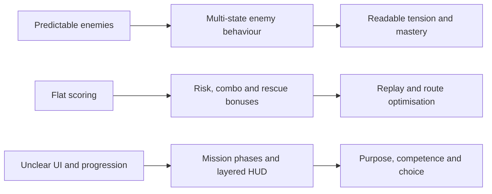

# BCL1244 Game Programming

## Case Study: Cyber City Rescue Mission

**Student Name:** Chan Jing Yi  
**Student ID:** SUOL2500321  
**Semester:** May-August 2026  
**Assessment:** Individual Case Study (20%)

---

## Declaration

I confirm that I have read and understood the assessment plagiarism policy. I declare that this case study is my own work and that every external source used in the analysis has been acknowledged.

**Student:** Chan Jing Yi (SUOL2500321)  
**Signature:** ____________________  
**Date:** ____________________

\newpage

## Design Position

*Cyber City Rescue Mission* has a workable action-platform foundation: movement, rescue, hazards and enemies already create a recognisable play loop. Its weakness is not a lack of features but a lack of meaningful variation and feedback. Predictable opposition makes success routine, a flat score provides little reason to improve, and unclear objectives prevent the player from reading progress. These faults are connected. The Mechanics-Dynamics-Aesthetics framework argues that implemented rules produce play behaviour and, in turn, the player's emotional experience (Hunicke, LeBlanc and Zubek, 2004). The redesign therefore links each proposed mechanic to a desired player behaviour instead of adding unrelated content.



The resulting structure preserves fairness. Enemies become less certain but still telegraph their actions; scoring rewards skilful rescue rather than repetitive farming; and progression communicates what the player should do without removing exploration.

## (a) Gameplay System Analysis — 8 Marks

### Problem 1: Predictable enemy behaviour collapses the challenge curve

An enemy that repeats one route or attacks at a fixed interval can be solved through memorisation. Once the player discovers the safe timing, the enemy stops functioning as an active threat and becomes a moving platform hazard. This reduces decision-making because observation, positioning and rapid adaptation are no longer required. Repeating the same solution also weakens the difficulty curve: later encounters may contain more enemies, but quantity alone creates clutter rather than deeper play.

The quality problem is especially serious in an action-platform game, where movement and enemy timing should interact. If every opponent responds identically, the player cannot develop a richer understanding of enemy roles. A fair enemy does not need to be fully predictable, but it must be *legible*. Players should recognise patrol, alert and attack cues, then choose whether to evade, distract or engage. The current design supplies certainty without meaningful counterplay, so the feeling of mastery arrives too early and the remaining level becomes repetitive.

### Problem 2: The scoring system lacks meaningful performance feedback

A score motivates replay only when the player understands which decisions produced it and can imagine a better attempt. A simple total awarded for reaching the end fails this test. It treats a cautious rescue, a fast no-damage run and careless completion as equivalent outcomes; the number therefore has little diagnostic value. If repeated actions earn unlimited points, the optimal strategy may also become tedious score farming rather than heroic rescue.

This weakens game quality in two ways. First, the system does not recognise competence. Ryan, Rigby and Przybylski (2006) found that perceived competence and autonomy are associated with enjoyment and continued motivation in games. A flat score gives little evidence of either. Second, there is no strategic tension between speed, safety and optional goals. The player has no reason to experiment with a different route or improve execution after completing the mission once.

### Problem 3: Unclear UI and level progression damage orientation

Health and objectives are decision-critical information. If health is difficult to read, the player cannot judge whether to risk a jump, confront an enemy or search for recovery. If the rescue target is unclear, exploration turns into aimless movement rather than intentional investigation. Damage or failure then appears arbitrary even when the underlying collision and combat rules are correct. Poor communication therefore makes fair mechanics *feel* unfair.

The absence of visible mission structure causes a related pacing problem. A level without milestones offers no short-term confirmation that the player is advancing. Civilians may appear to be collectibles rather than people whose rescue controls access to the extraction point. The player cannot form a plan because the game has not exposed the relevant state. Clear and consistent feedback is one feature associated with need satisfaction in play (Center for Self-Determination Theory, n.d.); the present interface withholds that feedback and weakens competence, purpose and engagement.

## (b) Game Design Enhancement — 9 Marks

### Enhancement 1: A readable multi-state enemy system and controlled difficulty curve

Each enemy should use a finite set of observable states: **Patrol**, **Suspicious**, **Chase**, **Attack**, **Search** and **Return**. A guard patrols between points until sight or sound raises suspicion. Confirmed detection begins a chase; reaching attack range triggers a short anticipation animation before damage is possible. If line of sight is lost, the enemy searches the last known position for a limited time, then returns to patrol. Small variation in wait times and route choice prevents rote memorisation, while coloured indicators, animation poses and audio cues keep every transition readable.

Difficulty should rise by combining behaviours rather than merely increasing health. The first area introduces one slow patrol and a safe observation point. The second combines a patroller with a flying drone whose sight cone covers the upper route. The third introduces environmental hazards and coordinated enemy coverage, but provides alternate paths. Reaction delay, detection range, search duration and projectile speed can rise gradually within tested limits. No state should remove the player's opportunity to respond.

This design produces a stronger challenge curve because new demands build on learned skills. Early play teaches recognition; middle play asks the player to select routes; later play requires timing, prioritisation and recovery when a plan fails. The variation creates tension, yet telegraphing protects fairness. A no-damage or stealth-oriented player can display mastery without the game relying on sudden, unexplained difficulty spikes.

### Enhancement 2: A transparent score built around rescue, risk and mastery

The redesigned score should reward actions that express the rescue fantasy. A civilian rescue grants **1,000 points**, completing the mission grants **2,000**, and each optional data core grants **300**. A rescue chain multiplier rises from **x1.0** to **x2.0** when the next rescue occurs within 25 seconds; taking damage resets it. End-of-mission bonuses reward remaining health and time under the par time, while repeated attacks on respawning enemies give no exploitable score. The results screen must break the total into rescue, time, health, exploration and multiplier components.

A three-rank target makes improvement concrete: Bronze represents completion, Silver requires competent rescue with moderate damage, and Gold requires all civilians plus either a strong time or health result. The player's personal best, highest rank and best rescue time remain visible on the mission-selection screen. Optional challenges—such as “rescue every civilian without losing armour” or “find both data cores”—create different routes to success. They add autonomy without blocking the main mission.

The system encourages replay because the player can identify an attainable next goal. A first attempt may focus on survival, a second on complete rescue, and a later attempt on route optimisation. The score also resists empty accumulation: its largest rewards come from fulfilling the game's stated role. Mechanics, play behaviour and desired experience therefore remain aligned rather than pulling the player toward repetitive combat.

### Enhancement 3: Mission phases, clear HUD hierarchy and purposeful progression

The level should be divided into three communicated phases. **Infiltration** asks the player to enter the district and locate civilians. **Rescue** requires a defined minimum number of civilians while optional rescues and data cores remain available. **Extraction** activates only after the rescue threshold is met and directs the player to a clearly marked exit. A short banner announces each phase, the pause screen explains the full objective, and world-space markers identify nearby civilians only after the player activates a scanner. This preserves exploration while preventing confusion.

The HUD should follow an information hierarchy. Health is placed at the upper-left as five armour segments with a numeric fallback; damage triggers a brief colour pulse and accessible audio cue. The upper-right shows `Civilians 2/4`, the current phase and the optional objective. Score and multiplier occupy a smaller area because they inform optimisation rather than immediate survival. The extraction marker appears only when relevant, reducing screen noise. Colour is never the only signal: icons, text and animation communicate the same change.

Progression should alternate challenge and relief. A protected opening teaches movement and health feedback; the first rescue introduces the objective counter; a mid-level safe room provides a checkpoint and score summary; the final mixed encounter tests the learned systems before extraction. Completion unlocks the next district, while missed optional objectives invite replay. This arrangement supports competence through visible progress and autonomy through optional goals. It also avoids the false choice of either overwhelming the player with instructions or leaving the mission unreadable.

## (c) Unity System Integration — 8 Marks

### Unity implementation 1: Enemy finite-state controller with 2D perception

Each enemy prefab should contain an `EnemyController` `MonoBehaviour`, `Rigidbody2D`, `Collider2D`, `Animator` and a small sensor transform. The controller stores a state enum and switches behaviour through explicit transition methods rather than placing all logic in one `Update()` block. `Physics2D.Raycast` checks line of sight against a layer mask; Unity documents that this query casts against 2D colliders and can selectively filter detected layers (Unity Technologies, 2025a). A second downward ray prevents a ground enemy from walking off a platform.

```csharp
public enum EnemyState { Patrol, Suspicious, Chase, Attack, Search, Return }

void EvaluatePerception()
{
    Vector2 direction = (player.position - sensor.position).normalized;
    RaycastHit2D hit = Physics2D.Raycast(
        sensor.position, direction, detectionRange, sightMask);

    bool seesPlayer = hit.collider != null && hit.collider.CompareTag("Player");
    if (seesPlayer) ChangeState(EnemyState.Chase);
    else if (state == EnemyState.Chase) ChangeState(EnemyState.Search);
}
```

Enemy statistics should be held in a `ScriptableObject` profile containing speed, detection range, reaction delay, search duration and attack cooldown. ScriptableObjects are asset-based data containers that multiple prefabs can reference without duplicating unchanged values (Unity Technologies, 2025b). Separate `RookieGuard`, `Drone` and `EliteGuard` profiles let the designer tune the curve from the Inspector without rewriting behaviour. Animator parameters such as `Alerted` and `Attack` provide visible anticipation, so technical unpredictability remains perceptually fair.

### Unity implementation 2: Event-driven score, multiplier and persistent best result

A single `ScoreManager` should subscribe to gameplay events raised by `CivilianRescued`, `PlayerDamaged`, `DataCoreCollected` and `MissionCompleted`. Each event passes only the required data; the manager calculates points, refreshes the multiplier timer and publishes `ScoreChanged`. This prevents civilian, player and UI scripts from modifying one another directly. A `ScoreRules` ScriptableObject stores base values, time limits and rank thresholds, which makes balancing auditable.

```csharp
public void RegisterRescue()
{
    int award = Mathf.RoundToInt(rules.rescuePoints * multiplier);
    score += award;
    multiplier = Mathf.Min(rules.maxMultiplier, multiplier + 0.25f);
    comboTimeRemaining = rules.comboWindow;
    ScoreChanged?.Invoke(score, multiplier);
}

public void RegisterDamage()
{
    multiplier = 1f;
    ScoreChanged?.Invoke(score, multiplier);
}
```

At mission completion, the manager produces a category breakdown and compares the total with the saved best. `PlayerPrefs` is sufficient for non-sensitive local integers such as a high score and rank; Unity cautions that its data is stored locally without encryption, so it must not hold sensitive information (Unity Technologies, 2022). Saving occurs at mission checkpoints or the results screen, not every frame. This implementation supports immediate feedback during play and credible comparison after play, while the single authority prevents double-awards.

### Unity implementation 3: Mission-state coordinator, runtime UI and scene progression

A `MissionManager` should own the phase enum—`Infiltration`, `Rescue`, `Extraction`, `Complete`—and track rescued civilians. It raises `ObjectiveChanged` whenever the count or phase changes. A UI presenter subscribes to player-health, objective and score events, then updates the HUD rather than polling every value each frame. Unity's UI Toolkit supports runtime game interfaces through reusable UXML structure and USS styling (Unity Technologies, 2023), making it suitable for a consistent health display, objective panel, phase banner and results screen.

```csharp
public void OnCivilianRescued()
{
    rescued++;
    if (phase == MissionPhase.Infiltration)
        phase = MissionPhase.Rescue;

    if (rescued >= requiredRescues)
    {
        phase = MissionPhase.Extraction;
        extractionPoint.SetActive(true);
    }
    ObjectiveChanged?.Invoke(phase, rescued, requiredRescues);
}
```

Each district is a separate Unity scene with its own `MissionConfig` asset, spawn points and goals. When the results screen is accepted, `SceneManager.LoadSceneAsync` loads the next district in the background and exposes an `AsyncOperation` for completion tracking (Unity Technologies, 2025c). The transition screen can therefore show loading progress without freezing the presentation. Checkpoint data should retain current phase, rescue count and player health during the active mission; only validated completion unlocks the next scene. The same state that drives progression also drives the HUD, preventing contradictory messages such as an active extraction marker before the rescue requirement has been met.

## Design Traceability and Evaluation

| Brief weakness | Revised mechanic | Expected player behaviour | Test evidence |
|---|---|---|---|
| Predictable enemies | Telegraphing, multi-state perception and mixed roles | Observe, plan, adapt and recover | State-transition logs; detection and reaction-time playtests |
| Unmotivating score | Rescue-weighted score, multiplier, ranks and best result | Replay, optimise routes and protect health | Score-unit tests; completion-rate and repeat-attempt comparison |
| Unclear UI/progression | Phase-based objectives, layered HUD and gated extraction | Understand risk, locate goals and recognise progress | Five-second objective recall test; HUD readability and scene-unlock tests |

The redesign should be validated through short playtests rather than judged only from implementation correctness. Players should be able to state their current objective after five seconds of play, predict why an enemy changed state, and explain how their result score was formed. Difficulty data should compare deaths, damage taken and completion time across sections. A steep increase identifies a spike; no change suggests that a new mechanic has not created meaningful demand. Scoring tests should also confirm that rescue remains more valuable than repeatable combat and that a damaged fast run does not always dominate a careful complete rescue.

This evaluation closes the design loop. The three Unity systems do not merely reproduce the proposal in code; they expose tunable data and observable events that make iteration possible. The intended outcome is a game in which challenge is variable but readable, achievement is measurable, and every level communicates a clear rescue purpose.

## References

Center for Self-Determination Theory (n.d.) *Player Experience of Needs Satisfaction (PENS)*. Available at: https://selfdeterminationtheory.org/player-experience-of-needs-satisfaction-pens/ (Accessed: 23 July 2026).

Hunicke, R., LeBlanc, M. and Zubek, R. (2004) ‘MDA: A formal approach to game design and game research’, *Proceedings of the AAAI Workshop on Challenges in Game AI*, Technical Report WS-04-04, pp. 1–5. Available at: https://aaai.org/papers/ws04-04-001-mda-a-formal-approach-to-game-design-and-game-research/ (Accessed: 23 July 2026).

Ryan, R.M., Rigby, C.S. and Przybylski, A. (2006) ‘The motivational pull of video games: A self-determination theory approach’, *Motivation and Emotion*, 30(4), pp. 347–363. doi: https://doi.org/10.1007/s11031-006-9051-8.

Unity Technologies (2022) *PlayerPrefs*. Unity Scripting API 2022.3. Available at: https://docs.unity3d.com/2022.3/Documentation/ScriptReference/PlayerPrefs.html (Accessed: 23 July 2026).

Unity Technologies (2023) *UI Toolkit*. Unity Manual 2023.2. Available at: https://docs.unity3d.com/2023.2/Documentation/Manual/UIElements.html (Accessed: 23 July 2026).

Unity Technologies (2025a) *Physics2D.Raycast*. Unity 6 Scripting API. Available at: https://docs.unity3d.com/6000.0/Documentation/ScriptReference/Physics2D.Raycast.html (Accessed: 23 July 2026).

Unity Technologies (2025b) *ScriptableObject*. Unity 6.1 Manual. Available at: https://docs.unity3d.com/6000.1/Documentation/Manual/class-ScriptableObject.html (Accessed: 23 July 2026).

Unity Technologies (2025c) *SceneManager.LoadSceneAsync*. Unity 6 Scripting API. Available at: https://docs.unity3d.com/6000.0/Documentation/ScriptReference/SceneManagement.SceneManager.LoadSceneAsync.html (Accessed: 23 July 2026).

